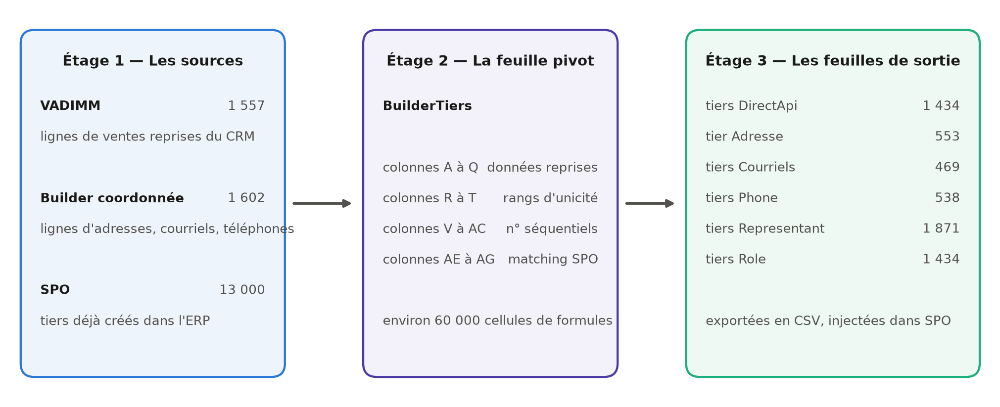
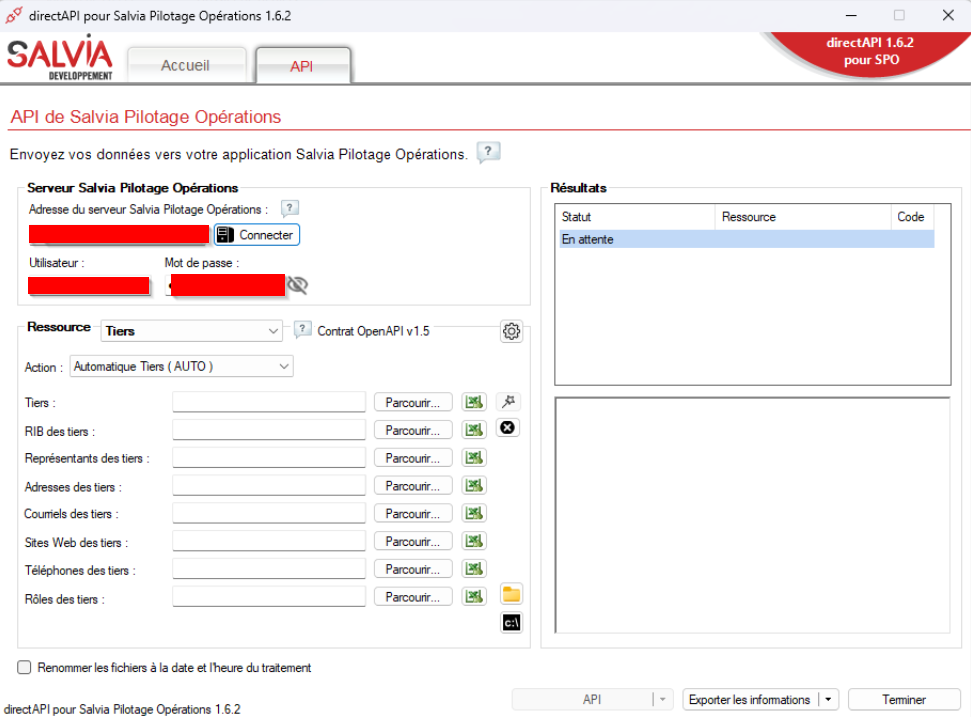
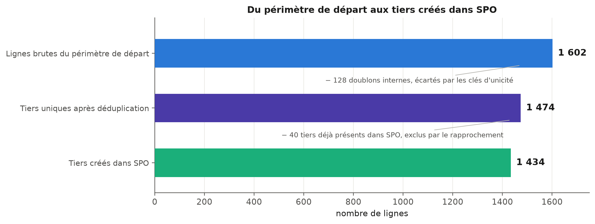
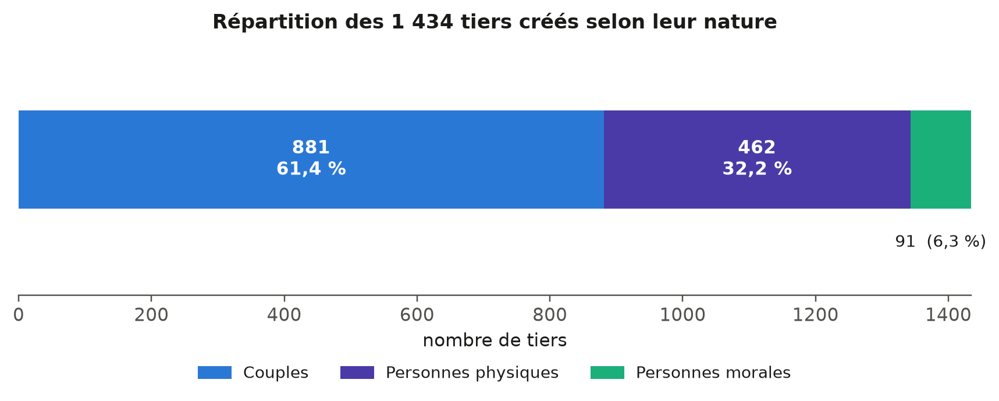

# La migration des tiers vers SPO

::: sommaire
**Sommaire**

- 1.1 Contexte et enjeux de la reprise des tiers
    - 1.1.1 Du CRM Vadimm à l'ERP SPO : le périmètre des données clients
    - 1.1.2 L'enjeu central : créer sans dupliquer
- 1.2 Conception du fichier de travail : une chaîne de traitement pilotée par formules
    - 1.2.1 Une architecture en trois temps : sources, feuille pivot, feuilles de sortie
    - 1.2.2 Le modèle de données des tiers dans SPO : couples, personnes physiques, personnes morales
- 1.3 Les trois mécanismes algorithmiques
    - 1.3.1 La déduplication par clés d'unicité différenciées selon la nature du tiers
    - 1.3.2 L'exclusion des tiers déjà présents dans SPO
    - 1.3.3 La propagation vers les feuilles de sortie par numérotation séquentielle
- 1.4 De la préparation à l'injection : procédure et contraintes techniques
    - 1.4.1 Génération et normalisation des fichiers d'import
    - 1.4.2 Le contournement par API : 872 requêtes PATCH pour les coordonnées des couples
- 1.5 Traitement des cas particuliers et arbitrages
- 1.6 Bilan de l'import et points de vigilance pour la suite
:::

Ce chapitre détaille la reprise des tiers, c'est-à-dire des clients acquéreurs, depuis
notre système historique vers le nouvel ERP du groupe, SPO. Cette mission prolonge
directement le chantier de migration exposé dans mon mémoire de mi-parcours, mais elle en
change la nature : il ne s'agissait plus d'injecter des structures de gestion, opérations,
tranches et budgets, mais des personnes, avec ce que cela implique de risques de doublons
et d'exigence de qualité. J'y expose la conception du fichier de travail que j'ai construit
pour industrialiser cette reprise, les trois mécanismes algorithmiques sur lesquels il
repose, les contraintes techniques du format d'import de SPO et la manière dont je les ai
contournées, puis le bilan de l'import et les enseignements que j'en retire.

## Contexte et enjeux de la reprise des tiers

### Du CRM Vadimm à l'ERP SPO : le périmètre des données clients

Le remplacement de l'ERP historique du groupe par SPO, décrit dans mon mémoire de
mi-parcours, s'est fait par lots successifs. Après la création des opérations
immobilières, de leurs tranches et de leurs budgets, il restait à reprendre les données
commerciales, et en premier lieu les clients. Dans SPO, ces clients sont désignés par le
terme générique de *tiers* : la même entité de base sert à représenter un acquéreur, une
société, un prescripteur ou un fournisseur, et se voit ensuite attribuer un ou plusieurs
rôles. Reprendre les tiers signifiait donc alimenter le socle sur lequel toute la gestion
commerciale allait s'appuyer.

Le périmètre m'a été fixé de la manière suivante : importer dans SPO l'ensemble des clients
ayant déjà acheté un bien chez Angelotti. La matière première provenait de notre CRM
(*Customer Relationship Management*, l'outil de gestion de la relation client) Vadimm, sous
la forme d'une extraction de toutes les ventes enregistrées. Cette extraction comptait
**1 602 lignes**, auxquelles s'ajoutait une seconde extraction, réalisée avec MyReport
Builder, portant les coordonnées de contact des acquéreurs et de leurs co-acquéreurs :
adresses postales, courriels et numéros de téléphone.

La difficulté n'était pas la volumétrie, qui reste modeste au regard des 283 opérations
traitées au premier semestre. Elle tenait à la nature même de la donnée. Concrètement, une
ligne de l'extraction Vadimm ne décrit pas un client, elle décrit une vente. Un même acquéreur qui a
acheté trois lots apparaît donc trois fois, et rien dans le fichier ne le signale.
Transformer un fichier de ventes en un référentiel de personnes suppose de reconstituer
l'identité de chacune, ce que le système source ne faisait pas à ma place.

### L'enjeu central : créer sans dupliquer

L'enjeu de cette reprise se résume à une contrainte simple à énoncer et difficile à tenir :
créer chaque client une fois et une seule. Deux sources de duplication se cumulaient, et
elles n'appelaient pas la même parade.

La première est interne au fichier. Comme chaque ligne correspond à une vente, un client
fidèle est présent autant de fois qu'il a acheté. Importer le fichier tel quel aurait créé
autant de fiches que d'achats, avec des conséquences directes sur la gestion : un même
acquéreur aurait été rattaché à plusieurs identifiants, et il serait devenu impossible de
reconstituer son historique ou de lui adresser un courrier unique.

La seconde est externe. Au moment de préparer l'import, SPO n'était pas vide : environ
13 000 tiers y avaient déjà été créés, soit par des saisies manuelles réalisées par les
équipes commerciales depuis le démarrage de l'outil, soit par d'autres canaux d'alimentation.
Injecter mes 1 602 lignes sans les confronter à cet existant aurait produit des doublons
d'une autre nature, plus insidieux parce qu'ils auraient opposé une fiche importée et une
fiche saisie, toutes deux légitimes en apparence.

Face à cette double contrainte, une reprise manuelle était exclue. Vérifier ligne à ligne
qu'un acquéreur n'existe ni ailleurs dans le fichier ni déjà dans un référentiel de 13 000
tiers représentait un volume de contrôles incompatible avec les délais, et surtout un
risque d'erreur humaine que rien n'aurait permis de tracer ensuite. J'ai donc fait le choix
de construire un fichier de travail qui automatise entièrement ces contrôles par formules,
de manière à ce que la décision d'importer ou non une ligne soit calculée et non prise au
cas par cas.

## Conception du fichier de travail : une chaîne de traitement pilotée par formules

### Une architecture en trois temps : sources, feuille pivot, feuilles de sortie

Le fichier que j'ai conçu ne se présente pas comme un tableur de saisie mais comme une
chaîne de traitement automatique, dans la lignée des maquettes d'injection que j'avais
construites au premier semestre. Les données entrent d'un côté sous leur forme brute et
ressortent de l'autre sous la forme exacte attendue par SPO, sans qu'aucune donnée soit
recopiée à la main entre les deux. Cette architecture se décompose en trois étages, que
présente la Figure 1.1.

1. **Les feuilles sources** : trois feuilles en lecture seule qui reçoivent les extractions
   telles quelles. La feuille `VADIMM` porte les 1 557 lignes de ventes reprises du CRM, la
   feuille `Builder coordonnée` les 1 602 lignes de coordonnées des acquéreurs et
   co-acquéreurs, et la feuille `SPO` l'extraction des tiers déjà existants dans l'ERP, qui
   sert de référentiel de comparaison.
2. **La feuille pivot `BuilderTiers`** : c'est le cœur du dispositif. Elle reçoit
   l'intégralité des lignes issues des sources et y adjoint les colonnes de calcul qui
   déterminent, pour chaque ligne, si elle correspond à un tiers nouveau, à un doublon
   interne ou à un tiers déjà présent dans SPO.
3. **Les six feuilles de sortie** : une feuille par fichier d'import attendu par SPO,
   entièrement générée par formules à partir de la feuille pivot, et destinée à être
   exportée en CSV.

{width=100%}

Ce découpage répond à une règle que je me suis imposée dès la conception, et qui figure en
tête de la note de procédure que j'ai rédigée pour l'équipe : on ne modifie jamais
directement une feuille de sortie. Ces feuilles étant intégralement calculées, toute
correction saisie dedans serait écrasée au recalcul suivant, sans laisser de trace. Toute
intervention passe donc par `BuilderTiers` ou par la feuille de coordonnées. Cette
discipline peut sembler contraignante à l'usage, mais elle est la contrepartie
indispensable de l'automatisation : c'est elle qui garantit qu'à tout moment, le contenu
des fichiers d'import est bien le résultat des règles décrites, et non d'une retouche
ponctuelle oubliée depuis.

### Le modèle de données des tiers dans SPO : couples, personnes physiques, personnes morales

Avant de pouvoir automatiser quoi que ce soit, il fallait comprendre comment SPO représente
un tiers. Cette phase d'appropriation a repris la méthode que j'avais déjà éprouvée sur les
opérations : lecture de la documentation de l'éditeur, puis tests unitaires de création
pour valider empiriquement les champs réellement obligatoires.

Deux caractéristiques du modèle ont structuré tout le reste du travail.

La première est que SPO distingue trois **natures** de tiers, et que cette nature commande
la manière dont l'identité est portée. Une **personne morale** est une société, identifiée
par sa raison sociale et son SIRET (le numéro d'identification à quatorze chiffres d'un
établissement). Une **personne physique** est un individu, identifié par son nom, son
prénom et sa date de naissance. Un **couple** est une entité particulière : le tiers
lui-même n'est ni l'un ni l'autre des deux conjoints, il les regroupe, et les deux
personnes qui le composent sont enregistrées comme ses *représentants*. Cette troisième
nature est de loin la plus fréquente dans notre activité, puisque l'essentiel de nos ventes
se fait à des couples acquéreurs.

La seconde caractéristique est qu'un tiers n'est pas un enregistrement unique mais un
ensemble d'objets liés. La fiche principale ne porte que l'identité ; l'adresse, le
courriel, le téléphone, les représentants et les rôles sont autant d'objets rattachés, avec
chacun son propre fichier d'import. La Figure 1.2, reprise de mon mémoire de mi-parcours,
montre l'interface du module DirectAPI avec la ressource « Tiers » sélectionnée : on y lit
directement cette décomposition, puisque l'écran propose un emplacement de fichier distinct
pour les tiers, les représentants, les adresses, les courriels, les téléphones et les rôles.

{width=78%}

C'est cette décomposition qui explique pourquoi mon fichier produit six feuilles de sortie
et non une seule. Elle explique aussi une asymétrie qui reviendra plus loin : les adresses,
courriels et téléphones se rattachent directement à une personne physique ou morale, mais
pour un couple, ils se rattachent aux représentants. Cette différence de traitement, qui
paraît anodine sur le papier, s'est révélée être la principale contrainte technique de
l'import.

## Les trois mécanismes algorithmiques

La feuille pivot repose sur trois mécanismes qui s'enchaînent : d'abord identifier les
doublons internes, ensuite écarter les tiers déjà créés dans SPO, enfin distribuer les
lignes retenues vers les six feuilles de sortie. Ces trois mécanismes sont l'apport
méthodologique de ce travail, et ce sont eux qui font la différence entre un simple fichier
de mise en forme et un véritable outil de reprise.

### La déduplication par clés d'unicité différenciées selon la nature du tiers

Dédupliquer suppose de répondre d'abord à une question qui n'est pas technique : à partir de
quoi décide-t-on que deux lignes désignent la même personne ? C'est le point sur lequel
j'ai le plus hésité, et celui qui commande la qualité de tout le résultat.

Une clé unique appliquée à l'ensemble du fichier ne pouvait pas convenir, précisément parce
que les trois natures de tiers ne s'identifient pas de la même façon. Deux sociétés peuvent
porter des raisons sociales très proches sans être la même entité, alors que deux personnes
homonymes nées le même jour à la même adresse sont, en pratique, la même personne. J'ai
donc retenu **trois clés d'unicité distinctes**, une par nature, calculées chacune dans sa
propre colonne de la feuille pivot :

1. **Pour un couple** : le nom et le prénom de l'acquéreur principal du dossier de vente,
   désigné ADV dans nos extractions, complétés du nom et du prénom du co-acquéreur, désigné
   CO. C'est la combinaison des deux identités qui fait l'unicité, et non chacune prise
   isolément.
2. **Pour une personne physique** : le nom, le prénom, la date de naissance et l'adresse.
   La date de naissance sépare les homonymes ; l'adresse ajoute une sécurité pour les cas
   où elle n'est pas renseignée de façon fiable.
3. **Pour une personne morale** : la raison sociale et le SIRET. Le SIRET est l'identifiant
   légal, il suffirait seul, mais il n'est pas toujours renseigné dans les données
   historiques : la raison sociale prend alors le relais.

Chaque colonne calcule un **rang** : la première occurrence d'un tiers reçoit le rang 1,
les occurrences suivantes les rangs 2, 3, et ainsi de suite. Seules les lignes de rang 1
sont retenues pour l'import, les autres étant considérées comme des achats successifs d'un
client déjà compté. Ce principe de rang présente un avantage sur une déduplication par
suppression : aucune ligne n'est effacée du fichier de travail. Les doublons restent
visibles, avec leur rang, ce qui permet à tout moment de vérifier pourquoi une ligne n'a
pas été importée et de remonter à la vente concernée.

Ce choix de trois clés différenciées est, à mes yeux, le véritable cœur méthodologique de
ce travail. En effet, il traduit une idée simple : la règle d'unicité n'est pas une propriété du
fichier, c'est une propriété du métier. Chercher une clé universelle aurait conduit soit à
fusionner des tiers distincts, soit à en dupliquer, et dans les deux cas l'erreur n'aurait
été découverte que bien plus tard, dans l'usage quotidien de l'ERP.

### L'exclusion des tiers déjà présents dans SPO

Le deuxième mécanisme répond à la duplication externe. Pour chaque ligne de la feuille
pivot, trois formules de recherche interrogent la feuille contenant l'extraction des tiers
déjà créés dans SPO, chacune adaptée à une nature :

1. La première recherche les **personnes morales** par leur raison sociale.
2. La deuxième recherche les **personnes physiques** par leur nom et leur prénom.
3. La troisième recherche les **couples** par les quatre noms qui les composent, en testant
   les deux ordres possibles entre l'acquéreur et le co-acquéreur.

Ce dernier point mérite d'être souligné, parce qu'il illustre le genre de détail qui décide
de la réussite d'une reprise. Rien ne garantit que l'ordre des deux conjoints soit le même
dans Vadimm et dans SPO : un couple saisi manuellement peut très bien y figurer avec le
conjoint en premier. Une recherche qui ne testerait qu'un seul sens laisserait donc passer
une partie des doublons, et les tiers concernés seraient créés une seconde fois sans que
personne s'en aperçoive avant longtemps. Tester les deux sens allonge la formule, mais
supprime entièrement ce risque.

Lorsque l'une de ces trois formules renvoie un code tiers de SPO, du type `T00012666`, la
ligne est automatiquement exclue de l'import. Sur ce projet, **40 tiers** ont ainsi été
détectés comme déjà existants et écartés. Rapporté aux 1 474 tiers uniques, le volume peut
sembler faible, mais chacun de ces 40 cas aurait produit un doublon durable dans le
référentiel client de l'entreprise.

La Figure 1.3 récapitule l'effet cumulé de ces deux premiers mécanismes. Des 1 602 lignes
brutes issues de Vadimm, la déduplication interne en écarte 128 qui correspondent à des
achats répétés, ce qui ramène à 1 474 tiers uniques ; l'exclusion des tiers déjà présents
dans SPO en retire 40 de plus, pour un total de **1 434 tiers à créer**. Chaque étage de
ce filtrage correspond à une règle explicite, écrite dans une colonne du fichier, donc
vérifiable et reproductible.

{width=92%}

### La propagation vers les feuilles de sortie par numérotation séquentielle

Restait à alimenter les six feuilles de sortie à partir des lignes retenues. La difficulté
tient à ce que ces feuilles n'ont ni la même population ni le même nombre de lignes. La
feuille des tiers reçoit un enregistrement par tiers créé, mais la feuille des adresses ne
concerne que les personnes physiques et morales, celle des courriels seulement celles dont
le courriel est renseigné, et celle des représentants deux lignes par couple plus une par
société. Il fallait donc, pour chaque feuille, une numérotation qui lui soit propre.

Le mécanisme que j'ai retenu attribue à chaque ligne de la feuille pivot un **numéro
séquentiel par destination**, calculé dans une colonne dédiée. Une ligne qui n'a pas
vocation à alimenter une feuille donnée ne reçoit pas de numéro pour cette feuille ; les
lignes concernées sont numérotées de 1 à *n* dans l'ordre de la feuille pivot. Chaque
feuille de sortie n'a plus alors qu'à rechercher, pour sa ligne *i*, la ligne de
`BuilderTiers` portant le numéro *i* dans la colonne qui la concerne.

L'intérêt de ce détour est qu'il rend les six feuilles indépendantes les unes des autres
tout en les gardant synchronisées avec une source unique. Si une ligne est corrigée dans la
feuille pivot, ou si une nouvelle exclusion apparaît, les six numérotations se recalculent
et les six fichiers restent cohérents entre eux. C'est exactement le problème qui, en
saisie manuelle, produit les incohérences les plus difficiles à détecter : une adresse
rattachée au mauvais tiers parce qu'une ligne a été insérée quelque part sans que le reste
suive.

La Figure 1.4 donne la volumétrie effectivement produite par chacune des six feuilles. On
y lit directement le modèle de données décrit plus haut : 1 434 lignes pour la liste
maîtresse des tiers et autant pour l'attribution du rôle « Client », mais 1 871 lignes de
représentants, puisque chaque couple en compte deux, et seulement 553 adresses, 538
téléphones et 469 courriels, ces trois derniers fichiers ne portant que les personnes
physiques et morales.

{width=95%}

**[Emplacement réservé pour une figure — capture d'écran de la feuille `BuilderTiers`,
montrant côte à côte les colonnes de données reprises et les colonnes calculées : les trois
rangs de déduplication avec des valeurs 1 et 2 visibles, une ligne portant un code SPO dans
les colonnes de matching, et le panneau de contrôle avec ses compteurs. À insérer ici, avec
renumérotation des figures suivantes.]**

## De la préparation à l'injection : procédure et contraintes techniques

### Génération et normalisation des fichiers d'import

Une fois les six feuilles calculées, il restait à les transformer en fichiers réellement
acceptés par SPO. Cette étape, que j'imaginais purement mécanique, a en réalité mobilisé
plusieurs contraintes de format qu'aucune documentation ne mentionnait et que j'ai
découvertes par rejets successifs.

- **L'encodage et le séparateur.** Les fichiers doivent être enregistrés en CSV
  (*Comma-Separated Values*, un format texte où les colonnes sont séparées par un
  caractère) encodé en UTF-8, avec le point-virgule comme séparateur. C'est la
  configuration attendue par l'outil d'import ; toute autre combinaison produit un fichier
  lu comme une colonne unique.
- **La normalisation des caractères.** SPO refuse les caractères accentués dans les
  colonnes textuelles. Il a donc fallu convertir en ASCII pur l'ensemble des noms, prénoms,
  adresses et professions, en remplaçant les caractères accentués par leur équivalent non
  accentué. Cette contrainte est frustrante, puisqu'elle dégrade volontairement une donnée
  correcte, mais elle est bloquante : sans elle, les lignes concernées sont rejetées.
- **La structure de l'en-tête.** Les feuilles de travail comportent deux lignes de titre,
  l'intitulé des colonnes et le type de données attendu. Seule la première doit être
  conservée dans le fichier exporté.
- **Le découpage en lots.** Les fichiers doivent être découpés en lots de 200 tiers au
  maximum, et surtout être homogènes en nature : un même fichier ne peut pas contenir à la
  fois des couples et des personnes physiques. Cette dernière règle a une conséquence
  pratique importante, puisqu'elle impose de trier les lignes par nature avant de découper,
  et c'est elle qui explique que l'import des couples se soit fait en cinq lots successifs.

J'ai consigné l'ensemble de ces contraintes dans la note de procédure remise à l'équipe, en
même temps que la marche à suivre pour rejouer l'import si celui-ci devait être différé.
Ce dernier point n'est pas anecdotique : entre la préparation du fichier et l'injection
effective, d'autres tiers peuvent être créés dans SPO par les équipes commerciales. La
procédure prévoit donc de redemander une extraction actualisée des tiers existants, de
remplacer le contenu de la feuille de référence et de recalculer : les tiers devenus
existants entre-temps sortent alors automatiquement du périmètre d'import. Le fichier reste
ainsi utilisable dans le temps, ce qui était l'un de mes objectifs de conception.

### Le contournement par API : 872 requêtes PATCH pour les coordonnées des couples

C'est à ce stade que j'ai rencontré la contrainte la plus structurante du projet, et celle
dont la résolution m'a le plus appris.

Le format d'import CSV de SPO ne permet pas de porter les courriels et les téléphones des
couples. La raison en est logique au regard du modèle de données décrit en 1.2.2 : pour un
couple, ces coordonnées ne sont pas des attributs du tiers mais des attributs de ses
représentants, et les fichiers d'import de coordonnées ne savent viser qu'un tiers. Le
résultat est que, sur les 881 couples créés, les fichiers CSV pouvaient produire l'identité
et les représentants, mais laissaient les coordonnées de contact vides. Concrètement,
plus de six tiers sur dix se seraient retrouvés dans l'ERP sans adresse électronique ni
numéro de téléphone, ce qui aurait vidé une bonne partie de l'intérêt de la reprise pour
les équipes commerciales.

Trois options s'offraient à moi. La première, saisir ces coordonnées à la main après
l'import, représentait plusieurs centaines de saisies et reconduisait exactement le risque
d'erreur que le fichier automatisé visait à supprimer. La deuxième, demander à l'éditeur
une évolution du format d'import, était sans rapport avec les délais du projet. La
troisième consistait à passer par l'API de SPO, que j'avais déjà pratiquée pour la reprise
des budgets au premier semestre. C'est celle que j'ai retenue.

L'API expose en effet une opération de modification partielle au format **JSON Patch**,
normalisé par la RFC 6902. Ce format permet de décrire une modification non pas en
renvoyant l'objet entier, mais sous la forme d'une liste d'opérations élémentaires, chacune
indiquant l'action à effectuer, le chemin de la propriété visée dans l'objet et la valeur à
appliquer. C'est exactement ce dont j'avais besoin : ajouter un courriel et un téléphone
sur un représentant déjà créé, sans toucher au reste de sa fiche ni risquer d'écraser une
donnée saisie ailleurs.

La démarche s'est déroulée en trois temps :

1. **Génération des requêtes.** J'ai construit dans le fichier de travail, par formules et
   sur le même principe de numérotation séquentielle que les feuilles de sortie, le corps
   de chaque requête à partir des coordonnées présentes dans la feuille des coordonnées.
2. **Constitution de la collection.** J'ai regroupé ces requêtes dans une collection
   Postman, l'outil de test et d'exécution de requêtes que j'utilisais déjà pour mes
   essais unitaires. La collection compte **872 requêtes PATCH**, organisées en cinq lots
   correspondant aux cinq fichiers d'import de couples, afin que l'ordre d'exécution suive
   exactement l'ordre de création.
3. **Exécution et contrôle.** Les cinq lots ont été exécutés après la création des couples,
   et l'intégralité des 872 requêtes est passée sans erreur.

**[Emplacement réservé pour une figure — capture d'écran de la collection Postman :
arborescence des cinq lots et vue d'une requête PATCH sur son onglet *Body*, montrant la
structure JSON Patch. Masquer l'adresse du serveur et les identifiants, comme sur la
Figure 1.2. À insérer ici, avec renumérotation des figures suivantes.]**

Ce contournement m'a appris quelque chose que je n'avais pas formulé aussi clairement
jusque-là : dans un projet de reprise, la limite d'un format d'import n'est pas
nécessairement une limite du système. Le fichier plat et l'API sont deux portes d'entrée
vers le même modèle de données, et elles n'offrent pas les mêmes possibilités. Savoir
basculer de l'une à l'autre au bon moment, plutôt que d'accepter une perte de données ou de
retomber dans la saisie manuelle, est une compétence que ce projet m'a fait acquérir bien
plus que la précédente reprise.

## Traitement des cas particuliers et arbitrages

Aussi automatisée soit-elle, une reprise de données laisse toujours un résidu de cas qui ne
rentrent dans aucune règle. Les traiter est moins spectaculaire que de concevoir un
mécanisme de déduplication, mais c'est une part réelle du travail, et surtout une part qui
engage une décision. J'ai tenu à documenter chacun de ces arbitrages dans la note de
procédure, pour que la trace en subsiste indépendamment de moi.

**Les adresses étrangères :** Quelques acquéreurs résidaient hors de France, en Allemagne
et aux Émirats arabes unis. SPO refusait initialement la création d'un tiers avec un pays
étranger renseigné directement dans le fichier d'import. Plutôt que de bloquer la chaîne
pour ces quelques cas, nous avons choisi de les créer avec le pays France par défaut, puis
de rectifier le pays manuellement dans l'ERP après création, en vérifiant à chaque fois que
la modification était bien prise en compte. C'est un compromis assumé : il fait passer une
information provisoirement fausse dans le système, mais sur un périmètre connu, listé, et
corrigé dans la foulée.

**Les tiers mal classés :** Trois tiers étaient renseignés dans Vadimm avec une nature qui
ne correspondait pas à la réalité. Deux étaient enregistrés comme personnes physiques alors
qu'il s'agissait de sociétés, et un troisième comme personne physique alors qu'il
s'agissait d'un couple mal saisi. J'ai modifié manuellement leur nature dans la feuille
pivot avant génération des fichiers, ce qui a suffi à ce qu'ils soient créés correctement,
puisque la nature commande à la fois la clé d'unicité et la feuille de sortie qui les
reçoit. L'un de ces trois cas était en réalité déjà créé dans SPO par un autre canal, et il
a donc été retiré du fichier d'import.

**Les exclusions ponctuelles :** Un tiers relevant d'une opération de dation, c'est-à-dire
d'un paiement en biens plutôt qu'en numéraire, existait déjà dans SPO et a été retiré du
fichier.

**Les doublons avec adresses divergentes :** Deux cas ont demandé un arbitrage véritable.
Une même personne y apparaissait deux fois avec deux adresses différentes, sans qu'il soit
possible de déterminer automatiquement laquelle retenir : la déduplication savait dire
qu'il s'agissait de la même personne, elle ne pouvait pas dire où cette personne habite
aujourd'hui. L'explication la plus vraisemblable était un déménagement entre deux achats.
Après vérification des dates dans Vadimm, nous avons tranché en conservant l'adresse
rattachée à la vente la plus récente.

Ces cas sont peu nombreux au regard des 1 434 tiers créés, et il serait tentant de les
présenter comme des détails. Je crois au contraire qu'ils délimitent précisément ce que
l'automatisation peut et ne peut pas faire. Les formules savent appliquer une règle ;
elles ne savent pas décider laquelle de deux adresses également plausibles est la bonne.
La valeur du fichier de travail n'est pas d'avoir supprimé la décision humaine, mais de
l'avoir concentrée sur une poignée de cas identifiés, au lieu de la diluer sur 1 602 lignes.

## Bilan de l'import et points de vigilance pour la suite

L'intégralité des imports CSV et des requêtes PATCH a été exécutée avec succès. Le tableau
suivant récapitule ce qui a été créé dans SPO.

| Objet créé | Volume | Canal |
|:---------------------------------------|-------:|:-----------------|
| Tiers                                  |  1 434 | Import CSV       |
| Adresses                               |    553 | Import CSV       |
| Courriels des personnes physiques et morales |    469 | Import CSV  |
| Téléphones des personnes physiques et morales |   538 | Import CSV |
| Représentants des couples et des sociétés |  1 871 | Import CSV    |
| Rôles « Client »                       |  1 434 | Import CSV       |
| Coordonnées des couples                |    872 | Requêtes PATCH   |

Les 1 434 tiers créés se répartissent en **881 couples**, **462 personnes physiques** et
**91 personnes morales**, répartition que représente la Figure 1.5. Cette structure n'est
pas un simple constat de volumétrie : elle justifie a posteriori l'attention portée au
traitement des couples, qui représentent plus de six tiers sur dix et concentrent à eux
seuls la contrainte de format qui a imposé le recours à l'API.

{width=92%}

**[Emplacement réservé pour une figure — capture d'écran d'une fiche de couple dans SPO,
onglet des représentants ouvert, montrant les deux personnes du couple et les coordonnées
ajoutées par requête PATCH sur l'une d'elles. Anonymiser les noms. À insérer ici.]**

Au-delà du résultat, ce projet m'a laissé un ensemble de points de vigilance que j'ai
documentés et qui valent, je crois, bien au-delà du cas de cet import.

Le premier concerne l'usage du fichier lui-même. Trois manipulations le cassent
silencieusement : modifier une feuille de sortie, dont le contenu est régénéré à chaque
recalcul ; insérer une ligne au milieu de la feuille pivot ou de la feuille de coordonnées,
ce qui décale toutes les références ; et trier la feuille pivot, ce qui détruit la logique
de rang, celle-ci étant calculée de façon cumulative sur l'ordre des lignes. Aucune de ces
trois manipulations ne produit de message d'erreur, ce qui les rend d'autant plus
dangereuses. C'est la raison pour laquelle la note de procédure les mentionne avant même
d'expliquer comment utiliser le fichier.

Le second concerne un ensemble de pièges techniques que j'ai rencontrés en construisant les
formules, et qui ont chacun coûté du temps de recherche avant d'être compris :

1. **Le comptage des chaînes vides.** Une formule de comptage conditionnel considère comme
   une valeur la chaîne vide renvoyée par une autre formule. Les compteurs de contrôle
   étaient donc systématiquement surévalués, jusqu'à ce que je restreigne le comptage aux
   seules valeurs textuelles réelles.
2. **Le format des dates.** Le code de mise en forme des mois peut être interprété comme
   un code de minutes selon le contexte, ce qui produit des clés de déduplication fausses
   sans qu'aucune erreur soit signalée. J'ai remplacé toute mise en forme globale par une
   recomposition explicite de l'année, du mois et du jour.
3. **Les heures parasites dans les dates de naissance.** Certaines dates issues de
   l'extraction portaient une heure non nulle, d'autres non. Deux dates identiques à
   l'affichage étaient donc considérées comme différentes par le tableur, ce qui cassait
   la déduplication des personnes physiques. La normalisation systématique des dates à
   minuit a réglé le problème.
4. **La différence entre cellule vide et chaîne vide.** Une cellule contenant une formule
   qui renvoie une chaîne vide n'est pas une cellule vide, et les tests de vacuité ne la
   détectent pas comme telle. Cette confusion est à l'origine de plusieurs faux positifs
   dans les premières versions des formules d'exclusion.

Ces quatre points ont un dénominateur commun, et c'est l'enseignement principal que j'en
tire : dans une chaîne de traitement par formules, l'erreur ne se manifeste presque jamais
par un message d'erreur. Elle se manifeste par un compteur qui ne tombe pas juste. C'est
pourquoi j'ai ajouté à la feuille pivot un panneau de contrôle affichant en permanence les
compteurs clés, et pourquoi la procédure impose de les vérifier avant tout export : tout
écart entre ces compteurs et les valeurs attendues signale un problème à investiguer avant
d'aller plus loin. Ce panneau est le seul dispositif de détection dont je disposais, et il
a effectivement révélé plusieurs anomalies que rien d'autre n'aurait signalées.

Un dernier point de vigilance relève de la performance. Le fichier comporte environ 60 000
cellules de formules, ce qui rend le recalcul automatique pénible pendant les phases de
modification. Basculer en calcul manuel pendant le travail, puis forcer un recalcul complet
avant chaque export, est la manière de travailler que j'ai retenue et que la procédure
recommande.

::: transition
Cette reprise des tiers achève, pour la partie qui me revenait, le travail de constitution
du socle de données du nouvel ERP. Après les opérations, les tranches et les budgets migrés
au premier semestre, les 1 434 clients acquéreurs disposent désormais dans SPO d'une fiche
unique, correctement typée, dotée de ses coordonnées, de ses représentants et de son rôle.
Le référentiel commercial du groupe est reconstitué, et il l'est selon des règles écrites,
tracées et rejouables plutôt que par une saisie dont personne n'aurait pu, six mois plus
tard, reconstituer la logique.

Néanmoins, il serait excessif de présenter ce chantier comme achevé. La reprise des
historiques budgétaires reste devant nous, et le fichier de travail devra probablement être
rejoué au moins une fois avant la bascule définitive, à mesure que de nouveaux tiers sont
créés dans l'ERP par les équipes commerciales. Cependant, la donnée client est désormais
fiable, et c'est ce qui compte pour la suite.

Ce chapitre aura montré, je l'espère, que la valeur de ce travail ne se mesure pas au
nombre de lignes importées. Elle tient d'abord au choix des trois clés d'unicité, qui
décide de ce qu'est un client dans notre référentiel ; ensuite à la capacité à contourner
une limite de format en changeant de porte d'entrée vers le système ; enfin à la
documentation des arbitrages, qui rend la reprise vérifiable par quelqu'un d'autre que
celle qui l'a faite. Ce sont trois compétences d'ingénierie des données, et non de saisie.

Cette étape était aussi un prérequis. Je concluais mon mémoire de mi-parcours en avançant
que la qualité de l'architecture de données est le socle indispensable de toute
modélisation, et que le report de mon projet de Data Science au second semestre était moins
un retard qu'une conséquence logique de cet ordre des choses. Il est temps de le
démontrer plutôt que de l'affirmer. Le chapitre suivant présente le projet que ce socle a
rendu possible : le Copilote Financier, un outil d'aide à la décision construit sur les
données de gestion du groupe pour sa direction financière. On y verra que les mêmes
questions reviennent, déplacées d'un cran : comprendre ce que contient réellement un export
avant de le modéliser, écrire une définition une seule fois pour que tout le monde
consomme la même, et savoir dire ce qu'un résultat ne permet pas de conclure.
:::
