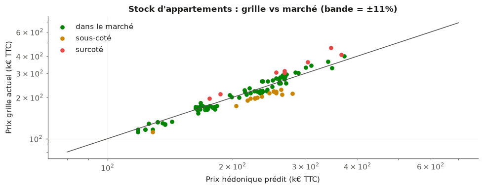

# Le Copilote Financier

::: sommaire
**Sommaire**

- 2.1 Contexte
    - 2.1.1 Problème métier
        - 2.1.1.1 Besoins par axe et exigences non fonctionnelles
    - 2.1.2 Objectifs du dashboard
- 2.2 Données disponibles
    - 2.2.1 Données internes
    - 2.2.2 Données externes
- 2.3 Architecture technique
- 2.4 Notebooks et résultats
    - 2.4.1 Exploration et nettoyage des données brutes
    - 2.4.2 SQL et Spark
    - 2.4.3 Axe A
    - 2.4.4 Axe B
    - 2.4.5 Axe C
    - 2.4.6 Signaux faibles (texte et réseau)
- 2.5 Plateforme Streamlit
- 2.6 Périmètre et limites
- 2.7 Conclusion du chapitre et conclusion générale
:::

Ce chapitre présente le projet de Data Science que j'annonçais en fin de mémoire de
mi-parcours : le « Copilote Financier », un outil d'aide à la décision construit sur les
données de gestion du groupe Angelotti pour sa direction financière. J'y expose d'abord le
besoin métier tel qu'il m'a été formulé, puis les données dont je disposais réellement,
l'architecture retenue pour les rendre exploitables, les trois axes d'analyse et leurs
résultats, la plateforme qui les restitue aux contrôleurs de gestion, et enfin les limites
que je considère comme faisant partie du livrable.

Une décision a orienté tout le projet, et il vaut mieux l'énoncer d'emblée parce qu'elle
explique la forme de ce qui suit. La taille des données disponibles, 267 opérations et
quatre exports totalisant 32 Mo, ne justifie pas un empilement de modèles. J'ai donc
retenu un petit nombre de méthodes simples, chacune choisie pour une question précise et
validée sérieusement, plutôt qu'un catalogue d'algorithmes dont aucun n'aurait pu être
correctement évalué à cette échelle.

## Contexte

Le groupe Angelotti conçoit, finance et commercialise des programmes immobiliers en
Occitanie et en région PACA. Chaque opération de promotion y est portée par une société
dédiée et vit sur un cycle long : un budget est arrêté au moment de l'engagement, puis le
chantier et la commercialisation le font dériver au fil des mois. Les appels d'offres
reviennent plus chers qu'anticipé, des acquéreurs se désistent, le rythme de vente
ralentit sous l'effet de la conjoncture.

La direction financière suit ces dérives. Néanmoins, elle les suit opération par opération,
sur tableurs, sans vision transverse. Chaque contrôleur de gestion connaît très bien les
dossiers dont il a la charge ; personne ne dispose d'une vue d'ensemble permettant de dire,
à un instant donné, quelles opérations méritent l'attention en priorité. C'est ce manque
qui a motivé le projet.

### Problème métier

En échangeant avec la direction financière, j'ai identifié trois questions qui structurent
les revues de gestion et auxquelles les tableurs actuels ne répondent pas.

La première porte sur la marge. Quelles opérations examiner en priorité, parce que leur
marge d'engagement dérive, et sur quels postes cette dérive se joue-t-elle, pour combien
d'euros ? La question suppose de comparer des dizaines d'opérations entre elles, ce
qu'aucun tableur individuel ne permet.

La deuxième porte sur le rythme de vente. Quel volume de réservations budgéter pour 2026 ?
La période récente a montré à quel point la demande est sensible au coût du crédit : le
taux moyen des crédits habitat est passé d'environ 1,1 % à un pic de 3,6 % fin 2023, avant
de refluer vers 3,1 % mi-2026, et le rythme du groupe est tombé d'environ 150 à moins de
115 réservations par mois en 2023. Reste à savoir ce qui, dans cette chute, revient à la
conjoncture et ce qui revient aux programmes eux-mêmes.

La troisième porte sur le prix. Quels lots du stock faut-il repricer ? La question n'est
pas théorique, puisque 45 % des 2 157 désistements enregistrés ont pour motif un problème
de financement ou un refus de prêt, et que les remises sont aujourd'hui accordées au cas
par cas, sans grille ni justification chiffrée.

Il faut souligner ce que ces trois questions ont en commun. Face à des besoins de ce type,
la tentation serait de partir sur un projet d'apprentissage automatique de grande ampleur.
C'est pourtant un problème de contrôle de gestion outillé par la donnée, et rien d'autre. Le matériau disponible se résume à 267 opérations et quatre exports Excel, soit
une photographie à date. Cette lucidité initiale sur la nature du problème a évité, je
crois, une bonne partie des erreurs que j'aurais pu commettre en cherchant à appliquer des
méthodes disproportionnées.

#### Besoins par axe et exigences non fonctionnelles

J'ai formalisé ces besoins en trois axes de travail, complétés d'un axe transverse :

1. **Axe A, risque de marge** : un score permettant de trier les opérations par risque de
   dérive, le détail en euros des postes déjà en dépassement, et la possibilité de
   comparer une opération à ses semblables.
2. **Axe B, vitesse d'écoulement** : quantifier l'effet du taux d'intérêt sur le rythme de
   réservation, en le séparant de l'effet propre à chaque programme, et simuler des
   scénarios de taux pour 2026.
3. **Axe C, prix** : estimer un prix de marché par lot, signaler le stock qui s'en écarte,
   et proposer une règle de remise argumentée.
4. **Axe transverse** : tirer des signaux simples des commentaires de vente et de la
   structure du réseau de vendeurs.

Quatre exigences non fonctionnelles ont cadré le travail, et je les ai posées avant de
commencer plutôt qu'après coup. La **reproductibilité** d'abord : tout doit se reconstruire
depuis les exports bruts par un seul script, sans étape manuelle intermédiaire.
L'**interprétabilité** ensuite : chaque score doit être accompagné des variables qui le
déterminent, faute de quoi un contrôleur de gestion n'a aucune raison de lui faire
confiance. La **confidentialité** également : aucune donnée nominative de client n'est
affichée ni modélisée. L'**acceptation d'un petit échantillon** enfin : à cette taille, des
modèles simples validés en validation croisée valent mieux que des architectures complexes
dont on ne saurait pas mesurer la performance réelle.

### Objectifs du dashboard

Le livrable final est une application web destinée à la direction financière, dont la
fonction est de traduire les modèles en décisions. C'est sur ce point qu'un retour de
l'entreprise, reçu en cours de projet, a imposé une clarification utile.

La première version de l'interface était trop marquée par le vocabulaire de la
modélisation. Les écrans parlaient de scores, de probabilités et d'intervalles, là où les
utilisateurs attendaient des niveaux d'alerte, des dépassements en euros et un prix de
marché estimé. J'ai donc entièrement réécrit l'interface en langage de gestion, et nous en avons
restreint le périmètre aux 147 opérations de promotion immobilière, l'aménagement foncier
relevant d'une logique économique différente. Les métriques de validation, elles, restent
dans les notebooks : l'écran ne montre que ce qui se décide.

Ce retour a été l'un des enseignements les plus utiles du projet. Un modèle correctement
validé mais restitué dans le vocabulaire du modélisateur reste inutilisable par le métier,
et cette distance ne se comble pas par de la pédagogie, elle se comble en changeant les
mots affichés.

## Données disponibles

### Données internes

Quatre exports du système de gestion constituent le point de départ du projet.

| Export | Grain | Volumétrie | Usage |
|:-------|:------|:-----------|:------|
| Grille de Prix Avec Désistements | lot × dossier de vente | 16 467 lignes, 196 opérations | ventes, prix, dates, désistements |
| Budget & EFR | poste analytique | 65 000 lignes, 267 opérations | budget, engagé, facturé par poste |
| A_DM_BUDGET_MONTANT_GESTION_LIVE | poste budgétaire | 79 106 lignes | contrôle de cohérence |
| 06_Informations Lots | dossier désisté | 2 164 lignes | détail des désistements |

Comprendre ces exports m'a demandé plus de temps que les modéliser. Ce déséquilibre m'a
d'abord surprise, puis m'a paru normal : c'est à cette étape que se jouait la fiabilité de
tout le reste. Trois constats l'illustrent.

Le premier concerne le fichier « 06_Informations Lots ». Malgré son nom, il ne contient
pas les lots : il ne porte que des dossiers désistés, 2 157 au motif « Désisté » et 7 au
motif « Résolution de vente ». La table maîtresse des lots est en réalité la grille de
prix. Prendre ce fichier pour ce que son nom annonce aurait faussé toute l'analyse du
stock.

Le deuxième concerne le fichier « Budget & EFR ». Il affiche 65 000 lignes, un chiffre rond
qui évoquait immédiatement une troncature à l'export. J'ai donc réconcilié ce fichier avec
le fichier LIVE, et la vérification a montré le contraire de ce que je craignais : les
totaux sont identiques à l'euro près sur les 118 opérations jointes, avec un écart médian
nul. Les 65 000 lignes se décomposent en 64 788 postes de détail et 212 lignes de synthèse.
Le chiffre rond n'était qu'une coïncidence.

Le troisième concerne le nettoyage proprement dit, qui a traité les défauts classiques d'un
export de gestion. Les natures de lot ont été harmonisées, les libellés « appt »,
« Appartement » ou « stat » étant regroupés en huit familles. Les doublons orthographiques
de communes ont été fusionnés : 91 orthographes désignaient en réalité 90 communes. Enfin,
les surfaces et les prix à zéro ont été convertis en valeurs manquantes plutôt que traités
comme des zéros réels, un zéro de surface n'ayant aucun sens économique.

### Données externes

Trois sources publiques complètent les données internes. Je les ai toutes récupérées par
script, et non par téléchargement manuel, pour qu'elles restent re-téléchargeables et que
l'analyse puisse être rejouée sur des séries actualisées :

1. **Le taux moyen des crédits habitat en France**, série mensuelle de la Banque centrale
   européenne, de 2015 à 2026.
2. **L'indicateur de confiance des ménages**, publié par Eurostat, sur la même période.
3. **Un référentiel des 90 communes d'implantation** du groupe, comprenant la population et
   les coordonnées géographiques, obtenu par l'API publique `geo.api.gouv.fr` et enrichi
   d'une distance au littoral que j'ai calculée.

## Architecture technique

L'architecture retenue tient en une chaîne courte et entièrement rejouable. Les quatre
exports et les trois sources externes alimentent un script de nettoyage, qui charge une
base SQLite organisée en schéma en étoile, c'est-à-dire autour de tables de faits
rattachées à des tables de dimensions. On y trouve trois dimensions, les opérations, les
communes et la conjoncture mensuelle, et quatre tables de faits : 64 788 lignes
budgétaires, 14 123 lots, 14 428 dossiers de vente et 2 164 désistements. Les notebooks
d'analyse et l'application s'appuient tous deux sur cette base.

Trois vues SQL y encapsulent les calculs partagés : la marge budgétée contre la marge
engagée par opération, les réservations par opération et par mois, et l'état du stock. Ce
choix est plus structurant qu'il n'y paraît. La définition de la marge est écrite une seule
fois, dans la vue, et les notebooks comme la plateforme consomment la même. C'est
exactement le problème que j'avais rencontré sur les reportings décrits dans mon mémoire de
mi-parcours, où la même notion pouvait être calculée différemment selon l'outil qui
l'interrogeait.

Une seule commande reconstruit l'ensemble depuis les exports bruts, en quelques secondes.
L'analyse complète est versionnée et ré-exécutable de bout en bout, ce qui signifie que
tous les résultats présentés dans ce chapitre sont reproductibles.

## Notebooks et résultats

### Exploration et nettoyage des données brutes

Au-delà du nettoyage décrit en section 2.2, l'exploration a produit deux résultats qui ont
directement orienté la modélisation.

Le premier concerne la distribution des prix. Le prix au mètre carré des appartements est
fortement asymétrique, avec un coefficient d'asymétrie de 19,2, interdisant d'appliquer
telle quelle une régression linéaire. Après passage au logarithme, la
distribution devient proche d'une loi normale : le coefficient d'asymétrie tombe à 0,39 et
le diagramme quantile-quantile, qui compare la distribution observée à la distribution
théorique, devient presque rectiligne. La Figure 2.1 montre les deux distributions côte à
côte. C'est ce constat qui a conduit l'axe C à modéliser le logarithme du prix plutôt que
le prix lui-même.

{width=100%}

Le second résultat est une leçon de méthode, et c'est peut-être le passage du projet dont
j'ai le plus appris. En calculant la corrélation entre les réservations mensuelles du
groupe et le taux des crédits habitat, j'obtenais une valeur quasi nulle, de +0,07. Prise
au premier degré, cette valeur signifiait que la conjoncture n'explique rien du rythme de
vente, ce qui contredisait à la fois l'intuition des équipes commerciales et tout ce que
l'on sait du marché.

En réalité, la série brute est brouillée par la croissance du portefeuille. Le nombre
d'opérations en commercialisation a fortement augmenté sur la période, soutenant le volume
total de réservations même lorsque la demande par programme s'effondre. Rapportées
au nombre d'opérations actives, les réservations racontent l'inverse, comme le montre la
Figure 2.2 : la corrélation passe à -0,34 avec le taux d'intérêt et à +0,44 avec la
confiance des ménages. Tout l'axe B repose sur cette correction. Sans elle, j'aurais conclu
à l'absence d'effet de la conjoncture, et j'aurais eu tort.

{width=100%}

### SQL et Spark

Le véritable livrable de cette étape est la base SQL décrite en section 2.3 : les vues
métier partagées, les index, et un contrôle croisé des agrégats qui retrouve les mêmes
totaux par deux moteurs indépendants, soit 1 561,8 M€ de dépenses budgétées et 1 754,8 M€
de recettes, à l'arrondi près. Ce contrôle n'est pas une coquetterie : il garantit que la
base chargée dit bien la même chose que les exports d'origine.

J'ai ensuite évalué Spark comme piste de montée en charge, l'entreprise appartenant à un
groupe dont le périmètre de données dépasse largement le sien. Le test est concluant,
mais par la négative. Sur notre volumétrie, 64 788 lignes représentant 9 Mo en mémoire,
l'agrégation chronométrée est environ cinquante fois plus lente qu'avec pandas. Le rapport
mesuré est de 58, après 24 secondes de démarrage de la machine virtuelle Java ; une
exécution antérieure donnait 28. Le chiffre varie donc avec la machine, mais la conclusion
non.

SQLite et pandas constituent la bonne architecture à cette échelle, et il faut savoir le
dire plutôt que d'ajouter une technologie parce qu'elle figure au programme. L'intérêt du
test est ailleurs : le chemin de montée en charge est identifié et documenté, si le
périmètre devait un jour s'étendre à celui du groupe Nexity.

### Axe A

La difficulté de l'axe A n'était pas le modèle mais la définition de la cible. Les exports
dont je disposais sont une photographie à date, sans historique des révisions budgétaires :
je ne peux donc pas observer comment un budget a évolué, seulement où il en est
aujourd'hui.

J'ai donc mesuré la dérive par les dépassements déjà engagés, poste par poste. Les dépenses
à terminaison sont estimées par le maximum de l'engagé et du budget de chaque poste, selon
un principe qui se formule simplement : un dépassement engagé est acquis, et le budget
restant sera dépensé. La variation de marge rapporte ensuite la marge ainsi recalculée à la
marge budgétée.

Cette définition impose une précaution sur les variables explicatives, et j'y ai veillé
dès la construction du jeu de données. Concrètement, le modèle n'utilise que le budget
initial et les signaux commerciaux, jamais l'engagé ni le facturé, qui sont précisément ce
qui définit la cible. Sans cette précaution, le modèle aurait « prédit » sa propre
définition, avec des performances flatteuses et parfaitement trompeuses.

Sur le périmètre exploitable, soit les 123 opérations engagées à au moins 60 % et dont la
marge budgétée dépasse 50 k€, plus d'un tiers des opérations, 36,6 % exactement, n'a aucun
dépassement engagé. Mais 28 % franchissent le seuil de dérive matérielle, que j'ai fixé à
2 % de la marge, et deux cas extrêmes dépassent la moitié de la marge budgétée. La
Figure 2.3 donne la distribution complète et situe ce seuil.

{width=95%}

Un point mérite d'être dit clairement, parce qu'il va à l'encontre de ce qu'on attend d'un
projet de Data Science. La partie la plus utile de cet axe pour l'entreprise n'est pas un
modèle appris : c'est le tableau descriptif des dépassements engagés en euros, par
opération et par poste, calculé en SQL pur. C'est lui qui alimente la page « Alertes
marge » de la plateforme, et c'est lui que les contrôleurs de gestion consultent.

La modélisation vient en complément, comme score de tri. Une régression du taux de
variation atteint un coefficient de détermination de 0,08 sur l'échantillon test. Le
résultat est modeste, et je le présente tel quel : la structure du budget initial
prédispose à la dérive mais ne la détermine pas, l'aléa de chantier faisant le reste. Une
classification des opérations « à risque », c'est-à-dire dont la dérive dépasse 2 %,
atteint un score F1 de l'ordre de 0,30 à 0,34 en validation croisée stratifiée, contre 0
pour la référence majoritaire, qui ne détecte rien du tout. J'ai confronté quatre
classifieurs classiques, la régression logistique, le séparateur à vaste marge, l'arbre de
décision et la forêt aléatoire ; à 123 observations, leurs écarts de performance ne sont
pas significatifs, et le choix s'est porté sur la forêt aléatoire, dont les probabilités
alimentent les niveaux d'alerte de la plateforme.

Il faut donc lire ce dispositif pour ce qu'il est : un outil de hiérarchisation de
l'attention, pas un oracle. Un score F1 de 0,3 contre une référence à 0 signifie que le
modèle détecte quelque chose là où l'approche naïve ne détecte rien, ce qui est utile pour
ordonner une revue de gestion, mais ne permet pas de fonder une décision à lui seul.

### Axe B

C'est l'axe dont les résultats sont les plus solides, et celui qui sert le plus directement
la décision budgétaire.

Le rythme de vente est modélisé sur un panel opération × mois, soit 3 230 observations
portant sur 160 opérations. J'ai pris soin d'y réintroduire les mois à zéro réservation,
entre la première et la dernière vente de chaque programme : les omettre reviendrait à ne
compter que les mois où quelque chose s'est passé, et donc à surestimer le rythme.

Un modèle à effets aléatoires sépare alors ce qui revient à l'opération de ce qui revient à
la conjoncture. Deux enseignements en ressortent. D'une part, les deux tiers de la variance
tiennent au programme lui-même, avec un coefficient de corrélation intraclasse de 0,66 : la
localisation, le produit et le prix pèsent davantage que le contexte macroéconomique.
D'autre part, l'effet du taux d'intérêt est fortement significatif : **une hausse d'un point
de taux réduit les réservations mensuelles d'environ 19 %**, pour un coefficient de -0,216
associé à une p-valeur inférieure à 10^-15^. La régression naïve, qui ignore la structure en
panel, surestime cet effet ; le modèle à effets aléatoires le corrige.

Un garde-fou mérite d'être raconté, parce qu'il fonde la manière dont les scénarios sont
construits. Sur la série agrégée du groupe, qui compte 114 mois, j'ai mené une régression
dynamique à erreurs ARIMA dans les règles de l'art : vérification que les résidus sont
assimilables à un bruit blanc d'abord, sélection du modèle par le critère AICc ensuite.
Cette approche ne parvient pas à identifier l'effet du taux, dont le coefficient y est
indiscernable de zéro, avec une p-valeur de 0,82. L'explication tient à la nature de la
série : les variations du taux sont trop lentes pour être identifiées sur une seule série
de cette longueur.

Ce résultat négatif dit deux choses. Il confirme d'abord que la significativité obtenue sur
le panel n'est pas un artefact de régression fallacieuse, puisque la voie temporelle, plus
exigeante sur ce point, ne produit tout simplement pas d'effet mesurable. Il indique
ensuite que les scénarios doivent combiner les deux modèles : la série temporelle fournit
la trajectoire de référence, avec sa dynamique et sa saisonnalité, et l'élasticité estimée
sur le panel traduit chaque scénario de taux en effet sur le rythme. Sur cette base,
présentée en Figure 2.4, une détente à 2,5 % fin 2026 redonnerait environ +6 % de rythme en
moyenne sur douze mois, tandis qu'une remontée à 3,5 % en retirerait 3 %.

{width=95%}

À l'échelle d'un programme pris isolément, la courbe des réservations cumulées suit une
forme en S, que j'ai ajustée par une fonction logistique à trois paramètres. Sur les 28
opérations terminées du périmètre, cet ajustement bat la droite dans 25 cas, comme
l'illustre la Figure 2.5 sur quatre programmes. Il fournit surtout un indicateur
directement utile à la trésorerie : le délai d'atteinte de 90 % du potentiel de vente, dont
la médiane est proche de vingt mois.

{width=95%}

La limite de cet indicateur est connue et vérifiée : en début de commercialisation, le
potentiel n'est pas identifiable, l'ajustement pouvant alors produire n'importe quelle
valeur. L'outil n'est donc proposé que sur les programmes suffisamment avancés.

### Axe C

Le modèle de prix est volontairement le plus simple qui fonctionne. Il s'agit d'une
régression linéaire du logarithme du prix au mètre carré des 5 064 appartements transigés
depuis 2016, expliqué par leurs caractéristiques, à savoir la surface, l'étage,
l'exposition, le type de produit, l'agence, la commune et la proximité du littoral, ainsi
que par leur année de réservation. Ce modèle explique 88,6 % de la variance sur
l'échantillon test, avec une erreur type d'environ 11 % sur le prix.

Son intérêt principal n'est pas sa performance mais sa lisibilité : ses coefficients se
lisent comme des prix implicites, permettant de les discuter avec la direction
commerciale. On y lit une prime d'étage de +6 %, une prime d'exposition sud, une décote de
63 % pour le logement social, qui s'explique par des prix réglementés, et un effet millésime
d'environ +19 points entre 2016 et 2023, suivi d'un plateau. La Figure 2.6 représente cet
effet millésime année par année.

{width=88%}

Ce plateau mérite d'être commenté, car il recoupe l'axe B. Les prix du neuf n'ont pas
baissé avec la remontée des taux : c'est le volume qui s'est ajusté. Les deux axes disent
donc la même chose par deux chemins indépendants, renforçant la confiance que l'on peut
accorder à l'un comme à l'autre. J'ai également testé une variante régularisée du
modèle, sans gain : avec cinq mille observations pour une trentaine de coefficients, il n'y
avait rien à stabiliser.

Appliqué aux 127 appartements en stock, ce modèle sert de détecteur. Au seuil d'une erreur
type, 103 lots sont dans le marché, 8 se situent au-dessus du prix estimé et 16 en dessous.
La Figure 2.7 confronte le prix de grille au prix de marché estimé et matérialise cette
bande de tolérance.

{width=88%}

La recommandation de remise est ensuite posée comme une petite optimisation sous
contrainte : maximiser le revenu attendu à douze mois d'une opération, en ajustant chaque
prix dans des bornes commerciales de -10 à +5 %, sous un objectif d'accélération de
l'écoulement, la demande réagissant au prix avec une élasticité fixée à -1.

Ce paramètre d'élasticité est la fragilité assumée de l'axe, et je préfère l'exposer que la
laisser découvrir. Mon estimation interne donne -0,81, valeur qui a le bon signe mais qui
n'est pas significative sur les 95 opérations disponibles. La valeur retenue vient donc de
la littérature sur le logement neuf, et non de nos données.

Le résultat, lui, est robuste et contre-intuitif. À cette élasticité, la remise optimale
est uniforme en euros sur tous les lots, de l'ordre de 23 k€ par lot sur l'opération
d'application. Elle est donc proportionnellement plus forte sur les petits lots, à
l'inverse de la pratique actuelle des remises accordées au cas par cas. Sur l'opération
test, qui compte 18 appartements en stock, viser +8 % d'écoulement déplace le volume
attendu de 6,8 à 7,4 lots pour un revenu quasi inchangé, en recul de 0,3 %. L'intérêt de la
manœuvre n'est donc pas le revenu immédiat mais la vitesse, et l'économie de frais de
portage que l'objectif ne compte pas.

### Signaux faibles (texte et réseau)

Trois constats simples, obtenus avec des moyens simples, complètent le dispositif.

Le premier est un moteur de recherche par similarité, construit sur les 9 688 commentaires
libres de vente. Une requête formulée en langage courant, comme « refus de prêt banque » ou
« remise prix hors pack », remonte les dossiers concernés. C'est un outil d'audit des
remises non structurées réellement utilisable.

Le deuxième porte sur les motifs de désistement, analysés par agence. Le profil obtenu
révèle un problème de qualité de saisie plus qu'un fait commercial : à Salon-de-Provence,
90 % des motifs sont enregistrés en « Autres motifs », rendant les désistements de cette
agence inanalysables tant que la saisie n'est pas fiabilisée. Ce constat n'est pas un
résultat d'analyse au sens strict, mais c'est une information directement actionnable, et
elle n'aurait pas été visible sans ce travail.

Le troisième porte sur la structure du réseau de vente, qui se révèle très concentrée. Deux
acteurs, le réseau interne et un prescripteur externe, portent à eux seuls 51,6 % des
dossiers attribués, avec des taux de désistement allant du simple au triple : 9 % pour le
réseau interne contre 29,6 % pour le prescripteur externe. L'écart a une traduction
financière immédiate, puisque chaque commission versée sur un dossier qui n'aboutit pas est
une dépense sans recette.

J'ai enfin tenté de prédire le désistement à partir du seul texte du commentaire, avec un
contrôle de fuite soigneux pour ne pas utiliser d'information postérieure au désistement.
Ce résultat plafonne à un score F1 de 0,34 : le texte seul ne suffit pas, et il est donc
traité comme un signal d'appoint et non comme un prédicteur.

## Plateforme Streamlit

L'application finale est la meilleure réponse au risque de sur-complexité que j'évoquais en
ouverture de ce chapitre : ce qui est livré au métier est simple. Cinq pages, un périmètre
restreint aux 147 opérations de promotion, et aucun terme de modélisation à l'écran.

La page **Vue d'ensemble**, présentée en Figure 2.8, donne la situation en quelques
secondes : 147 opérations suivies, dont 10 en alerte et 2 à surveiller parmi les 68
opérations en cours suffisamment engagées, 421 lots principaux en stock, un rythme récent
de 4,8 réservations par opération et par mois, pour un taux de crédit à 3,11 %.

{width=100%}

La page **Alertes marge**, présentée en Figure 2.9, classe les opérations par niveau
d'alerte, le score de l'axe A étant traduit en trois niveaux. Elle affiche surtout, pour
chaque opération, les dépassements déjà engagés en euros et les postes concernés. C'est la
page la plus consultée, et il faut redire qu'elle repose sur du SQL et non sur un modèle.

{width=100%}

Les trois autres pages transposent les axes restants. La page **Rythme de vente** fait de
l'axe B un simulateur : un curseur de taux 2026 produit une phrase de résultat fondée sur
l'élasticité du panel, et la trajectoire d'écoulement de chaque programme donne son délai
estimé. La page **Pilotage des prix** affiche le diagnostic du stock et la grille
d'ajustement recommandée sous un objectif d'accélération choisi au curseur. La page
**Qualité commerciale** reprend les signaux faibles, alerte de saisie comprise.

Chaque page a été vérifiée par le cadre de test de Streamlit, en contrôlant qu'elle
s'exécute sans exception, y compris aux bornes des curseurs et sur les sélections vides. Et
l'ensemble se reconstruit depuis les exports bruts, conformément à l'exigence de
reproductibilité posée au départ.

## Périmètre et limites

Je considère que l'énoncé des limites fait partie du livrable, au même titre que les
résultats. Les présenter comme telles est aussi ce qui permet à la direction financière de
savoir jusqu'où elle peut s'appuyer sur l'outil.

La limite principale est structurelle et commande la suite du projet : les données
budgétaires sont une photographie à date, sans historique des révisions. C'est elle qui
plafonne l'axe A, avec un coefficient de détermination de 0,08 en régression et des scores
F1 de l'ordre de 0,3 en classification. On ne peut pas apprendre la dynamique d'une dérive
sur une image fixe. Ma première recommandation à l'entreprise est donc d'historiser les
exports mensuels dans le nouvel ERP : au bout d'un an, le score statique deviendra un
véritable suivi de trajectoire.

Les autres limites sont assumées et documentées :

- L'échantillon de l'axe A est petit, 123 opérations, et les écarts entre modèles y sont
  indiscernables ; c'est ce qui a motivé le choix d'un modèle interprétable unique plutôt
  qu'une sélection par performance.
- L'élasticité de l'axe C n'a pas pu être estimée significativement en interne et vient de
  la littérature. Les recommandations de prix sont donc des aides à la décision, non
  opposables, et la grille reste sous le contrôle de la direction commerciale.
- Les intervalles de prévision de l'axe B ignorent l'incertitude sur les taux futurs
  eux-mêmes, ce qui est précisément la raison pour laquelle la plateforme présente des
  scénarios plutôt qu'une prévision unique.
- Le texte des commentaires est un signal d'appoint, et non un prédicteur.

Enfin, la plateforme couvre la promotion, soit 147 opérations, et exclut l'aménagement
foncier, dont la logique économique justifierait un traitement dédié. L'analyse, elle,
couvre bien les 267 opérations. Il est intéressant de noter que la frontière entre les deux
activités ressort d'elle-même dès l'analyse exploratoire, constituant une validation
involontaire du choix de périmètre demandé par l'entreprise.

## Conclusion du chapitre et conclusion générale

Le Copilote Financier répond aux trois questions posées en ouverture, mais il n'y répond
pas avec la même force, et je crois qu'il est plus honnête de le dire que de présenter un
ensemble homogène. L'axe B est solide : l'effet du taux d'intérêt sur le rythme de
réservation est mesuré, séparé de l'effet propre à chaque programme, et confirmé par un
garde-fou méthodologique qui aurait pu l'invalider. L'axe C est lisible et directement
discutable avec la direction commerciale, à la réserve près d'un paramètre d'élasticité
emprunté à la littérature. L'axe A, enfin, ne dépasse pas le stade du score de tri, et sa
partie la plus utilisée n'est pas un modèle mais une requête SQL.

Ce déséquilibre n'est pas un accident de parcours, c'est une conséquence directe de la
donnée disponible. Là où j'avais une profondeur temporelle, le modèle a produit un résultat
exploitable ; là où je n'avais qu'une photographie à date, il n'a pas pu en produire. Cette
observation est, pour moi, l'apport principal du projet, et elle rejoint la thèse que
j'avançais en fin de mémoire de mi-parcours : la structure de la donnée commande ce que la
modélisation peut en tirer.

Les deux chapitres de ce mémoire se répondent précisément sur ce point. Le premier raconte
la reconstitution d'un référentiel client dans un nouvel ERP, avec ses clés d'unicité, ses
contournements de format et ses arbitrages documentés. Le second raconte ce que l'on peut
faire d'un patrimoine de données une fois qu'il est fiable, et ce que l'on ne peut pas en
faire lorsqu'il lui manque une dimension. Le lien entre les deux n'est pas rhétorique : les
recommandations qui terminent le chapitre 2, historiser les exports mensuels et fiabiliser
la saisie des motifs de désistement, sont exactement de la même nature que le travail
décrit au chapitre 1. Ce sont des travaux de structure, faits pour rendre possible une
analyse à venir.

Cette année d'alternance m'aura donc fait parcourir un cycle complet. Le premier semestre a
été celui de l'ingénierie des données, avec la migration vers SPO, ses dépendances
hiérarchiques, ses identifiants dynamiques et sa stratégie de déploiement en coquilles
vides. La reprise des tiers, exposée au chapitre 1, en a été le prolongement direct et,
d'une certaine manière, l'aboutissement, puisqu'elle a achevé de constituer le socle
commercial du nouvel outil. Le second semestre a été celui de la valorisation, avec un
projet de Data Science mené de bout en bout, de la compréhension des exports jusqu'à une
application utilisée par la direction financière.

Ce que je retire de ce parcours tient en peu de mots. Un projet de données ne se joue pas
au moment du choix de l'algorithme mais bien avant, lorsqu'on décide ce qu'est un client,
ce qu'est une marge, ou ce que contient réellement un fichier dont le nom annonce autre
chose. Ce sont des décisions modestes en apparence, invisibles dans le résultat final, et
pourtant ce sont elles qui déterminent si le résultat vaut quelque chose. Le métier de
gestionnaire d'information, tel que je l'ai pratiqué cette année, consiste largement à
prendre ces décisions-là, à les écrire, et à les rendre vérifiables par d'autres.

Il reste évidemment beaucoup à faire. La migration vers SPO n'est pas achevée, l'historique
budgétaire reste à reprendre, et le Copilote Financier ne deviendra un véritable outil de
suivi que lorsque les exports auront été historisés sur une durée suffisante. Mais les deux
chantiers avancent désormais dans le même sens, et c'est cette convergence entre la
structuration technique des données et leur valorisation statistique qui aura constitué le
fil conducteur de mon année de Master 2.
