# Le Copilote Financier

Le mémoire de mi-parcours a détaillé la migration des données opérationnelles
vers l'ERP SPO : un travail de fiabilisation indispensable, mais qui a
mécaniquement reporté le lancement du projet de Data Science annoncé en
introduction. La fiabilisation achevée, ce chapitre présente ce second
projet, mené sur le second semestre : le **Copilote Financier**, un outil
d'aide à la décision construit pour la direction financière du Groupe
Angelotti sur ses données de gestion réelles. J'y expose le problème métier
qui l'a motivé, les données mobilisées, l'architecture technique retenue, la
démarche et les résultats de chacun des sept notebooks qui la composent,
puis la plateforme qui restitue ce travail aux utilisateurs métier, avant
d'en assumer le périmètre et les limites.

## 1. Contexte

Le Groupe Angelotti est un promoteur-aménageur immobilier implanté en
Occitanie et en région PACA (agences de Béziers, Montpellier, Toulouse,
Perpignan, Salon-de-Provence et Carcassonne, cette dernière en aménagement
uniquement), filiale du groupe Nexity. Son activité se
répartit en deux métiers : la **promotion immobilière** (concevoir,
construire et commercialiser des logements neufs) et l'**aménagement
foncier** (diviser et viabiliser un terrain en lots à bâtir). Chaque
opération immobilière est portée par une SCCV dédiée : un budget
prévisionnel est posé à l'engagement (foncier, VRD, construction,
honoraires, commercialisation, en face de recettes attendues), puis la vie
de l'opération le fait dériver — appels d'offres plus chers que prévu,
rythme de vente plus lent qu'anticipé, désistements d'acquéreurs, remises
commerciales consenties au cas par cas. Cette dérive est aujourd'hui suivie
opération par opération, dans des tableaux Excel, sans vision statistique
transverse au portefeuille.

### 1.1. Problème métier

Trois questions reviennent systématiquement en comité d'engagement et en
revue de gestion, et structurent le projet :

1. **Quelles opérations vont déraper financièrement ?** La marge budgétée à
   l'engagement est-elle tenable, et peut-on détecter tôt les opérations à
   risque, avant que la dérive ne soit actée en facturation ?
2. **À quel rythme le stock va-t-il s'écouler ?** Le rythme de réservation
   dépend du contexte macroéconomique — en premier lieu du taux des crédits
   à l'habitat — de la localisation et du produit. La remontée des taux de
   1,1 % (décembre 2021) à 3,6 % (décembre 2023), selon la série BCE utilisée
   par le Copilote, a donné une illustration brutale de ce lien, avec un
   effondrement visible du rythme de vente sur la même période.
3. **À quel prix vendre chaque lot ?** Un lot trop cher reste en stock et
   génère des frais financiers de portage ; un lot bradé érode la marge. Les
   remises sont aujourd'hui accordées au cas par cas, sans règle explicite,
   et ne sont pas corrélées au délai de vente effectivement constaté — signe
   d'une politique de remise non pilotée.

#### 1.1.1. Besoins par axe et exigences non fonctionnelles

J'ai formalisé ces trois questions avec les utilisateurs cibles — direction
financière (pilotage de la marge consolidée), responsables de programmes
(suivi de 5 à 10 opérations), direction commerciale (grilles de prix et
remises) et comité d'engagement (validation des budgets proposés) — en
besoins modélisables, par axe.

**Axe A — Risque de dérive de marge.** Le constat chiffré (notebook 03) est
que, sur les opérations suffisamment avancées, la moitié n'a aucun
dépassement engagé, mais qu'une part matérielle dérive au-delà du seuil
d'alerte, avec une concentration des dépassements sur les postes techniques
(construction, VRD) ; l'entreprise découvre aujourd'hui la dérive au moment
de la facturation, trop tard pour agir. J'en ai tiré trois besoins : un
score de risque par opération, mis à jour à chaque export de gestion
(B-A1) ; un classement des postes budgétaires qui expliquent la dérive, avec
une exigence d'interprétabilité — des coefficients, pas seulement une boîte
noire (B-A2) ; et une comparaison de chaque opération à ses « voisines » de
profil de coûts similaire, pour objectiver les revues de gestion (B-A3).

**Axe B — Vitesse d'écoulement.** Le rythme mensuel du groupe est passé
d'environ 150 réservations par mois en 2021-2022 à moins de 115 par mois en
2023, en pleine remontée des taux, sur un total de 14 428 réservations
enregistrées entre 2016 et 2026 ; 45 % des 2 157 désistements du portefeuille
tiennent à un problème de financement ou un refus de prêt. J'en ai tiré trois
besoins : une prévision du nombre de réservations par mois et par opération
sous scénarios de taux 2026 (B-B1) ; une décomposition de l'effet propre de
l'opération (localisation, produit, prix) et de l'effet de la conjoncture
(B-B2) ; et une estimation du délai d'écoulement complet d'un programme, pour
caler les échéanciers de trésorerie (B-B3).

**Axe C — Optimisation des prix.** Les prix au m² varient du simple au
triple au sein d'une même commune, et les remises commerciales, hétérogènes,
ne sont pas corrélées au délai de vente constaté. J'en ai tiré trois
besoins : un prix « de marché » attendu pour chaque lot compte tenu de ses
caractéristiques (B-C1) ; une recommandation d'ajustement du stock restant,
qui maximise le revenu attendu sous contrainte d'écoulement et de marge
minimale (B-C2) ; et un signalement des lots sur- ou sous-cotés par rapport
au modèle (B-C3).

**Axe transverse — Signaux faibles.** Les 9 688 commentaires libres de vente
et les motifs de désistement peuvent porter un signal précoce de risque
avant qu'il ne soit acté dans les champs structurés (B-T1) ; le réseau
vendeurs-opérations peut révéler des vendeurs pivots et des dépendances
commerciales à surveiller (B-T2).

Quatre exigences non fonctionnelles ont cadré tout le projet, de la
préparation des données à la plateforme finale : la **reproductibilité**
(tout se reconstruit depuis les exports bruts par un script, les notebooks
tournent sur Google Colab) ; l'**interprétabilité** (chaque score affiché
est accompagné des variables qui le déterminent) ; la **confidentialité**
(aucune donnée nominative de client — nom, date de naissance — n'est
affichée ni utilisée comme variable, seules des variables agrégées sont
dérivées) ; et un **petit échantillon assumé** (validation croisée
systématique, métriques rapportées avec leur dispersion, pas de deep
learning au-delà d'une démonstration pédagogique).

### 1.2. Objectif du dashboard

L'objectif est de construire, à partir des données de gestion réelles de
l'entreprise, un outil d'aide à la décision organisé en trois axes et un axe
transverse, résumés dans le tableau suivant.

| Axe | Question | Cible modélisée | Familles de modèles |
|---|---|---|---|
| A — Risque de marge | Quelles opérations dérapent ? | Taux de variation de la marge (budget → réalisé) ; classe de risque | Régression (OLS, Ridge, Lasso), classification (logistique, SVM, arbres, forêt) |
| B — Vitesse d'écoulement | Combien de réservations par mois ? | Réservations mensuelles par opération ; délai d'écoulement | Modèle à effets aléatoires (panel), régression à erreurs ARIMA, courbe logistique |
| C — Optimisation de prix | Quel prix pour quel lot ? | Prix hédonique au m² ; ajustement sous contrainte de marge | OLS hédonique, optimisation sous contrainte (Lagrange) |

Un axe transverse exploite les données textuelles et le réseau de
commercialisation pour enrichir la détection de risque des trois axes. Le
Copilote n'est pas conçu comme un exercice de démonstration technique : il
est adossé, du premier au dernier notebook, aux exports réels du système de
gestion du groupe, et débouche sur une plateforme Streamlit destinée à un
usage par la direction financière — c'est cette continuité entre la donnée
brute, la démarche statistique et la décision opérationnelle que ce chapitre
documente.

## 2. Données disponibles

### 2.1. Données internes

Le point de départ est constitué de quatre exports du système de gestion,
décrits dans `docs/02_dictionnaire_donnees.md` : la Grille de Prix avec
Désistements (16 467 lignes au grain lot × dossier, 196 opérations), Budget &
EFR (64 788 lignes de postes analytiques de niveau 3, 267 opérations),
A_DM_BUDGET_MONTANT_GESTION_LIVE (79 106 lignes, hiérarchie budgétaire
niveaux 0-3) et 06_Informations Lots (2 164 lignes).

L'exploration de ces quatre fichiers a produit trois constats qui ont
directement conditionné le nettoyage. D'abord, « 06_Informations Lots » ne
contient **que** des dossiers désistés (2 157 « Désisté » et 7 « Résolution
de vente ») : ce n'est pas la table des lots annoncée par son nom, mais un
export de détail des désistements, porteur d'informations client absentes
ailleurs (nationalité, date de naissance, canal de vente, commission).
Ensuite, Budget & EFR, malgré ses 65 000 lignes rondes qui pouvaient laisser
craindre une troncature d'export, s'est révélé complet : la réconciliation
avec le fichier LIVE, qui décrit la même donnée budgétaire sous une autre
forme, donne un écart médian **nul** sur les 118 opérations jointes par leur
code `GR_xxx` — j'ai donc conservé Budget & EFR, dont les libellés de poste
sont hiérarchisés, et écarté le LIVE, redondant. Enfin, la Grille de Prix
est au grain lot × dossier : un lot désisté puis revendu y apparaît plusieurs
fois, ce qui a imposé de séparer, dans le nettoyage, une table `lots` (état
physique du lot, dossier le plus récent) d'une table `ventes` (chaque
événement commercial).

Ces quatre exports sont transformés par `src/nettoyage.py` en sept tables
propres, chargées dans la base SQLite `data/copilote.db` par
`src/base_sql.py` : `operations` (267 lignes), `budget` (64 788 lignes),
`lots` (14 123 lignes), `ventes` (14 428 lignes), `desistements` (2 164
lignes), auxquelles s'ajoutent les deux tables de données externes,
`communes` (90 lignes) et `conjoncture` (138 lignes). Le nettoyage a
harmonisé les libellés hétérogènes de nature de lot (`appt` et
`Appartement`, `stat` et `Parking extérieur`... regroupés en huit familles)
et les doublons orthographiques de communes (91 orthographes ramenées à 90
communes, par exemple « LATOUR BAS ELNE » et « LATOUR-BAS-ELNE »), converti
en valeurs manquantes les surfaces et prix à 0 qui étaient en réalité des
valeurs sentinelles (stationnements et lots non déployés), et purgé les
retours chariot Excel (`_x000d_`) laissés dans les commentaires de vente.

### 2.2. Données externes

Trois sources publiques, ajoutées par des scripts rejouables plutôt que
recopiées à la main, complètent les données internes. Le **taux des crédits
à l'habitat en France**, mensuel de 2015 à 2026, provient de la série BCE
`MIR.M.FR.B.A2C.AM.R.A.2250.EUR.N` (`data/externe/taux_credit_habitat_france.csv`) ;
la **confiance des ménages en France**, également mensuelle, provient de la
série Eurostat `ei_bsco_m` (`data/externe/confiance_menages_france.csv`) ;
ces deux séries sont les variables exogènes de l'axe B, dont le besoin
motive directement leur collecte — la remontée des taux de 2022-2023
coïncide avec la chute des réservations observée dans la grille. Le
**référentiel des communes** (`data/externe/communes_geo.csv`), enrichi
d'une distance au littoral calculée à partir des coordonnées de
geo.api.gouv.fr, fournit population, département et coordonnées pour les 90
communes du portefeuille, et sert de base à l'indicateur `littoral` utilisé
comme variable hédonique dans l'axe C.

## 3. Architecture technique

Le pipeline qui transforme les exports bruts en base interrogeable, puis en
notebooks et en plateforme, est entièrement rejouable par script : aucune
retouche manuelle des fichiers n'intervient à aucune étape.

```text
donnéebrut/*.xlsx (4 exports)          data/externe/ (BCE, Eurostat, geo.api)
        │                                       │
        └────────────► src/nettoyage.py ◄───────┘
                        │   harmonisation, typage, dédoublonnage
                        ▼
               src/base_sql.py ──► data/copilote.db (SQLite)
                                    7 tables + 3 vues SQL métier
                        │
        ┌───────────────┼────────────────────────────┐
        ▼               ▼                            ▼
  notebooks/       src/theme_viz.py             plateforme/app.py
  00 → 06          thème graphique commun       application Streamlit
  (démarche pas à                               (5 pages, modèles
   pas, exécutés)                                entraînés en cache)
```

Le schéma de la base suit une organisation **en étoile** : des tables de
faits au grain fin (`budget`, `lots`, `ventes`, `desistements`) sont reliées
à des tables de dimensions (`operations`, `communes`, `conjoncture`) par des
clés simples — `id_operation` relie toutes les tables internes,
`commune_norm` relie les opérations au référentiel externe, et le mois
`YYYY-MM` relie les ventes à la conjoncture macroéconomique. Trois vues SQL
métier, définies dans `src/base_sql.py`, fixent une source de vérité unique
pour chaque axe : `v_marge_operation` (recettes, dépenses et taux
d'engagement par opération, socle de l'axe A), `v_ecoulement_mensuel`
(réservations et désistements par opération et par mois, socle de l'axe B)
et `v_stock_lots` (photo du stock par opération, socle de l'axe C). Encapsuler
ces calculs en SQL garantit que l'exploration, les notebooks de modélisation
et la plateforme partagent exactement la même définition de chaque
indicateur, plutôt que de la recopier — et potentiellement la faire diverger
— dans chaque fichier.

Les sept notebooks (`00` à `06`) sont commités **avec leurs sorties
exécutées** : chaque chiffre commenté dans ce chapitre correspond à une
cellule réellement exécutée, et non à une valeur recopiée d'un brouillon.
Chacun s'ouvre indifféremment sur Google Colab (sa première cellule clone le
dépôt et reconstruit la base) ou en local ; la commande
`python src/nb_specs/nbXX_*.py` régénère un notebook de bout en bout à partir
de sa spécification source dans `src/nb_specs/`, ce qui garantit que le
contenu commité correspond exactement au code source versionné. J'ai
vérifié, en préparant ce chapitre, que les sept notebooks s'exécutent
intégralement sans erreur et que les chiffres cités ci-après correspondent
aux sorties effectivement produites.

## 4. Notebooks et résultats

### 4.1. Exploration et nettoyage des données brutes

Le notebook `00_exploration_donnees` applique la checklist du cours d'EDA
du master (comprendre le problème, qualité, analyse univariée, bivariée,
catégorielle, temporelle, valeurs manquantes, anti-fuite, synthèse) aux sept
tables de la base. Sur la variable centrale de l'axe C, le prix TTC au m²
des appartements (n = 5 137, hors valeurs nulles), la distribution brute est
fortement asymétrique à droite (asymétrie de 19,2) : quelques lots de
standing tirent la queue de la distribution, et un z-score calculé sur les
données brutes sur-détecte les valeurs aberrantes. Après transformation
logarithmique, l'asymétrie tombe à 0,39 et le diagramme quantile-quantile
devient quasi rectiligne (Figure 1) : l'hypothèse de normalité devient
tenable, ce qui a orienté le choix de modéliser le **log-prix** dans le
modèle hédonique du notebook 05. La détection d'outliers par IQR, appliquée
selon la convention exacte du cours, isole 30 lots (0,6 % de l'échantillon).

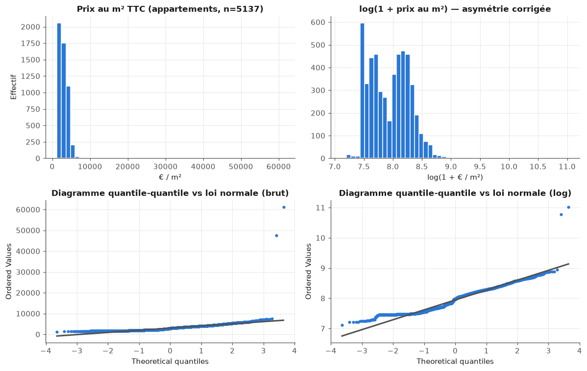

L'analyse des variables catégorielles par l'entropie (au sens du cours
d'arbres de décision) montre que `nature_lot` et `agence` portent une
information équilibrée, tandis que `motif_desistement` est concentré : 42 %
des désistements relèvent d'un seul motif dominant (financement), un
déséquilibre qui a orienté, au notebook 06, le choix du F1 par classe plutôt
que de l'exactitude comme métrique de classification.

L'analyse bivariée temporelle a mis en évidence un piège méthodologique que
j'ai d'abord manqué avant de le corriger : la corrélation de Pearson brute
entre les réservations mensuelles du groupe et le taux des crédits habitat
est quasi nulle (r = +0,07), alors que le lien économique entre les deux est
avéré. J'avais initialement rédigé la conclusion attendue avant de vérifier
la sortie de la cellule ; le chiffre réel m'a contredite. L'explication tient
à la non-stationnarité de la série : le nombre d'opérations en
commercialisation a doublé sur la période, ce qui soutient mécaniquement le
volume de réservations même quand la demande par programme s'effondre —
exactement la mise en garde du cours de séries temporelles contre la
*spurious regression*. En neutralisant l'effet de portefeuille, c'est-à-dire
en travaillant sur l'**intensité** de vente (réservations par opération
active), le lien macroéconomique apparaît nettement : r = −0,34 avec le taux
des crédits, r = +0,44 avec la confiance des ménages (Figure 2). Cette leçon
de méthode — une corrélation en niveaux peut masquer ou fabriquer une
relation sur données séquentielles — a directement structuré la démarche de
l'axe B, qui travaille sur séries transformées et contrôle l'effet
opération par un modèle à effets aléatoires plutôt que sur la série brute.

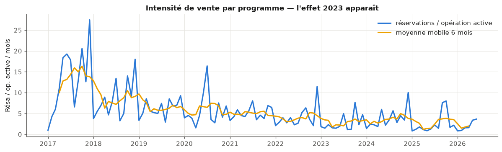

Enfin, la vérification anti-fuite (corrélation des variables candidates à la
cible provisoire de l'axe A) a confirmé que `depenses_engagees` entre dans
la définition même de la cible de dérive de marge : cette variable, et plus
généralement tout ce qui relève du réalisé comptable, est exclue des
variables explicatives de l'axe A — seule la structure du budget initial y
est utilisée.

### 4.2. SQL et Spark

Le notebook `01_preparation_sql_spark` documente la couche d'ingestion :
comment les quatre exports Excel deviennent la base SQL interrogeable, et
comment cette préparation passerait à l'échelle avec Apache Spark si la
volumétrie l'exigeait. Le catalogue `sqlite_master`, interrogeable en SQL,
confirme la présence des sept tables et des trois vues métier attendues.

J'y déroule cinq requêtes de complexité croissante, chacune répondant à une
question métier réelle. La sélection-projection identifie les opérations en
cours à l'agence de Montpellier ; la jointure avec le référentiel des
communes fait ressortir les opérations en cours dans les plus grandes villes
(Toulouse, Montpellier) et introduit l'indicateur `littoral` qui distingue
déjà deux marchés. L'agrégation avec `GROUP BY` et `HAVING` (filtrage avant
puis après agrégation) fait apparaître la concentration géographique du
portefeuille : Béziers, avec 31 opérations, et Canet-en-Roussillon dominent
le chiffre d'affaires budgété, et Le Cap d'Agde atteint 117,1 M€ avec
seulement 2 opérations — un poids concentré sur peu d'opérations, à
surveiller dans les modèles de l'axe A (Figure 3).


La vue `v_marge_operation`, affichée dans le notebook telle qu'elle est
stockée dans le catalogue de la base, pivote le sens comptable
Dépenses/Recettes par une agrégation conditionnelle `SUM(CASE WHEN ... END)`
et protège la division du taux d'engagement contre les budgets nuls : c'est
elle qui garantit que l'exploration, les modèles de l'axe A et la plateforme
partagent une définition unique de la marge. Une fonction fenêtre,
`SUM(nb_reservations) OVER (PARTITION BY id_operation ORDER BY mois)`,
produit ensuite la courbe d'écoulement cumulée de chaque opération sans
réduire le grain des données : les quatre opérations les plus vendues du
portefeuille affichent des profils très différents, démarrages en flèche
contre montées lentes par paliers (Figure 4) — modéliser cette pente et sa
sensibilité à la conjoncture est précisément l'objet du notebook 04.

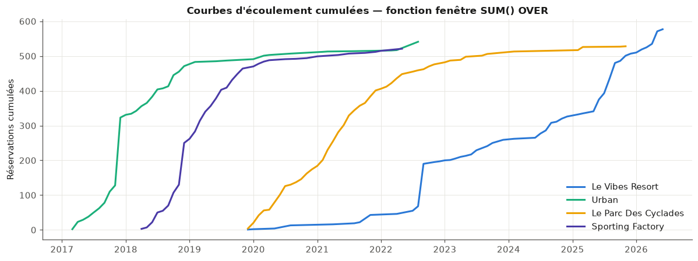

La seconde moitié du notebook reproduit cette même agrégation budgétaire en
**PySpark**, en mode local (Spark 4.1.2, quatre cœurs), pour illustrer le
paradigme MapReduce : évaluation paresseuse (les transformations ne
déclenchent aucun calcul tant qu'aucune action n'est exécutée), plan physique
explicite avec `HashAggregate` partiel par partition puis `Exchange` de
shuffle, et comptage de mots distribué sur les 64 788 libellés de postes
budgétaires (400 mots distincts, « honoraires » en tête avec 5 026
occurrences). Le contrôle croisé Spark contre SQLite tombe juste à l'euro
près (dépenses 1 561,8 M€, recettes 1 754,8 M€ dans les deux moteurs).

La mesure honnête que j'ai voulu faire — chronométrer la même agrégation en
pandas et en Spark, sur les 64 788 lignes déjà en mémoire — donne un verdict
sans ambiguïté : pandas répond en 9,9 ms (meilleur temps sur cinq essais),
Spark en 577,4 ms (meilleur temps sur trois essais), soit un rapport
d'environ 58, sans même compter les 23,9 secondes de démarrage de la session
Spark et les 5,1 secondes de conversion pandas → Spark. Sur cette
volumétrie — quelques dizaines de mégaoctets, tenant largement en mémoire —
le coût fixe de la distribution (sérialisation Python-JVM, planification des
jobs, shuffle entre partitions) n'est amorti par aucun gain : Spark est
surdimensionné. La bonne architecture pour le Copilote aujourd'hui est
SQLite et pandas ; la démonstration Spark établit que le chemin de montée en
charge existe (mêmes requêtes en `groupBy`/`pivot`, plans optimisés par le
moteur) si la volumétrie change d'échelle — par exemple si le Copilote
devait un jour couvrir l'ensemble du groupe Nexity — sans en présenter le
bénéfice comme immédiat.

### 4.3. Axe A

L'axe A répond à la première question métier : quelles opérations dérapent,
et pourquoi. Je l'ai construit en deux temps — une typologie des opérations
qui sert de comparateur (notebook 02), puis la prédiction proprement dite de
la dérive de marge (notebook 03).

**Typologie des opérations (notebook 02).** Comparer deux opérations de 2 M€
et de 50 M€ sur leurs montants n'a pas de sens : c'est la **structure** de
leur budget qui signe leur type. J'ai donc construit, pour 223 opérations
(sur 267, les 44 opérations embryonnaires — moins d'1 M€ de dépenses
budgétées — étant écartées car elles formaient des clusters singletons dans
les premiers essais), une matrice de profils de coûts : la part de chacun
des neuf postes de dépense de niveau 1 dans le budget total de l'opération,
standardisée poste par poste. Une ACP écrite à la main (valeurs et vecteurs
propres de la matrice de covariance, obtenus par résolution du problème de
maximisation de variance sous contrainte de norme via un multiplicateur de
Lagrange) montre que deux composantes résument 61 % de la variance des
profils (44,6 % puis 16,4 %) ; la vérification par SVD confirme cette
décomposition à 1,8 × 10⁻¹⁵ près. Le premier axe factoriel oppose sans
ambiguïté la promotion immobilière (construction, honoraires techniques) à
l'aménagement foncier (foncier, VRD, frais financiers).

J'ai ensuite construit une typologie par K-moyennes (implémentation maison
de l'algorithme de Lloyd, vérifiée identique à `sklearn.KMeans` à l'inertie
et à la partition près) et par classification ascendante hiérarchique
(distance de Ward), avec un accord fort entre les deux méthodes (indice de
Rand ajusté de 0,862). Les critères internes (coude, silhouette,
Davies-Bouldin) désignaient tous $K = 2$, mais cette partition ne fait que
redécouvrir la frontière entre promotion et aménagement, déjà lue sur le
premier axe de l'ACP — une validation, pas une information nouvelle. J'ai
retenu $K = 4$, la granularité la plus fine où chaque groupe conserve un
effectif substantiel et une signature de coûts nettement distincte : c'est
l'arbitrage prévu par le cours entre critère interne et évaluation externe,
par l'expertise métier. Les quatre types — nommés d'après leur profil
dominant et validés par des variables externes à la construction de la
typologie (marge, désistement, littoral) — sont le résidentiel classique
(116 opérations, construction 58 %, marge relative médiane +8,2 %, mais le
taux de désistement le plus élevé à 12 %), l'aménagement foncier (61
opérations, foncier 39 % et VRD 33 %, marge +13,2 %, désistements quasi nuls
à 1,1 %), la promotion sur foncier allégé (27 opérations, construction 57 %
mais foncier réduit à 9 %, marge la plus mince à +7,0 %) et l'aménagement
lourd VRD et taxes (19 opérations, 38 % en zone littorale contre 9 % pour
l'aménagement courant, marge la plus confortable à +14,4 %) (Figure 5).

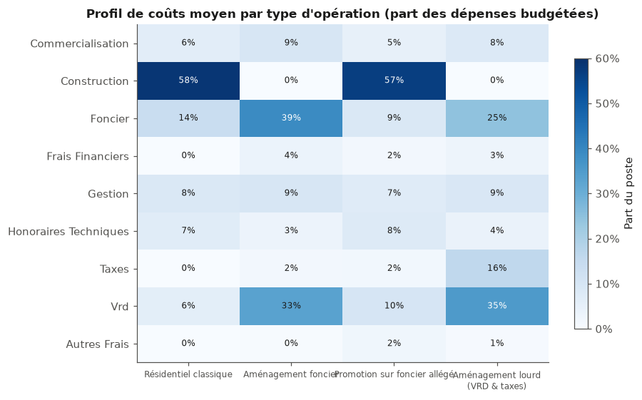

Cette typologie répond directement au besoin B-A3 : la similarité cosinus
entre profils standardisés fournit, pour toute opération, ses voisines de
structure de coûts comparable. Sur l'opération Le Parc des Cyclades (marge
budgétée +6,5 %), ses cinq voisines les plus proches (cosinus ≥ 0,945)
affichent des marges de +7,9 % à +11,3 % — un référentiel objectif de 2 à 5
points de marge que la plateforme n'aurait pas pu produire sans cette
typologie.

**Prédiction de la dérive de marge (notebook 03).** La cible est le taux de
variation de la marge entre le budget d'engagement et une marge « à
terminaison » estimée poste par poste par la règle $D^{\text{term}} =
\sum_p \max(\text{engagé}_p, \text{budget}_p)$ — un dépassement déjà engagé
est acquis, le reste du budget sera dépensé. Le périmètre d'apprentissage,
arrêté aux opérations engagées à au moins 60 % et de marge budgétée
supérieure à 50 k€, compte 123 opérations. Sur cet échantillon, 34
opérations (28 %) subissent une dérive matérielle (plus de 2 % de la marge
budgétée) (Figure 6). Les variables explicatives n'utilisent que la
structure du budget initial (parts de postes), les caractéristiques de
l'opération et les signaux commerciaux — jamais l'engagé ou le facturé, qui
définissent la cible.

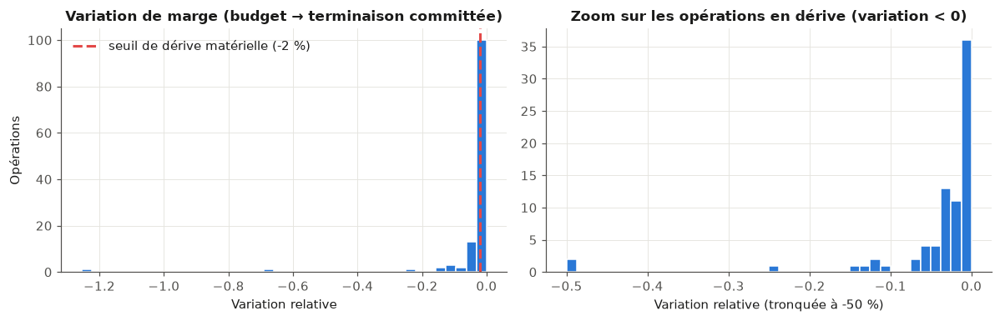

La régression par moindres carrés ordinaires, écrite en forme close puis
retrouvée par une descente de gradient maison (pas $\alpha = 1/L$ avec $L$
la plus grande valeur propre de la Hessienne, convergence vérifiée à
0,145 de la solution exacte après 400 itérations), donne un R² de test de
0,077 : la structure budgétaire initiale explique une part réelle mais
modeste de la dérive. La régularisation Ridge (λ choisi par validation
croisée sur cinq plis) et Lasso n'améliorent pas ce chiffre — attendu, la
moitié de l'échantillon étant à variation nulle. L'intérêt de la
régularisation Ridge est ailleurs : elle rend lisibles, sur variables
standardisées donc comparables, les facteurs structurels de dérive — le
poids des postes techniques (foncier, VRD, construction) et une marge
relative budgétée confortable qui protège de la dérive (Figure 7).

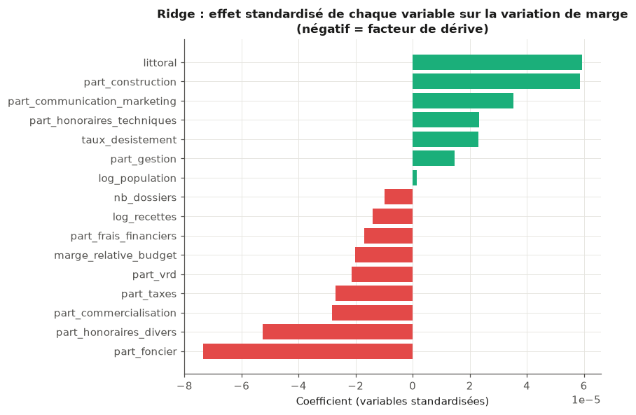

Le R² test modeste m'a conduite à basculer en **classification** du risque :
« à risque » si la dérive dépasse −2 % de la marge budgétée. J'ai comparé,
en validation croisée à 5 plis et sur la métrique F1 (imposée par le
déséquilibre des classes), une régression logistique équilibrée, un SVM à
noyau linéaire et à noyau RBF, un arbre de décision (profondeur choisie par
validation croisée), une forêt aléatoire et un perceptron multicouche. Les
résultats se tiennent dans un mouchoir : arbre CART (F1 = 0,340), forêt
aléatoire (0,306), SVM linéaire (0,303), régression logistique (0,283), MLP
(0,262), SVM à noyau RBF (0,257), contre 0 pour la baseline qui prédit
systématiquement « saine ». Le MLP illustre exactement la prédiction de la
théorie de la généralisation à petit échantillon : F1 de 0,913 sur
l'entraînement contre 0,262 en validation croisée, signature nette du
sur-apprentissage. J'ai retenu la forêt aléatoire (F1 = 0,306) pour la
plateforme, sérialisée avec le modèle Ridge explicatif.

Ces résultats, je les assume comme un système d'alerte précoce honnêtement
partiel : la structure budgétaire initiale prédispose à la dérive, elle ne
la détermine pas — l'aléa de chantier (contentieux, géotechnique) échappe
par construction aux données disponibles à l'engagement. Un F1 de 0,30 contre
0 en baseline est un signal réel, pas un oracle, et je le présente comme tel
dans la plateforme.

### 4.4. Axe B

L'axe B répond à la deuxième question métier : à quel rythme le stock
s'écoule, et comment ce rythme réagit à la conjoncture. Le notebook
`04_vitesse_ecoulement` mobilise trois approches complémentaires sur un
panel opération × mois de 3 230 observations (160 opérations, durée de
commercialisation médiane de 16 mois), construit en réintroduisant les mois
à zéro réservation entre la première et la dernière vente de chaque
opération — sans quoi le rythme moyen serait mécaniquement surestimé.

Le **modèle à effets aléatoires** (formalisme de Laird-Ware), qui traite
l'attractivité intrinsèque de chaque opération comme un effet aléatoire non
observé, donne un coefficient de corrélation intraclasse de 0,66 : les deux
tiers de la variance du rythme de vente tiennent à l'opération elle-même
(emplacement, produit, prix), un tiers aux fluctuations temporelles — la
réponse quantifiée au besoin B-B2. L'effet du taux des crédits est
fortement significatif ($p < 10^{-15}$) : +1 point de taux se traduit par
une multiplication des réservations mensuelles par $e^{-0{,}216} \approx
0{,}81$, soit environ **−19 %**. Le modèle pooled OLS, qui ignore la
structure du panel, surestime cet effet (−0,242 contre −0,216) en confondant
la conjoncture avec l'effet de composition du portefeuille dans le temps.

À l'échelle agrégée, j'ai suivi la procédure du cours de séries temporelles
pour ajuster une **régression à erreurs ARIMA** sur l'intensité mensuelle de
vente (114 mois, moyenne 5,56 réservations par opération active) : spécifier
l'ARIMA des erreurs, vérifier que les résidus ressemblent à un bruit blanc
(test de Ljung-Box), puis retenir, parmi les modèles aux résidus blancs,
celui d'AICc minimal. Le modèle retenu, ARIMA(1,1,1)×(1,0,1,12) saisonnier
(AICc = 611,7, Ljung-Box p = 0,224), donne un résultat que je juge instructif
précisément parce qu'il contredit l'intuition : une fois les erreurs
correctement modélisées, le coefficient du taux d'intérêt sur la série
agrégée perd toute significativité (p = 0,82). Cent quatorze points mensuels
ne suffisent pas à séparer l'effet du taux — lent et persistant — de la
dynamique propre de la série ; une régression naïve en niveaux aurait donné
un taux « très significatif », illusion typique de la *spurious
regression*. J'ai donc combiné les deux modèles selon ce que chacun sait
faire : l'ARIMAX fournit la trajectoire de référence (dynamique et
saisonnalité, taux au statu quo), et l'élasticité solidement identifiée par
le panel (β = −0,216, p < 10⁻¹⁵) traduit chaque scénario de taux en facteur
multiplicatif — l'esprit d'une fonction de transfert. Sous cette
construction, une détente à 2,5 % en 2026 porte le rythme moyen à +6 % par
rapport au statu quo (3,1 %), une remontée à 3,5 % le réduit de 3 % (Figure
8).


À l'échelle d'une opération, la courbe des réservations cumulées suit un
profil en S que j'ai ajusté par une **fonction sigmoïde** $F(t) = L /
(1 + e^{-k(t-t_0)})$ par moindres carrés non linéaires, sur les 28 opérations
terminées du portefeuille (au moins 90 % des lots vendus, au moins 40 lots,
au moins 18 mois d'historique). La sigmoïde bat l'ajustement linéaire sur 25
de ces 28 opérations (Figure 9) ; le paramètre de vitesse $k$ varie du simple
au quintuple selon les opérations — une signature de l'adéquation
prix-marché au lancement, réutilisable par l'axe C — et le délai médian
d'écoulement à 90 % du potentiel est d'environ 20 mois, un chiffre qui cale
directement les échéanciers de trésorerie visés par le besoin B-B3.


### 4.5. Axe C

L'axe C répond à la troisième question métier : à quel prix vendre chaque
lot. Le notebook `05_optimisation_prix` construit d'abord un **modèle
hédonique** — un logement comme somme de caractéristiques valorisées
séparément — sur les 5 064 appartements réservés, vendus ou livrés entre
2016 et 2026, en excluant les 127 appartements encore en stock qui sont
précisément ceux que le modèle doit évaluer. La cible est le log-prix au m²,
choix motivé par le constat de log-normalité du notebook 00. OLS, Ridge et
Lasso donnent des résultats quasiment identiques (R² test de 0,886, RMSE de
test de 0,111 en log, soit une erreur type d'environ 11 % sur le prix) : avec
plus de 5 000 observations pour une trentaine de coefficients, la
régularisation n'a presque rien à stabiliser, et j'ai retenu l'OLS, le plus
interprétable.

Les primes hédoniques sont économiquement cohérentes : une prime d'étage
(+6,0 % par écart-type), une prime d'exposition Sud (+2,6 % contre
Est-Ouest), une décote nette du logement social réglementé (−62,8 % contre
le libre) et une élasticité-taille négative (−3,1 % par écart-type de
log(surface), la demande de petites surfaces étant plus dense). L'effet millésime
est particulièrement parlant : +19,0 % en 2023 et +20,9 % en 2026 par
rapport à 2016, un plateau atteint après 2022 (Figure 10) — les prix du neuf
n'ont pas baissé avec la remontée des taux, c'est le **volume** de ventes
qui s'est ajusté, comme l'a montré l'axe B, comportement typique d'un
promoteur qui défend sa grille plutôt que de la démentir.

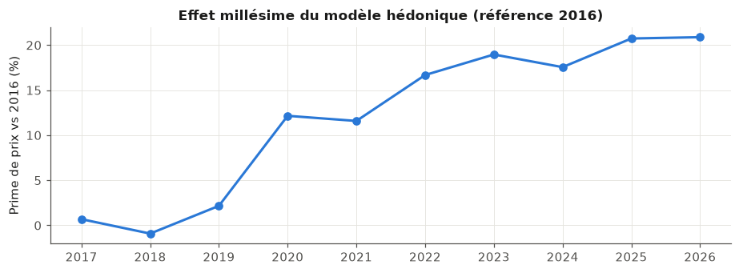

Appliqué aux 127 appartements en stock, l'écart entre le prix grille et le
prix hédonique prédit sert de diagnostic (besoin B-C3) : au-delà de ±1
RMSE, 103 appartements sont dans le marché, 16 sont sous-cotés et 8 sont
surcotés — soit 24 lots (19 %) qui méritent une revue de grille (Figure 11).


L'optimisation exige de savoir comment la demande réagit au prix. Mon
estimation interne, en régressant le rythme de vente sur 95 opérations,
donne une élasticité de −0,81 (IC 95 % [−3,62 ; 1,99], p = 0,57) : le bon
signe, mais non significative — les grilles du groupe sont déjà globalement
alignées sur le marché, et 95 opérations ne suffisent pas à trancher plus
finement. J'ai retenu ε = −1, une valeur compatible avec cette estimation et
cohérente avec le bas de la fourchette de la littérature sur la demande de
logements neufs (Meen, 2001 ; DiPasquale et Wheaton, 1994) — un choix
prudent, documenté plutôt que masqué.

Le problème d'optimisation — maximiser le revenu attendu sous une contrainte
de volume à écouler — se résout d'abord analytiquement, par un
multiplicateur de Lagrange. Pour ε = −1, la condition du premier ordre se
simplifie remarquablement en $p_j \delta_j = \lambda$ : **la remise optimale
en euros est identique sur tous les lots**, quel que soit leur prix, donc un
pourcentage de remise plus fort sur les lots les moins chers. Sur
l'opération ARPEGGIO (18 lots libres en stock, de 166 à 461 k€), viser +8 %
de rythme de vente donne λ* = −23 015 €, avec des ajustements individuels de
−5,0 % à −13,9 % selon le prix du lot. La résolution numérique sous bornes
commerciales (−10 % à +5 % par lot), par montée de gradient projetée puis
vérifiée par SLSQP, converge vers la même solution à 0,006 près, avec deux
lots sur 18 à une borne active. Le résultat que je retiens est non trivial :
la politique de remise actuelle, au cas par cas, ne respecte pas cette
règle d'égalité en euros — un point concret que le Copilote peut corriger.

### 4.6. Signaux faibles (texte et réseau)

Le notebook `06_texte_et_reseau` exploite ce que les champs structurés ne
captent pas : les 9 688 commentaires libres de vente (67 % des 14 428
dossiers) et le réseau des vendeurs.

**Texte.** J'ai appliqué les formules exactes du cours de recherche
documentaire (TF-IDF en base 10, similarité cosinus) à la main sur un
mini-corpus de trois commentaires réels, avant de passer à l'échelle avec
`TfidfVectorizer` sur le corpus dédupliqué (1 346 documents, 535 termes,
creux à 98,8 %) — en documentant explicitement l'écart entre la formule du
cours et l'implémentation lissée de scikit-learn, dont seule l'échelle
diffère, pas le classement des termes. Le moteur de recherche qui en résulte
(requête → vecteur → similarités → tri → top-k, le pipeline exact du cours)
répond aux deux besoins métier : « refus de prêt banque » remonte des
dossiers tous désistés (cosinus de 0,68 à 0,90), « remise prix hors pack »
remonte des ventes maintenues documentant des remises invisibles des champs
structurés.

Prédire le désistement à partir du texte exige d'abord d'écarter la fuite de
cible la plus évidente : 314 commentaires mentionnent explicitement le
désistement (« annulation », « résiliation »...) et sont désistés à 98,4 %
— je les ai retirés du corpus d'apprentissage, qui compte alors 9 374
commentaires pour un taux de désistement de 12,7 %. Sur ce corpus filtré, un
Naive Bayes multinomial (lissage de Laplace, comptages bruts) atteint un F1
de 0,343 sur la classe désistée (rappel 0,50, précision 0,26), contre 0 pour
la baseline majoritaire et 0,254 pour une régression logistique — plus
précise (0,72) mais quasi muette (rappel de 0,15). Pour un système d'alerte
précoce, où manquer un désistement coûte plus cher qu'une fausse alerte, le
Naive Bayes est préférable malgré sa précision plus faible. Les termes les
plus discriminants sont cohérents avec le métier — « refus », « retirés »
(plis SRU non retirés) penchent vers le désistement, le vocabulaire des
ventes en bloc et du logement social vers le maintien (Figure 12) — mais je
dois être honnête sur la force du signal : F1 ≈ 0,34 reste faible, la
plupart des commentaires décrivant les conditions de vente à la réservation
plutôt que la fragilité du client. Le texte est retenu comme signal
d'appoint pour l'axe A, pas comme prédicteur autonome.

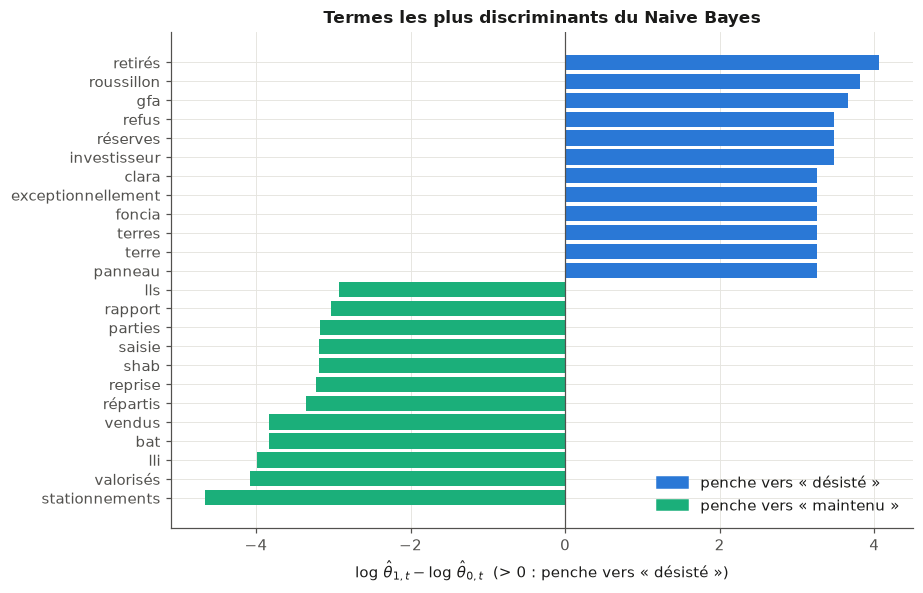

L'entropie des motifs de désistement (au sens du cours d'arbres de
décision) et la divergence de Kullback-Leibler par rapport au profil groupe
révèlent un résultat que je n'attendais pas au départ : l'agence de
Salon-de-Provence a un profil très atypique (KL ≈ 3,0 bits contre moins de
0,3 bit pour toutes les autres agences, entropie effondrée à 0,47 bit contre
1,5 bit pour le groupe), non pas un comportement client différent mais un
défaut de saisie — 90 % de ses motifs sont enregistrés sous « Autres
motifs » (Figure 13). La divergence KL sert ici d'abord de détecteur de
qualité de données, avant d'être un signal commercial.

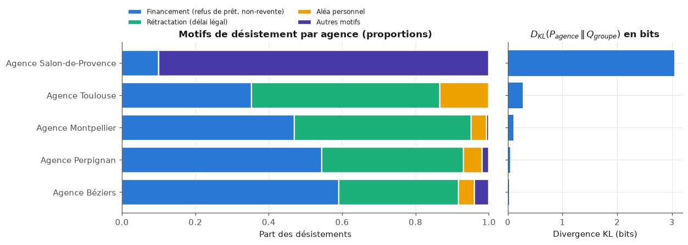

**Réseau.** Le graphe biparti vendeurs-opérations (209 vendeurs à au moins 3
dossiers, couvrant 98,8 % des dossiers attribués, 104 opérations, 711
arêtes) révèle une concentration commerciale forte : deux pivots, le réseau
interne Angelotti Promotion et le prescripteur externe Valoriciel,
concentrent à eux deux 51,6 % des dossiers attribués et les deux plus fortes
intermédiarités du réseau (Figure 14) — une dépendance commerciale
caractérisée, dont la défaillance toucherait la quasi-totalité des
opérations concernées. Le risque n'est pas uniforme entre ces deux pivots :
Valoriciel désiste 29,6 % de ses dossiers, contre 9,0 % pour le réseau
interne ; en moyenne, les dix vendeurs les plus centraux désistent même
légèrement moins (16,9 %) que les vendeurs périphériques (20,2 %) — la
centralité en elle-même n'est pas le facteur de risque, c'est la dispersion
entre pivots qui compte.

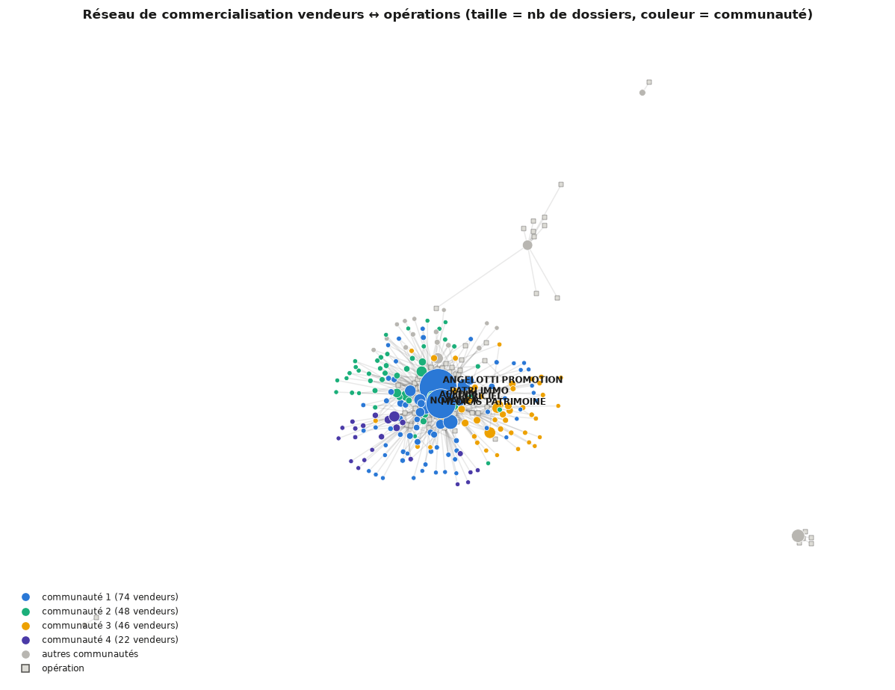

## 5. Plateforme Streamlit

Les six notebooks se referment sur une plateforme, `plateforme/app.py`, qui
restitue leurs résultats à la direction financière du Groupe Angelotti. Sa
conception a changé une fois en cours de projet : la première version,
construite dans le vocabulaire des notebooks (F1, R², coefficients), a reçu
un retour clair du commanditaire — trop « data science » pour ses
destinataires. Je l'ai refondue en langage métier : les métriques de
validation restent dans les notebooks, l'écran n'affiche que des décisions
possibles (niveau d'alerte, prix de marché estimé, sensibilité de la demande
au coût du crédit). Le périmètre a été restreint dans le même mouvement aux
147 opérations de **promotion** du portefeuille (`operations.activite =
'Promotion'`) : l'aménagement foncier (120 opérations), dont la logique
économique est différente, en est exclu — les notebooks, eux, conservent les
267 opérations, car la distinction promotion/aménagement y est un résultat
d'analyse (la typologie du notebook 02) plutôt qu'un filtre a priori. Le
modèle de risque de marge, entraîné sur toutes les activités du portefeuille,
ne score à l'écran que les lignes de promotion.

L'application compte cinq pages, chacune vérifiée sans exception par des
tests automatisés (`AppTest` de Streamlit), et que j'ai re-vérifiées en
exécutant l'application dans son intégralité au moment de rédiger ce
chapitre.

La page **Vue d'ensemble** synthétise le portefeuille de 147 opérations de
promotion : 421 lots principaux en stock, un rythme de vente récent de 4,8
réservations par mois et par opération, un taux de crédit habitat de
3,11 %, et un tableau des cinq opérations à examiner en priorité selon leur
niveau d'alerte (Figure 15).

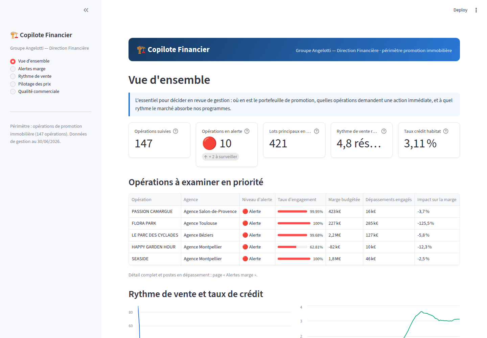

La page **Alertes marge** reprend, en langage métier, le score de risque
sérialisé par le notebook 03 : sur les 68 opérations en cours suffisamment
engagées, 10 sont en alerte, 2 à surveiller et 56 conformes ; chaque
opération peut être examinée en détail, avec la liste des postes budgétaires
effectivement en dépassement, en euros (Figure 16).

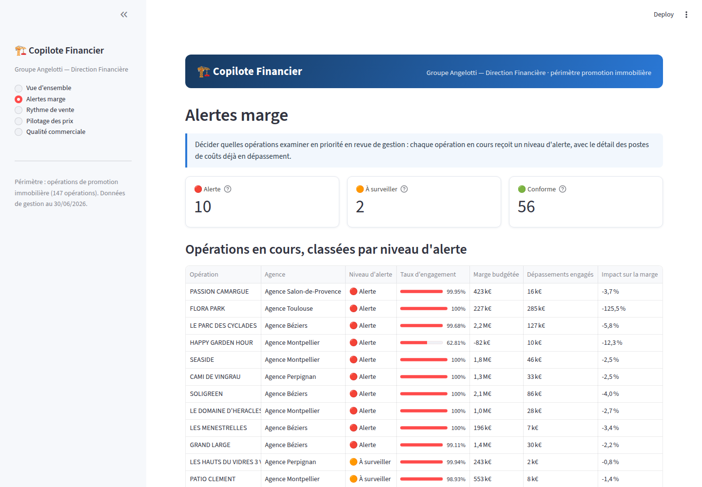

La page **Rythme de vente** transpose le modèle à effets aléatoires du
notebook 04 en simulateur : un curseur sur le taux des crédits habitat 2026
traduit immédiatement l'élasticité estimée (−19 % de réservations par point
de taux) en rythme attendu et en volume de réservations sur un an pour les
opérations en cours de commercialisation, complété par la trajectoire
d'écoulement sigmoïde d'un programme choisi par l'utilisateur (Figure 17).

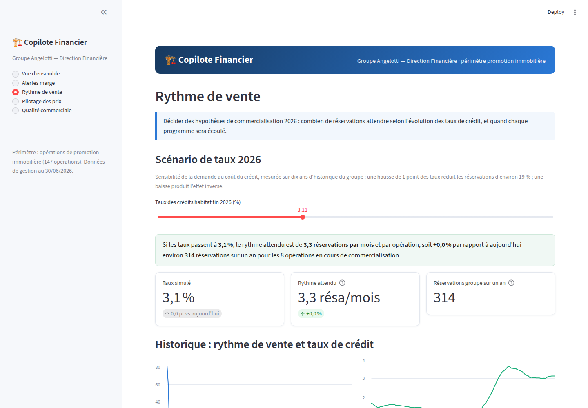

La page **Pilotage des prix** applique le modèle hédonique du notebook 05,
ré-entraîné au démarrage sur le seul périmètre de promotion et mis en cache :
sur les 127 appartements en stock évalués, 111 sont dans le marché, 4
au-dessus et 12 en dessous, avec une marge d'incertitude d'environ ±13 %
(un peu plus large que le RMSE de 11 % du notebook, la ré-estimation sur le
seul sous-ensemble promotion disposant de moins d'observations comparables).
Un simulateur d'ajustement de grille, qui redéploie directement la
résolution SLSQP sous contrainte du notebook 05, propose un prix par lot
pour un objectif de vente choisi par l'utilisateur, avec bornes de gestion à
−10 % et +5 % (Figure 18).

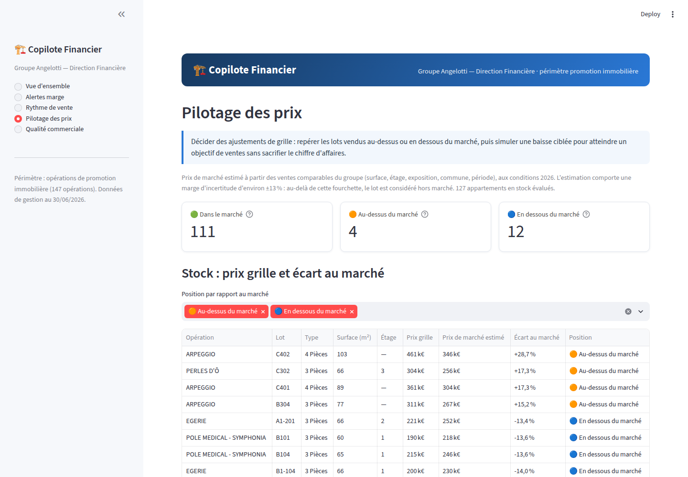

La page **Qualité commerciale**, enfin, restitue les deux résultats du
notebook 06 : la répartition des motifs de désistement par agence, avec une
alerte automatique sur Salon-de-Provence (90 % de motifs non renseignés,
retrouvée à l'identique de l'analyse par entropie et divergence KL), et un
moteur de recherche de dossiers similaires par similarité cosinus, pour
documenter un cas ou préparer une revue d'agence (Figure 19).

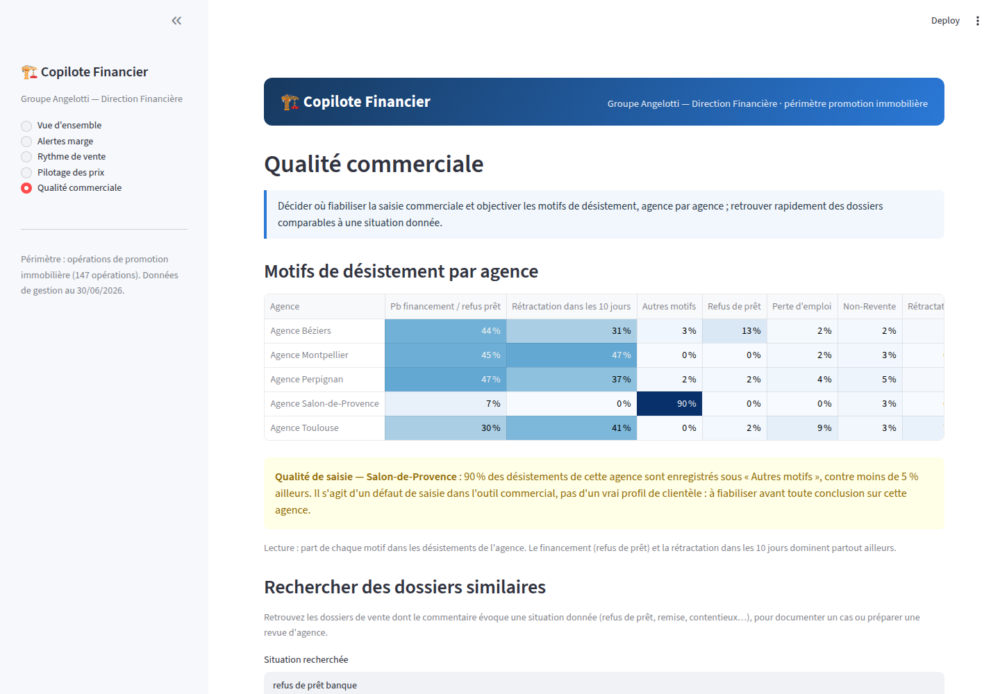

Sur le plan technique, les modèles rapides (le modèle hédonique) sont
ré-entraînés à chaque démarrage de l'application, avec mise en cache
(`st.cache_resource`), tandis que le classifieur de risque de marge, plus
coûteux à entraîner, est sérialisé une fois par le notebook 03 (`joblib`) et
simplement chargé par la plateforme : tout reste régénérable depuis les
exports bruts, conformément à l'exigence de reproductibilité posée dès le
cadrage du projet. Les pages reprennent systématiquement les définitions SQL
des vues métier et les conventions anti-fuite des notebooks : une seule
source de vérité par indicateur, de l'exploration jusqu'à l'écran. Aucune
donnée nominative de client (nom, date de naissance) n'est affichée ni
utilisée comme variable, conformément à l'exigence de confidentialité.

## 6. Périmètre et limites

Je referme ce chapitre en assumant explicitement le périmètre et les limites
du Copilote Financier, plutôt que de les laisser implicites.

Les données budgétaires sont une **photo à date d'export** : le système de
gestion ne conserve pas l'historique des révisions budgétaires, si bien que
le « taux de variation de marge » de l'axe A compare le budget initial au
réalisé (engagé et facturé) constaté à la date de l'export, et non une
trajectoire complète. Les opérations trop peu avancées (engagement inférieur
à 60 %) sont exclues de l'apprentissage supervisé de l'axe A pour cette
raison : les dépenses engagées n'y sont pas encore un bon estimateur des
dépenses finales.

Le portefeuille compte 267 opérations, dont seulement 123 exploitables pour
l'apprentissage de l'axe A (engagement ≥ 60 %, marge budgétée > 50 k€,
recettes budgétées > 0) : un échantillon volontairement restreint, qui
justifie la préférence donnée à des modèles simples et régularisés, validés
systématiquement en validation croisée, et une lecture prudente des
intervalles de confiance — l'élasticité prix-demande de l'axe C, par
exemple, n'est pas significative en interne (p = 0,57) et j'ai choisi de le
dire plutôt que de le masquer derrière une valeur ponctuelle présentée sans
son incertitude.

Les recommandations de prix de l'axe C sont des aides à la décision, non des
prix opposables : l'élasticité retenue (ε = −1) est estimée sur des données
historiques agrégées et appliquée à des lots individuels, et les
interactions concurrentielles avec des programmes voisins ne sont pas
modélisées. De même, les scénarios de taux de l'axe B ignorent
l'incertitude propre à la prévision des taux et de la confiance des ménages
eux-mêmes — seule l'incertitude de la trajectoire ARIMA, à taux fixé, est
représentée par l'intervalle de confiance affiché.

Enfin, le périmètre de la plateforme (147 opérations de promotion) est
volontairement plus étroit que celui des notebooks (267 opérations, toutes
activités) : ce choix, issu d'un retour direct du commanditaire sur la
lisibilité de l'outil pour son usage métier, signifie que l'activité
d'aménagement foncier, bien que modélisée et analysée dans les notebooks
(elle constitue notamment deux des quatre types de la typologie du notebook
02), n'est aujourd'hui pas pilotée par le Copilote à l'écran. Étendre la
plateforme à ce second métier, dont la dynamique de marge diffère
sensiblement de la promotion, est le prolongement naturel de ce travail.
