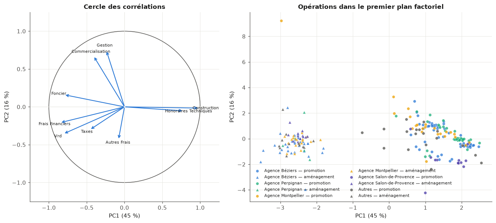
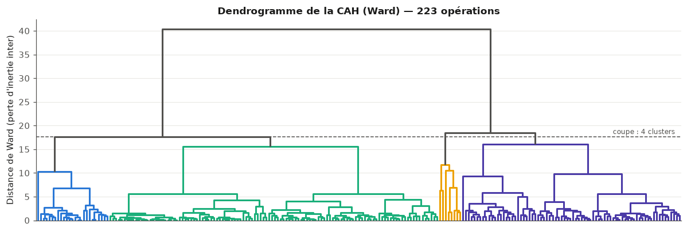
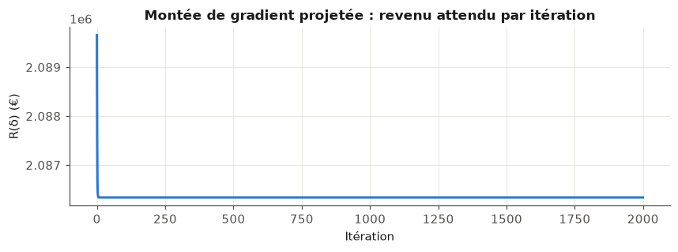
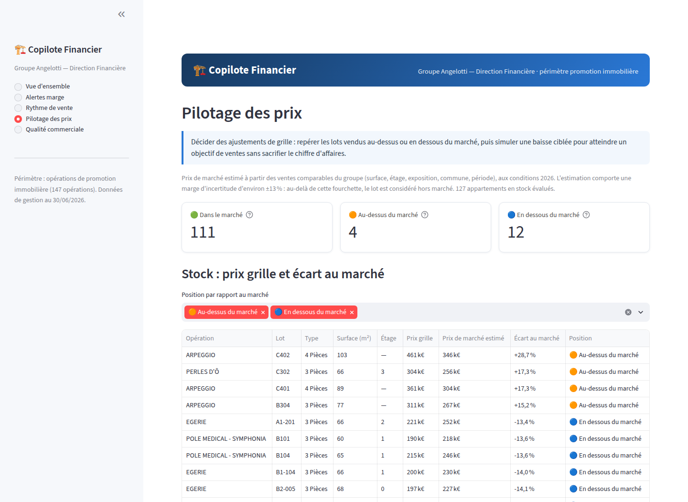

> **Note de rédaction.** Ce chapitre a été préparé avec l'aide d'un
> assistant : il constitue une base de travail factuelle, à reformuler et à
> s'approprier avant intégration au mémoire. Tous les chiffres proviennent
> des notebooks exécutés du dépôt `MemoireM2S2` (branche
> `claude/copilote-financier-angelotti-72c614`) ; chaque affirmation est
> traçable jusqu'à une cellule de notebook, une requête SQL ou une capture
> d'écran de la plateforme.

Ce chapitre présente le projet Data Science annoncé dans mon mémoire de
mi-parcours : le « Copilote Financier », un outil d'aide à la décision
construit sur les données de gestion du groupe Angelotti. Après un semestre
consacré à la fiabilisation de l'architecture de données dans le cadre de
la migration vers l'ERP SPO, ce projet marque le retour à la modélisation
statistique, en mobilisant l'ensemble des méthodes vues durant le Master
sur un cas d'entreprise réel.

# Contexte

Le groupe Angelotti conçoit, finance et commercialise des programmes
immobiliers en Occitanie et en région PACA. Chaque opération de promotion
est portée par une société dédiée (le plus souvent une SCCV) et vit sur un
cycle long : un budget prévisionnel est arrêté à l'engagement (foncier,
VRD, construction, honoraires, commercialisation, contre recettes
attendues), puis la vie du chantier et de la commercialisation fait
dériver ce prévisionnel — appels d'offres plus chers qu'anticipé,
désistements d'acquéreurs, rythme de vente ralenti par la conjoncture. La
direction financière pilote aujourd'hui ces dérives opération par
opération, sur tableurs, sans vision statistique transverse.

## Problème métier

Trois questions structurent les revues de gestion et ont servi de fil
conducteur au projet.

La première concerne la **marge** : quelles opérations sont en train de
déraper financièrement, et peut-on le détecter avant que la facturation ne
rende la dérive irréversible ? La deuxième concerne l'**écoulement** : à
quel rythme le stock de lots va-t-il se vendre, sachant que la période
2022-2024 a montré la sensibilité de la demande au coût du crédit (le taux
moyen des crédits habitat est passé d'environ 1,1 % à 4 % avant de refluer
vers 3,1 % mi-2026) ? La troisième concerne les **prix** : à quel niveau
positionner chaque lot du stock, alors que les remises commerciales sont
aujourd'hui accordées au cas par cas, sans règle explicite ?

### Besoins par axe et exigences non fonctionnelles

Ces trois questions ont été reformulées en trois axes de modélisation,
complétés d'un axe transverse exploitant les données textuelles et le
réseau de commercialisation :

* **Axe A — risque de marge** : produire un score de risque de dérive par
  opération, expliquer les facteurs de cette dérive (les coefficients
  doivent être lisibles par un contrôleur de gestion), et permettre de
  comparer une opération à ses semblables ;
* **Axe B — vitesse d'écoulement** : prévoir le nombre de réservations
  mensuelles par opération, en séparant l'effet propre du programme
  (localisation, produit, prix) de l'effet conjoncture (taux d'intérêt,
  moral des ménages), et simuler des scénarios de taux pour 2026 ;
* **Axe C — optimisation des prix** : estimer un prix de marché par lot,
  signaler les lots sur- ou sous-cotés, et recommander des ajustements de
  prix sous contrainte d'écoulement et de marge ;
* **Axe transverse** : exploiter les 9 688 commentaires libres de vente et
  les motifs de désistement comme signaux précoces, et cartographier la
  dépendance du groupe à ses vendeurs et prescripteurs.

Quatre exigences non fonctionnelles ont été posées dès le cadrage :
la **reproductibilité** (tout se reconstruit depuis les exports bruts par
un seul script), l'**interprétabilité** (chaque score affiché est
accompagné des variables qui le déterminent), la **confidentialité** (les
données nominatives des clients ne sont ni affichées ni utilisées comme
variables de modèle) et l'acceptation d'un **petit échantillon** : avec
267 opérations au total, la préférence va à des modèles simples,
régularisés et validés en validation croisée, plutôt qu'à des
architectures complexes invérifiables à cette échelle.

## Objectif du dashboard

Le livrable final n'est pas un rapport d'étude mais un outil utilisable :
une application web destinée à la direction financière, qui traduit les
modèles en décisions possibles. Un retour de l'entreprise en cours de
projet a d'ailleurs imposé une refonte complète de l'interface : la
première version, trop marquée par le vocabulaire de la data science
(métriques de validation, termes de modélisation), a été réécrite en
langage de gestion — niveaux d'alerte, prix de marché estimé, sensibilité
de la demande au coût du crédit — et son périmètre a été restreint aux
seules opérations de **promotion immobilière** (147 opérations),
l'activité d'aménagement foncier relevant d'une logique économique
différente. Cette refonte est détaillée en section 5.

# Données disponibles

## Données internes

Le point de départ est constitué de quatre exports du système de gestion,
d'un volume total d'environ 32 Mo :

| Export | Grain | Volumétrie | Usage |
|---|---|---|---|
| Grille de Prix Avec Désistements | lot × dossier de vente | 16 467 lignes, 163 colonnes, 196 opérations | ventes, prix, dates, désistements |
| Budget & EFR | poste analytique de niveau 3 | 65 000 lignes, 267 opérations | budget, engagé, facturé par poste |
| A_DM_BUDGET_MONTANT_GESTION_LIVE | poste budgétaire (hiérarchie complète) | 79 106 lignes | contrôle de cohérence |
| 06_Informations Lots | dossier désisté | 2 164 lignes | détail client et canal des désistements |

L'exploration a révélé deux pièges qui auraient faussé toute la suite si
je les avais ignorés. D'abord, le fichier « 06_Informations Lots », malgré
son nom, ne contient pas la liste des lots : ses 2 164 lignes sont toutes
des dossiers **désistés** (2 157 « Désisté » et 7 « Résolution de
vente ») ; c'est un export de détail des désistements, et la table
maîtresse des lots est en réalité la grille de prix. Ensuite, le fichier
« Budget & EFR » affiche exactement 65 000 lignes, un chiffre rond qui
ressemblait à une troncature d'export. La réconciliation avec le fichier
LIVE (qui porte la hiérarchie budgétaire complète) a montré qu'il n'en est
rien : les totaux de dépenses budgétées coïncident à l'euro près sur les
118 opérations jointes par leur ancien code (écart médian nul), et les
65 000 lignes se décomposent en 64 788 postes de niveau 3 plus 212 lignes
de synthèse. J'en ai tiré une règle de travail : quand deux sources
décrivent le même objet, les réconcilier avant d'en écarter une.

Le nettoyage a ensuite traité les problèmes classiques de ces exports :
harmonisation des natures de lot (« appt » et « Appartement », « stat » et
« Parking extérieur » ont été regroupés en huit familles), fusion des
doublons orthographiques de communes (91 orthographes pour 90 communes),
conversion en valeurs manquantes des surfaces et prix à zéro (valeurs
sentinelles des stationnements et lots non déployés) et suppression des
artefacts d'export Excel dans les textes libres.

## Données externes

Trois sources publiques complètent les données internes, toutes
récupérées par script pour rester re-téléchargeables :

* le **taux moyen des crédits habitat en France**, série mensuelle de la
  Banque centrale européenne (série MIR, janvier 2015 à avril 2026,
  prolongée par la dernière valeur connue pour compenser le délai de
  publication) ;
* l'**indicateur de confiance des ménages**, série mensuelle Eurostat
  (janvier 2015 à juin 2026) ;
* un **référentiel des 90 communes** d'implantation (population,
  département, coordonnées géographiques) construit via l'API publique
  geo.api.gouv.fr, enrichi d'une distance au littoral calculée depuis les
  coordonnées — un indicateur simple de l'attractivité « bord de mer »
  d'une partie du portefeuille.

# Architecture technique

L'architecture suit une chaîne simple et entièrement rejouable :

```
donnéebrut/ (4 exports Excel)          data/externe/ (BCE, Eurostat, geo.api)
        |                                       |
        +---------> src/nettoyage.py <----------+
                         |      harmonisation, typage, dédoublonnage
                         v
                src/base_sql.py ---> data/copilote.db (SQLite)
                                     7 tables + 3 vues SQL métier
                         |
         +---------------+---------------------------+
         v               v                           v
   notebooks/       modèles entraînés          plateforme/ (Streamlit)
   00 à 06          (sérialisés)               5 pages pour la direction
```

Le cœur est une base **SQLite** en schéma en étoile : trois dimensions
(opérations, communes, conjoncture mensuelle) et quatre tables de faits
(64 788 lignes budgétaires, 14 123 lots, 14 428 dossiers de vente, 2 164
désistements détaillés), reliées par la clé d'opération. Trois vues SQL
encapsulent les calculs métier partagés — marge budgétée contre engagée
par opération, réservations par opération et par mois, état du stock — de
sorte que les notebooks et la plateforme utilisent exactement les mêmes
définitions. La commande `python src/base_sql.py` reconstruit l'ensemble
depuis les exports bruts en quelques secondes.

Les notebooks eux-mêmes sont générés et ré-exécutés de bout en bout par
des scripts versionnés : les sorties enregistrées dans le dépôt sont donc
réelles, et chaque chiffre cité dans ce chapitre correspond à une cellule
exécutée. Une cellule d'amorçage commune permet en outre de les ouvrir
dans Google Colab : elle clone le dépôt (privé, via un jeton en lecture
seule), reconstruit la base et installe les dépendances manquantes — une
nécessité pratique, les postes de l'entreprise ne permettant pas
d'installation locale.

# Notebooks et résultats

La démarche est découpée en sept notebooks, chacun couvrant une étape et
un ensemble de méthodes du Master. Je présente ici les résultats
principaux ; le détail des dérivations et des diagnostics figure dans les
notebooks.

## Exploration et nettoyage des données brutes

Le notebook d'exploration suit la démarche vue en cours d'EDA :
formalisation du problème, contrôle de qualité, analyses univariée et
bivariée, traitement des valeurs manquantes, contrôle des fuites de cible.

Deux résultats de cette phase ont structuré toute la suite. Le premier
concerne la **distribution des prix**. Le prix au mètre carré des
appartements est fortement asymétrique à droite ; après transformation
logarithmique, le diagramme quantile-quantile devient presque rectiligne
(Figure 1) : l'hypothèse log-normale est tenable, ce qui justifie de
modéliser le logarithme du prix dans l'axe C et rend la détection
d'observations aberrantes par z-score raisonnable sur l'échelle
transformée.


Le second est une leçon de méthode sur les **corrélations en niveaux**.
La corrélation de Pearson entre les réservations mensuelles du groupe et
le taux des crédits habitat est quasi nulle (+0,07), alors que le lien
économique est avéré. L'explication tient à la croissance du
portefeuille : le nombre d'opérations en commercialisation a fortement
augmenté sur la période, ce qui soutient le volume total de réservations
même quand la demande par programme s'effondre. En passant à
l'**intensité** — les réservations par opération active (Figure 2) — le
lien apparaît : la corrélation vaut −0,34 avec le taux et +0,44 avec la
confiance des ménages. J'ajoute une honnêteté de démarche : j'avais
d'abord rédigé la conclusion attendue avant de vérifier la sortie de la
cellule, et le chiffre réel m'a contredite ; l'épisode est documenté dans
le journal de bord et m'a conduite à vérifier systématiquement chaque
commentaire contre la sortie exécutée.


L'exploration s'est conclue par une analyse multidimensionnelle des
profils de coûts : chaque opération est décrite par la part de chacun de
ses postes budgétaires, et une analyse en composantes principales — écrite
à la main par diagonalisation de la matrice de covariance, puis vérifiée
numériquement contre la décomposition en valeurs singulières (écart
maximal de l'ordre de 10^-15) — résume 61 % de la variance sur deux axes
(Figure 3). Le premier axe sépare nettement promotion et aménagement, ce
qui confirme par les données la pertinence du filtre métier retenu ensuite
pour la plateforme. Un partitionnement en K-moyennes (algorithme de Lloyd
réimplémenté puis confronté à scikit-learn : partitions identiques),
recoupé par une classification hiérarchique de Ward (accord mesuré par un
indice de Rand ajusté de 0,86, Figure 4), dégage quatre types
d'opérations interprétables — résidentiel classique, aménagement foncier,
promotion sur foncier allégé, aménagement lourd — et la similarité cosinus
entre profils fournit un « comparateur » : pour toute opération, ses plus
proches voisines et leurs marges.





## SQL et Spark

Le deuxième notebook documente la couche d'ingestion. La partie SQL
déroule des requêtes de complexité croissante sur la base — projections,
jointure des opérations au référentiel des communes, agrégations avec
`GROUP BY` et `HAVING` (le portefeuille est concentré sur le littoral :
Béziers compte 31 opérations pour 230 M€ de chiffre d'affaires budgété),
vues avec expressions conditionnelles, et une fonction fenêtre qui calcule
l'écoulement cumulé par opération.

La partie Spark met la même préparation à l'échelle : création d'une
session locale, démonstration de l'évaluation paresseuse (le plan
d'exécution est construit en quelques centaines de millisecondes, tout le
travail se fait à l'action), agrégation distribuée dont le plan physique
rend visible le schéma MapReduce, et contrôle croisé des résultats entre
Spark et SQLite — les deux moteurs concordent à l'arrondi près (1 561,8 M€
de dépenses budgétées, 1 754,8 M€ de recettes). J'en tire une conclusion
volontairement à contre-courant : sur notre volumétrie (64 788 lignes,
environ 25 Mo), Spark est environ vingt-huit fois **plus lent** que
pandas, après 27 secondes de démarrage de session. Le passage à l'échelle
est une assurance pour des volumétries futures, pas un accélérateur ;
présenter Spark comme un gain sur 25 Mo serait une erreur de diagnostic.

## Axe A

L'axe A prédit le **taux de variation de la marge**. Les exports étant une
photographie à date (sans historique des révisions budgétaires), j'ai
défini une cible prudente et sans fuite : les dépenses à terminaison sont
estimées poste par poste par la règle de gestion « un dépassement engagé
est acquis, le budget restant sera dépensé » (soit le maximum de l'engagé
et du budget par poste), et la variation de marge rapporte la marge ainsi
recalculée à la marge budgétée initiale. Le périmètre d'apprentissage
retient 123 opérations suffisamment avancées (taux d'engagement d'au
moins 60 %, marge budgétée supérieure à 50 k€, recettes budgétées
positives). Sur ce périmètre, la moitié des opérations n'a aucun
dépassement engagé, mais 28 % franchissent le seuil de dérive matérielle
fixé à 2 % de la marge, avec quelques cas extrêmes au-delà de la moitié de
la marge budgétée (Figure 5).


Un point de rigueur : les variables explicatives n'utilisent que la
structure du **budget initial** (parts des postes), les caractéristiques
de l'opération (taille, agence, commune) et les signaux commerciaux
(désistements, délais) — jamais l'engagé ni le facturé, qui entrent dans
la définition de la cible et créeraient une fuite mécanique.

La régression a d'abord été menée par moindres carrés ordinaires, en
retrouvant la solution en forme close par le calcul matriciel puis en la
vérifiant contre scikit-learn (écart maximal de 2,7·10^-12), et en la
retrouvant une seconde fois par descente de gradient avec le pas théorique
égal à l'inverse de la plus grande valeur propre de la hessienne. Deux
incidents numériques instructifs ont été rencontrés et documentés : les
parts de postes sommant à un, la matrice de Gram était singulière tant
qu'un poste de référence n'était pas retiré ; et un poste quasi constant
produisait une colonne standardisée nulle. La régularisation Ridge (avec
le paramètre choisi par validation croisée) stabilise les coefficients
(Figure 6), mais le pouvoir explicatif reste modeste — un R² de 0,08 sur
l'échantillon test — et je l'assume comme un résultat honnête : la
structure budgétaire initiale prédispose à la dérive, elle ne la détermine
pas ; l'aléa de chantier fait le reste.


C'est pourquoi l'axe A bascule en **classification** : détecter les
opérations « à risque » (dérive au-delà de 2 % de la marge). Plusieurs
familles ont été comparées en validation croisée stratifiée à cinq plis,
avec le F1 comme métrique en raison du déséquilibre des classes : la
régression logistique équilibrée atteint 0,28 (plus ou moins 0,19), le SVM
linéaire 0,30, l'arbre de décision élagué par validation croisée 0,34, la
forêt aléatoire 0,31 (plus ou moins 0,07, la plus stable), contre 0 pour
la base de référence qui prédit toujours « saine ». Un perceptron
multicouche testé à titre de démonstration sur-ajuste comme attendu à
cette taille d'échantillon (F1 de 0,91 en apprentissage contre 0,26 en
validation croisée). Le modèle retenu pour la plateforme est la forêt
aléatoire, dont les probabilités alimentent les niveaux d'alerte ; une
variante à trois classes (saine, vigilance, alerte) par régression
logistique multinomiale complète le dispositif. Ces niveaux de F1,
modestes dans l'absolu, sont à lire pour ce qu'ils sont : un système
d'alerte précoce qui hiérarchise l'attention en revue de gestion, pas un
oracle.

## Axe B

L'axe B modélise la vitesse d'écoulement sur trois niveaux complémentaires.

Le premier est un **modèle à effets aléatoires** sur le panel opération ×
mois (3 230 observations, 160 opérations, en réintroduisant les mois à
zéro réservation entre la première et la dernière vente de chaque
programme, sans quoi le rythme serait surestimé). La décomposition de la
variance donne un coefficient de corrélation intraclasse de 0,66 : les
deux tiers de la variance du rythme tiennent à l'opération elle-même,
un tiers aux fluctuations temporelles. Surtout, l'effet du taux d'intérêt
y est fortement significatif : **une hausse d'un point de taux réduit les
réservations mensuelles d'environ 19 %**, toutes choses égales par
ailleurs — c'est le résultat central du projet, et la régression naïve qui
ignore la structure en panel le surestime.

Le deuxième niveau est une **régression dynamique à erreurs ARIMA** sur la
série agrégée d'intensité (114 mois), menée selon la procédure du cours de
séries temporelles : différenciation, diagnostic des résidus par
autocorrélogramme et test de Ljung-Box, puis sélection par AICc **parmi
les seuls modèles à résidus assimilables à un bruit blanc**. Le modèle
retenu est un ARIMA(1,1,1) avec composante saisonnière, et il livre un
enseignement honnête : une fois la dynamique propre de la série modélisée,
le coefficient du taux d'intérêt n'y est plus statistiquement
identifiable — ses variations sont trop lentes pour 114 points mensuels,
et la régression en niveaux qui le donnait « très significatif » relevait
de la régression fallacieuse. Les deux modèles sont donc utilisés pour ce
que chacun sait faire : le panel identifie l'effet causal, la série
temporelle fournit la trajectoire de référence, et les **scénarios de taux
2026** combinent les deux (Figure 7) — une détente à 2,5 % redonnerait
environ +6 % de rythme en moyenne sur douze mois, une remontée à 3,5 % en
retirerait 3 %.


Le troisième niveau est une **régression non linéaire** au niveau de
l'opération : la courbe des réservations cumulées suit une forme en S,
ajustée par une fonction logistique à trois paramètres (potentiel, vitesse,
mi-parcours) par moindres carrés non linéaires. Sur les 28 opérations
terminées du périmètre, la sigmoïde bat l'ajustement linéaire dans 25 cas
(Figure 8), et elle fournit un indicateur directement utile à la
trésorerie : le délai d'atteinte de 90 % du potentiel, de médiane proche
de vingt mois. J'ai aussi vérifié sa limite : sur une opération en début
de commercialisation, le potentiel n'est pas identifiable et l'ajustement
diverge — l'outil n'est donc proposé que sur les programmes suffisamment
avancés.


## Axe C

L'axe C commence par un **modèle de prix hédonique** : le logarithme du
prix au mètre carré des 5 064 appartements transigés depuis 2016 est
régressé sur leurs caractéristiques (surface, étage, exposition, type de
produit, agence, commune, littoral) et sur l'année de réservation. Le
modèle explique 88,6 % de la variance sur l'échantillon test, avec une
erreur type d'environ 11 % sur le prix. Les prix implicites sont
économiquement cohérents : prime d'étage, prime d'exposition sud, décote
de 63 % du logement social (prix réglementés), et un effet millésime qui
raconte la décennie (Figure 9) — environ +19 points entre 2016 et 2023,
puis un plateau : les prix du neuf n'ont pas baissé avec la remontée des
taux, c'est le volume qui s'est ajusté, en cohérence avec l'axe B.


Appliqué aux 127 appartements en stock, le modèle sert de détecteur : les
lots dont le prix grille s'écarte du prix de marché estimé de plus d'une
erreur type sont signalés (Figure 10) — 111 sont dans le marché, 4
au-dessus, 12 en dessous à la date de l'export.


La **recommandation de prix** est ensuite posée comme un problème
d'optimisation sous contrainte : maximiser le revenu attendu à douze mois
d'une opération, en ajustant le prix de chaque lot dans des bornes
commerciales (de −10 % à +5 %), sous un objectif d'accélération de
l'écoulement. La demande est modélisée par une probabilité de vente
exponentielle en l'ajustement de prix, avec une élasticité fixée à −1 :
mon estimation interne (−0,81) a le bon signe mais n'est pas significative
(95 opérations ne suffisent pas), et la valeur retenue, compatible avec
cette estimation, correspond au bas de la fourchette de la littérature sur
la demande de logements neufs — un choix documenté plutôt que masqué.

Le cas à une contrainte d'égalité se résout analytiquement par
**multiplicateur de Lagrange**, et la solution a une lecture économique
frappante : à élasticité −1, la condition d'optimalité impose le **même
effort en euros sur chaque lot** (le produit du prix par l'ajustement est
constant), si bien que la remise optimale est un montant uniforme — donc
un pourcentage plus fort sur les petits lots — et le multiplicateur
s'interprète comme le prix fictif de l'objectif d'écoulement. Sur
l'opération d'application (18 appartements libres en stock, probabilité de
vente à douze mois estimée à 0,38 par l'écoulement récent), viser +8 % de
rythme donne un multiplicateur d'environ −23 k€ par lot. Le problème
complet avec bornes est ensuite résolu par montée de gradient projetée
écrite à la main, dont la convergence est tracée (Figure 11) et la
solution confrontée à un solveur de référence (SLSQP) : écart maximal de
0,006 sur les ajustements, deux lots venant buter sur la borne des −10 %
— là où les conditions de Karush-Kuhn-Tucker remplacent la condition
intérieure. Au total, le volume de ventes attendu passe de 6,8 à 7,4 lots
pour un revenu quasi inchangé : l'intérêt économique est l'accélération de
l'écoulement et l'économie de frais de portage, que l'objectif ne
comptabilise pas et qui rend le gain réel supérieur au gain affiché.



## Signaux faibles (texte et réseau)

Le dernier notebook exploite deux gisements négligés. Le premier est
textuel : les 9 688 commentaires libres de vente. Après un prétraitement
simple (minuscules, mots vides français, ponctuation), une représentation
TF-IDF — d'abord calculée à la main sur un mini-exemple pour en maîtriser
les formules, puis à l'échelle du corpus — alimente deux usages. Un moteur
de recherche par **similarité cosinus** retrouve les dossiers semblables à
une requête métier (« refus de prêt banque », « remise prix hors pack »).
Et un classifieur **Naive Bayes** prédit si un dossier réservé finira
désisté à partir de son commentaire : après élimination d'une fuite
manifeste (314 commentaires mentionnant explicitement le désistement,
désistés à 98,4 %, ont été retirés du corpus avec les mots directement
révélateurs), il atteint un F1 de 0,34 sur la classe désistée (rappel
0,50), contre 0 pour la base de référence et 0,25 pour une régression
logistique plus précise mais quasi muette. Le signal est réel mais
partiel, et les mots discriminants (refus, retirés, réserves) sont
cohérents avec le métier.

L'**entropie** des motifs de désistement et la **divergence de
Kullback-Leibler** entre le profil de chaque agence et le profil groupe
apportent un résultat inattendu (Figure 12) : l'agence de
Salon-de-Provence s'écarte de trois bits du profil groupe, non par un
comportement client différent, mais parce que 90 % de ses motifs sont
saisis en « Autres motifs » — la divergence sert ici de détecteur de
qualité de saisie, à fiabiliser avant toute analyse commerciale.


Le second gisement est relationnel : le graphe biparti vendeurs-opérations
(209 vendeurs à au moins trois dossiers, Figure 13) révèle une
concentration commerciale forte — deux acteurs, le réseau de vente interne
et un prescripteur externe, concentrent 51,6 % des dossiers attribués et
les plus fortes centralités d'intermédiarité. Le taux de désistement varie
du simple au triple entre ces deux pivots (environ 9 % contre 30 %), alors
que les vendeurs centraux pris ensemble désistent légèrement moins que les
périphériques : le facteur de risque n'est pas la centralité mais
l'hétérogénéité entre prescripteurs, ce qui pose la question du coût des
commissions versées sur des dossiers qui n'aboutissent pas.


# Plateforme Streamlit

La plateforme est l'aboutissement du projet : une application web de cinq
pages, branchée sur la base SQLite et les modèles entraînés, dont le
périmètre est restreint aux 147 opérations de promotion. Sa conception a
été guidée par un principe : chaque page commence par la décision qu'elle
permet de prendre, et aucun terme de modélisation n'apparaît à l'écran.

La **Vue d'ensemble** (Figure 14) donne la situation en quelques
secondes : 147 opérations suivies, 10 en alerte (et 2 à surveiller), 421
lots principaux en stock, un rythme récent de 4,8 réservations par
opération et par mois pour un taux de crédit à 3,11 %, et la liste courte
des opérations à examiner en priorité.


La page **Alertes marge** (Figure 15) décline le score de l'axe A en
trois niveaux lisibles (alerte, à surveiller, conforme) sur les 68
opérations en cours suffisamment engagées, avec pour chacune la marge
budgétée, les dépassements déjà engagés en euros et leur impact sur la
marge, puis le détail des postes en dépassement pour l'opération
sélectionnée. La page **Rythme de vente** transpose l'axe B en simulateur :
un curseur de taux 2026 produit une phrase de résultat (« si les taux
passent à X %, le rythme attendu est de Y réservations par mois »), fondée
sur l'élasticité du panel ; la trajectoire d'écoulement de chaque
programme et son délai estimé complètent la page. La page **Pilotage des
prix** (Figure 16) affiche le diagnostic du stock (dans le marché,
au-dessus, en dessous) et le simulateur d'ajustement de l'axe C, qui
produit une grille de prix recommandée lot par lot sous un objectif
d'accélération choisi au curseur. La page **Qualité commerciale** enfin
reprend les signaux faibles : motifs de désistement par agence (avec
l'alerte de qualité de saisie sur Salon-de-Provence) et recherche de
dossiers similaires dans les commentaires.




Techniquement, l'application ré-entraîne à la volée les modèles rapides
(le modèle de prix s'ajuste en quelques secondes sur 5 000 lignes, avec
mise en cache), charge le classifieur de risque sérialisé par le notebook
de l'axe A, et reconstruit la base si elle est absente : l'ensemble reste
reproductible depuis les exports bruts. Chaque page a été vérifiée par le
cadre de test de Streamlit (exécution sans exception, y compris sur les
valeurs extrêmes des curseurs et les sélections vides).

# Périmètre et limites

Je termine par les limites, parce qu'elles font partie du résultat et que
je préfère les énoncer moi-même.

La première est structurelle : les données budgétaires sont une
**photographie à date**, sans historique des révisions. La cible de l'axe
A ne mesure donc que les dépassements déjà engagés à la date de l'export ;
elle est bornée par construction (les économies ne sont pas modélisées) et
le risque de recettes relève de l'axe B. Un historique de photographies
mensuelles, désormais possible avec le nouvel ERP, transformerait ce score
statique en véritable suivi dynamique.

La deuxième est l'**échantillon** : 123 opérations exploitables pour
l'axe A, c'est peu, et les scores de classification (F1 de l'ordre de
0,3) le reflètent. J'ai préféré des modèles régularisés, validés en
validation croisée et présentés avec leur dispersion, à des architectures
plus flexibles qui auraient sur-ajusté — le perceptron multicouche testé
en fait la démonstration.

La troisième concerne l'axe C : l'**élasticité prix-demande** utilisée
par l'optimiseur est une valeur agrégée, appuyée sur la littérature faute
d'estimation interne significative, et appliquée uniformément à des lots
hétérogènes ; les recommandations de prix sont des aides à la décision,
pas des prix opposables, et la grille reste sous le contrôle de la
direction commerciale. De même, les intervalles de prévision de l'axe B
ignorent l'incertitude sur les taux futurs eux-mêmes — c'est précisément
pourquoi la plateforme présente des scénarios plutôt qu'une prévision
unique.

Enfin, le **périmètre** : la plateforme couvre la promotion immobilière
(147 opérations) et exclut l'aménagement foncier, dont la logique
économique — vente de terrains viabilisés, cycles et structures de coûts
différents — justifierait un traitement dédié. Les notebooks, eux,
conservent l'ensemble des 267 opérations : la frontière entre les deux
activités y est retrouvée par l'analyse elle-même, ce qui valide a
posteriori ce choix de périmètre. Ces limites dessinent la suite naturelle
du projet : historiser les photographies budgétaires, ré-estimer
l'élasticité sur données enrichies, et étendre le copilote à
l'aménagement.
