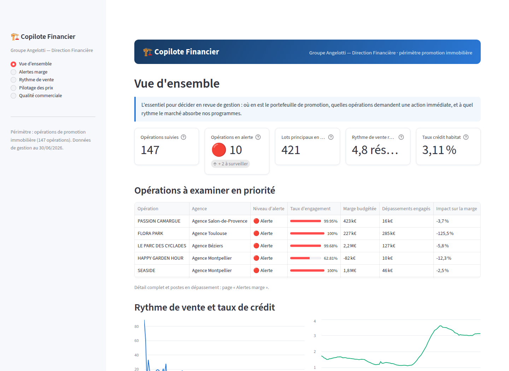
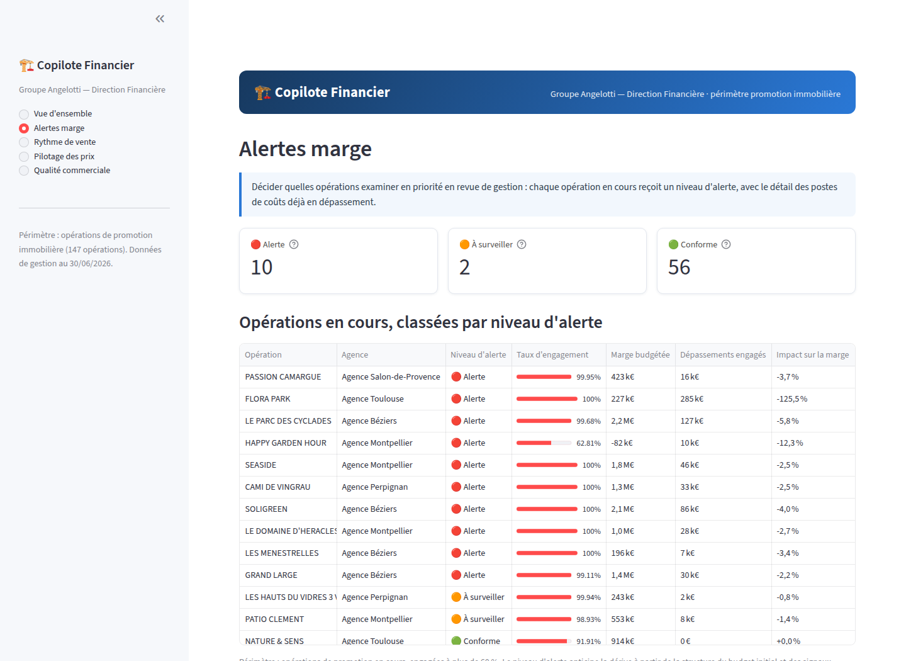

> **Note de rédaction.** Ce chapitre a été préparé avec l'aide d'un
> assistant : c'est une base de travail factuelle, à reformuler avant
> intégration au mémoire. Tous les chiffres proviennent des analyses
> exécutées du projet (dépôt `MemoireM2S2`) — cet encadré est à retirer
> lors de l'intégration.

Ce chapitre présente le projet Data Science annoncé dans mon mémoire de
mi-parcours : le « Copilote Financier », un outil d'aide à la décision
construit sur les données de gestion du groupe Angelotti pour sa direction
financière. La démarche suit un principe directeur que la taille des
données impose : 267 opérations et 32 Mo d'exports appellent un petit
nombre de méthodes simples, choisies chacune pour une question précise et
validées rigoureusement — pas un empilement de modèles. Le chapitre
déroule cette démarche : cadrage du besoin, constitution d'une base de
données fiable, puis trois axes de modélisation et leur restitution dans
une application destinée aux contrôleurs de gestion.

# Contexte

Le groupe Angelotti conçoit, finance et commercialise des programmes
immobiliers en Occitanie et en région PACA. Chaque opération de promotion
est portée par une société dédiée et vit sur un cycle long : un budget est
arrêté à l'engagement, puis le chantier et la commercialisation le font
dériver — appels d'offres plus chers qu'anticipé, désistements, rythme de
vente ralenti par la conjoncture. La direction financière pilote ces
dérives opération par opération, sur tableurs, sans vision transverse.

## Problème métier

Trois questions structurent les revues de gestion. Quelles opérations
examiner en priorité, parce que leur marge d'engagement dérive — sur quels
postes, pour combien d'euros ? Quel rythme de vente budgéter pour 2026,
alors que la période récente a montré la sensibilité de la demande au coût
du crédit (le taux moyen des crédits habitat est passé d'environ 1,1 % à
un pic de 3,6 % fin 2023, avant de refluer vers 3,1 % mi-2026, et le
rythme groupe est tombé d'environ 150 à moins de 115 réservations par mois
en 2023) ? Et quels lots du stock repricer, sachant que 45 % des 2 157
désistements enregistrés ont pour motif un problème de financement ou un
refus de prêt, et que les remises sont aujourd'hui accordées au cas par
cas ? C'est un problème de contrôle de gestion outillé par la donnée, pas
un problème de machine learning à grande échelle : 267 opérations, quatre
exports Excel totalisant 32 Mo, une photographie à date.

### Besoins par axe et exigences non fonctionnelles

Les besoins ont été formalisés en trois axes, plus un axe transverse :

* **Axe A — risque de marge** : un score de tri des opérations par risque
  de dérive, le détail en euros des postes déjà en dépassement, et la
  comparaison d'une opération à ses semblables ;
* **Axe B — vitesse d'écoulement** : quantifier l'effet du taux d'intérêt
  sur le rythme de réservation, séparé de l'effet propre de chaque
  programme, et simuler des scénarios de taux 2026 ;
* **Axe C — prix** : estimer un prix de marché par lot, signaler le stock
  hors marché, et proposer une règle de remise argumentée ;
* **Axe transverse** : tirer des signaux simples des commentaires de vente
  et de la structure du réseau de vendeurs.

Quatre exigences non fonctionnelles ont cadré le travail : la
reproductibilité (tout se reconstruit depuis les exports bruts par un seul
script), l'interprétabilité (chaque score est accompagné des variables qui
le déterminent), la confidentialité (aucune donnée nominative de client
affichée ni modélisée) et l'acceptation d'un petit échantillon — à cette
taille, des modèles simples validés en validation croisée, pas
d'architectures complexes.

## Objectif du dashboard

Le livrable final est une application web pour la direction financière,
qui traduit les modèles en décisions. Un retour de l'entreprise en cours
de projet a imposé une clarification utile : la première version de
l'interface, trop marquée par le vocabulaire de la modélisation, a été
entièrement réécrite en langage de gestion — niveaux d'alerte,
dépassements en euros, prix de marché estimé — et son périmètre restreint
aux 147 opérations de promotion immobilière, l'aménagement foncier
relevant d'une logique économique différente. Les métriques de validation
restent dans les notebooks ; l'écran ne montre que ce qui se décide.

# Données disponibles

## Données internes

Quatre exports du système de gestion constituent le point de départ :

| Export | Grain | Volumétrie | Usage |
|---|---|---|---|
| Grille de Prix Avec Désistements | lot × dossier de vente | 16 467 lignes, 196 opérations | ventes, prix, dates, désistements |
| Budget & EFR | poste analytique | 65 000 lignes, 267 opérations | budget, engagé, facturé par poste |
| A_DM_BUDGET_MONTANT_GESTION_LIVE | poste budgétaire | 79 106 lignes | contrôle de cohérence |
| 06_Informations Lots | dossier désisté | 2 164 lignes | détail des désistements |

Comprendre ces exports a demandé plus de temps que les modéliser, et
c'est normal : c'est là que se jouait la fiabilité de tout le reste. Trois
constats l'illustrent. Le fichier « 06_Informations Lots », malgré son
nom, ne contient que des dossiers désistés (2 157 « Désisté », 7
« Résolution de vente ») : la table maîtresse des lots est en réalité la
grille de prix. Le fichier « Budget & EFR » affiche 65 000 lignes, un
chiffre rond qui évoquait une troncature ; la réconciliation avec le
fichier LIVE a montré le contraire — totaux identiques à l'euro près sur
les 118 opérations jointes (écart médian nul), les 65 000 lignes se
décomposant en 64 788 postes de détail et 212 lignes de synthèse. Enfin,
le nettoyage a traité les défauts classiques : natures de lot harmonisées
(« appt », « Appartement », « stat »... regroupés en huit familles),
doublons orthographiques de communes fusionnés (91 orthographes pour 90
communes), surfaces et prix à zéro convertis en valeurs manquantes plutôt
que traités comme des zéros réels.

## Données externes

Trois sources publiques, récupérées par script pour rester
re-téléchargeables : le taux moyen des crédits habitat en France (série
mensuelle de la Banque centrale européenne, 2015 à 2026), l'indicateur de
confiance des ménages (Eurostat, 2015 à 2026) et un référentiel des 90
communes d'implantation (population, coordonnées, via l'API publique
geo.api.gouv.fr), enrichi d'une distance au littoral calculée.

# Architecture technique

L'architecture tient en une chaîne courte et entièrement rejouable : les
quatre exports et les sources externes alimentent un script de nettoyage,
qui charge une base **SQLite** en schéma en étoile — trois dimensions
(opérations, communes, conjoncture mensuelle), quatre tables de faits
(64 788 lignes budgétaires, 14 123 lots, 14 428 dossiers de vente, 2 164
désistements) — sur laquelle s'appuient les notebooks et l'application.
Trois vues SQL y encapsulent les calculs partagés : marge budgétée contre
engagée par opération, réservations par opération et par mois, état du
stock. C'est un choix structurant : la définition de la marge est écrite
une seule fois, et les notebooks comme la plateforme consomment la même.
Une seule commande reconstruit l'ensemble depuis les exports bruts en
quelques secondes, et l'analyse complète est versionnée et ré-exécutable
de bout en bout : tous les résultats présentés dans ce chapitre sont
reproductibles.

# Notebooks et résultats

## Exploration et nettoyage des données brutes

Au-delà du nettoyage décrit en section 2, l'exploration a produit deux
résultats qui ont orienté la modélisation.

Le premier concerne les prix : le prix au mètre carré des appartements est
fortement asymétrique (coefficient d'asymétrie de 19,2), mais devient
proche d'une loi normale après passage au logarithme (asymétrie 0,39,
diagramme quantile-quantile presque rectiligne, Figure 1). L'axe C
modélisera donc le logarithme du prix.

Le second est une leçon de méthode qui a évité une conclusion fausse. La
corrélation entre les réservations mensuelles du groupe et le taux des
crédits habitat est quasi nulle (+0,07) : à première vue, la conjoncture
n'expliquerait rien. En réalité, la série brute est brouillée par la
croissance du portefeuille — le nombre d'opérations en commercialisation
a fortement augmenté, ce qui soutient le volume total même quand la
demande par programme s'effondre. Rapportées au nombre d'opérations
actives, les réservations racontent l'inverse (Figure 2) : la corrélation
passe à -0,34 avec le taux et +0,44 avec la confiance des ménages. Tout
l'axe B repose sur cette correction.

## SQL et Spark

Le vrai livrable de cette étape est la base SQL décrite en section 3 : les
vues métier partagées, les index, et un contrôle croisé des agrégats qui
retrouve les mêmes totaux par deux moteurs indépendants (1 561,8 M€ de
dépenses budgétées, 1 754,8 M€ de recettes, à l'arrondi près).

Spark a été évalué comme piste de montée en charge, l'entreprise
appartenant à un groupe dont le périmètre de données dépasse largement le
sien. Le test est concluant par la négative : sur notre volumétrie
(64 788 lignes, 9 Mo en mémoire), l'agrégation chronométrée est environ
cinquante fois plus lente qu'avec pandas (rapport mesuré de 58, après 24
secondes de démarrage de la machine virtuelle Java ; une exécution
antérieure donnait 28 — le chiffre varie avec la machine, la conclusion
non). SQLite et pandas constituent donc la bonne architecture à cette
échelle, et le chemin de montée en charge est identifié si le périmètre
s'étendait un jour au groupe Nexity.

## Axe A

La difficulté de l'axe A était moins le modèle que la **définition de la
cible**. Les exports sont une photographie à date, sans historique des
révisions budgétaires : j'ai donc mesuré la dérive par les dépassements
déjà engagés, poste par poste — les dépenses à terminaison sont estimées
par le maximum de l'engagé et du budget de chaque poste (« un dépassement
engagé est acquis, le budget restant sera dépensé »), et la variation de
marge rapporte la marge ainsi recalculée à la marge budgétée. Les
variables explicatives n'utilisent que le budget initial et les signaux
commerciaux, jamais l'engagé ni le facturé qui définissent la cible : sans
cette précaution, le modèle aurait « prédit » sa propre définition.

Sur le périmètre exploitable — 123 opérations engagées à au moins 60 %,
de marge budgétée supérieure à 50 k€ — plus d'un tiers des opérations
(36,6 %) n'a aucun dépassement engagé, mais 28 % franchissent le seuil de
dérive matérielle fixé à 2 % de la marge, avec deux cas extrêmes au-delà
de la moitié de la marge budgétée (Figure 3).

Il faut le dire simplement : la partie la plus utile de cet axe pour
l'entreprise n'est pas un modèle appris, c'est le **tableau descriptif des
dépassements engagés en euros, par opération et par poste**, calculé en
SQL pur — c'est lui qui alimente la page « Alertes marge » de la
plateforme. La modélisation vient en complément, comme score de tri : une
régression du taux de variation atteint un R² de 0,08 sur l'échantillon
test — résultat modeste et honnête, la structure du budget initial
prédispose à la dérive mais ne la détermine pas, l'aléa de chantier fait
le reste — et une classification des opérations « à risque » (dérive
au-delà de 2 %) atteint un F1 de l'ordre de 0,30 à 0,34 en validation
croisée stratifiée, contre 0 pour la référence majoritaire qui ne détecte
rien. Quatre classifieurs classiques ont été confrontés (régression
logistique, séparateur à vaste marge, arbre de décision, forêt
aléatoire) ; à 123 observations, leurs écarts de performance ne sont pas
significatifs, et le choix s'est porté sur la forêt aléatoire, dont les
probabilités alimentent les niveaux d'alerte de la plateforme. Le système
est un outil de hiérarchisation de l'attention, pas un oracle.

## Axe B

C'est la section la plus solide du projet, et celle dont le résultat sert
le plus directement la décision.

Le rythme de vente est modélisé sur le panel opération × mois : 3 230
observations sur 160 opérations, en réintroduisant les mois à zéro
réservation entre la première et la dernière vente de chaque programme
(les omettre surestimerait le rythme). Un modèle à effets aléatoires y
sépare ce qui revient à l'opération de ce qui revient à la conjoncture :
les deux tiers de la variance tiennent au programme lui-même (coefficient
de corrélation intraclasse de 0,66), et l'effet du taux d'intérêt est
fortement significatif — **une hausse d'un point de taux réduit les
réservations mensuelles d'environ 19 %** (coefficient -0,216, p-value
inférieure à 10^-15). La régression naïve qui ignore la structure en panel
surestime cet effet ; le modèle à effets aléatoires le corrige.

Un garde-fou mérite d'être raconté, parce qu'il fonde la construction des
scénarios : sur la série agrégée du groupe (114 mois), une régression
dynamique à erreurs ARIMA, menée dans les règles (résidus assimilables à
un bruit blanc d'abord, sélection par AICc ensuite), ne parvient pas à
identifier l'effet du taux — le coefficient y est indiscernable de zéro
(p-value 0,82), car les variations du taux sont trop lentes pour une seule
série de cette longueur. Ce résultat négatif dit deux choses : la
significativité du panel n'est pas un artefact de régression fallacieuse,
et les scénarios doivent combiner les deux modèles — la série temporelle
fournit la trajectoire de référence (dynamique et saisonnalité), et
l'élasticité du panel traduit chaque scénario de taux en effet sur le
rythme. Sur cette base (Figure 4), une détente à 2,5 % fin 2026
redonnerait environ +6 % de rythme en moyenne sur douze mois ; une
remontée à 3,5 % en retirerait 3 %.

Enfin, à l'échelle d'un programme, la courbe des réservations cumulées
suit une forme en S ajustée par une fonction logistique à trois
paramètres : sur les 28 opérations terminées du périmètre, cet ajustement
bat la droite dans 25 cas (Figure 5) et fournit un indicateur directement
utile à la trésorerie — le délai d'atteinte de 90 % du potentiel, de
médiane proche de vingt mois. Sa limite est connue et vérifiée : en début
de commercialisation, le potentiel n'est pas identifiable, l'outil n'est
donc proposé que sur les programmes avancés.

## Axe C

Le modèle de prix est volontairement le plus simple qui fonctionne : une
régression linéaire du logarithme du prix au mètre carré des 5 064
appartements transigés depuis 2016, sur leurs caractéristiques (surface,
étage, exposition, type de produit, agence, commune, littoral) et leur
année de réservation. Elle explique 88,6 % de la variance sur
l'échantillon test, avec une erreur type d'environ 11 % sur le prix, et
ses coefficients se lisent comme des prix implicites : prime d'étage
(+6 %), prime d'exposition sud, décote de 63 % du logement social (prix
réglementés), et un effet millésime d'environ +19 points entre 2016 et
2023 suivi d'un plateau (Figure 6) — les prix du neuf n'ont pas baissé
avec la remontée des taux, c'est le volume qui s'est ajusté, en parfaite
cohérence avec l'axe B. Une variante régularisée a été testée sans gain :
avec cinq mille observations pour une trentaine de coefficients, il n'y
avait rien à stabiliser.

Appliqué aux 127 appartements en stock, le modèle sert de détecteur : 103
sont dans le marché, 8 au-dessus et 16 en dessous du prix estimé, au seuil
d'une erreur type (Figure 7).

La recommandation de remise est ensuite posée comme une petite
optimisation sous contrainte : maximiser le revenu attendu à douze mois
d'une opération en ajustant chaque prix dans des bornes commerciales (-10
à +5 %), sous un objectif d'accélération de l'écoulement, la demande
réagissant au prix avec une élasticité fixée à -1. Ce paramètre est la
fragilité assumée de l'axe : l'estimation interne (-0,81) a le bon signe
mais n'est pas significative sur 95 opérations, et la valeur retenue vient
de la littérature sur le logement neuf. Le résultat, lui, est robuste et
contre-intuitif : à cette élasticité, la remise optimale est **uniforme en
euros** sur tous les lots — environ 23 k€ par lot sur l'opération
d'application — donc proportionnellement plus forte sur les petits lots,
à l'inverse de la pratique actuelle des remises au cas par cas. Sur
l'opération test (18 appartements en stock), viser +8 % d'écoulement
déplace le volume attendu de 6,8 à 7,4 lots pour un revenu quasi inchangé
(-0,3 %) : l'intérêt est la vitesse et l'économie de frais de portage,
que l'objectif ne compte pas.

## Signaux faibles (texte et réseau)

Trois constats simples, obtenus avec des moyens simples, complètent le
dispositif. D'abord, un moteur de recherche par similarité sur les 9 688
commentaires libres de vente : une requête comme « refus de prêt banque »
ou « remise prix hors pack » remonte les dossiers concernés — un outil
d'audit des remises non structurées réellement utilisable. Ensuite, le
profil des motifs de désistement par agence révèle un problème de
qualité de saisie plus qu'un fait commercial : à Salon-de-Provence, 90 %
des motifs sont enregistrés en « Autres motifs », ce qui rend les
désistements de cette agence inanalysables tant que la saisie n'est pas
fiabilisée. Enfin, la structure du réseau de vente est très concentrée :
deux acteurs — le réseau interne et un prescripteur externe — portent
51,6 % des dossiers attribués, avec des taux de désistement allant du
simple au triple (9 % pour le réseau interne, 29,6 % pour le prescripteur
externe) ; chaque commission versée sur un dossier qui n'aboutit pas est
une dépense sans recette. Une tentative de prédire le désistement à
partir du seul texte du commentaire a aussi été menée, avec un contrôle de
fuite soigneux : elle plafonne à un F1 de 0,34 — le texte seul ne suffit
pas, et il est traité comme signal d'appoint.

# Plateforme Streamlit

L'application finale est la meilleure réponse au risque de
sur-complexité : ce qui est livré au métier est simple. Cinq pages,
périmètre restreint aux 147 opérations de promotion, aucun terme de
modélisation à l'écran.

La **Vue d'ensemble** (Figure 8) donne la situation en quelques secondes :
147 opérations suivies, 10 en alerte et 2 à surveiller sur les 68
opérations en cours suffisamment engagées, 421 lots principaux en stock,
un rythme récent de 4,8 réservations par opération et par mois pour un
taux de crédit à 3,11 %. La page **Alertes marge** (Figure 9) classe les
opérations par niveau d'alerte — le score de l'axe A traduit en trois
niveaux — et surtout affiche, pour chaque opération, les dépassements déjà
engagés en euros et les postes concernés : c'est la partie la plus
consultée, et elle repose sur du SQL, pas sur un modèle. La page **Rythme
de vente** transpose l'axe B en simulateur : un curseur de taux 2026
produit une phrase de résultat fondée sur l'élasticité du panel, et la
trajectoire d'écoulement de chaque programme donne son délai estimé. La
page **Pilotage des prix** affiche le diagnostic du stock et la grille
d'ajustement recommandée sous un objectif d'accélération choisi au
curseur. La page **Qualité commerciale** reprend les signaux faibles,
alerte de saisie comprise.

Chaque page a été vérifiée par le cadre de test de Streamlit (exécution
sans exception, y compris aux bornes des curseurs et sur les sélections
vides), et l'ensemble se reconstruit depuis les exports bruts.

# Périmètre et limites

La limite principale est structurelle et commande la suite du projet :
les données budgétaires sont une photographie à date, sans historique des
révisions. C'est elle qui plafonne l'axe A (un R² de 0,08 en régression,
des F1 de l'ordre de 0,3 en classification) : on ne peut pas apprendre la
dynamique d'une dérive sur une image fixe. Ma première recommandation à
l'entreprise est donc d'**historiser les exports mensuels** dans le
nouvel ERP — au bout d'un an, le score statique deviendra un vrai suivi
de trajectoire.

Les autres limites sont assumées et documentées : l'échantillon de l'axe
A est petit (123 opérations) et les écarts entre modèles y sont
indiscernables, d'où le choix d'un modèle interprétable unique ;
l'élasticité de l'axe C n'a pas pu être estimée significativement en
interne et vient de la littérature — les recommandations de prix sont des
aides à la décision, non opposables, et la grille reste sous le contrôle
de la direction commerciale ; les intervalles de prévision de l'axe B
ignorent l'incertitude sur les taux futurs eux-mêmes, raison pour
laquelle la plateforme présente des scénarios plutôt qu'une prévision
unique ; le texte des commentaires est un signal d'appoint, pas un
prédicteur. Enfin, la plateforme couvre la promotion (147 opérations) et
exclut l'aménagement foncier, dont la logique économique justifierait un
traitement dédié ; l'analyse, elle, couvre les 267 opérations, et la
frontière entre les deux activités y ressort d'ailleurs d'elle-même dès
l'analyse exploratoire — validation involontaire du choix de périmètre.
