# Remerciements {-}

Je souhaite exprimer ma sincère gratitude à toutes les personnes qui ont contribué à mon
intégration et à ma progression professionnelle tout au long de mon alternance au sein de la
Holding SPA du groupe Angelotti.

En premier lieu, je remercie chaleureusement ma tutrice en entreprise, Sabine Cruanas, pour
son accompagnement constant, sa bienveillance et le partage de ses connaissances. Son
expertise et son soutien ont été déterminants dans ma montée en compétences, tant sur le
plan technique que méthodologique.

Je tiens également à remercier Mme Trottier, ma tutrice universitaire, pour son suivi
rigoureux et ses conseils avisés. Je remercie aussi l'ensemble des équipes d'Angelotti avec
lesquelles j'ai collaboré, en particulier la direction financière et les équipes
commerciales, dont la disponibilité et les retours constructifs ont été essentiels pour
adapter mes réalisations aux besoins concrets de l'entreprise. C'est en écoutant leurs
objections que la plupart de mes livrables ont pris leur forme définitive.

Enfin, je remercie le groupe Angelotti pour m'avoir offert cette opportunité d'alternance
dans un environnement professionnel enrichissant, ainsi que mon université et l'équipe
pédagogique du Master MIASHS pour leur accompagnement tout au long de ce parcours. Merci à
toutes et à tous pour votre confiance et votre soutien.

# Résumé {-}

Ce mémoire présente les travaux que j'ai conduits durant ma deuxième année de Master MIASHS,
en alternance au sein de la Holding SPA du groupe Angelotti, promoteur-aménageur implanté en
Occitanie et en région PACA. L'année a été dominée par une transformation structurante du
système d'information : le remplacement de l'ERP historique Grimmo par la solution SPO,
éditée par Salvia.

Le premier semestre a été celui de l'ingénierie des données. J'y ai conçu et industrialisé
la reprise des données opérationnelles vers le nouvel ERP, sur un périmètre de 283
opérations immobilières, en m'appuyant sur les interfaces de programmation de l'éditeur. J'y
expose les difficultés algorithmiques rencontrées, notamment la gestion des identifiants
dynamiques et du versionnement des données budgétaires, ainsi que la stratégie de
déploiement en « coquilles vides » adoptée pour garantir la continuité de la facturation. En
parallèle, j'ai assuré le maintien du système décisionnel et participé au déploiement du
Single Sign-On sur deux périmètres du groupe.

Le second semestre a prolongé ce travail de structure, puis l'a valorisé. J'ai d'abord conduit
la reprise des tiers, c'est-à-dire des clients acquéreurs, en concevant une chaîne de traitement
entièrement pilotée par formules qui a permis de créer 1 434 tiers dans SPO à partir de 1 602
lignes brutes, sans doublon détecté par les trois clés d'unicité retenues. J'ai ensuite mené de
bout en bout un projet de Data Science, le « Copilote Financier », qui outille la direction
financière sur trois questions de gestion : le risque de dérive des marges, le rythme
d'écoulement des programmes et le pilotage des prix du stock.

Ce mémoire relit ensuite ces quatre missions transversalement, sous l'angle de la conduite de
projet, des technologies et des méthodes employées, des régimes de preuve mobilisés pour
évaluer chaque livrable et des difficultés rencontrées.

De cette année, il tire une thèse qu'il s'attache à démontrer plutôt qu'à énoncer : la
structure de la donnée commande ce que la modélisation peut en tirer. Il se termine par
une réflexion sur le métier de data scientist tel que je l'ai pratiqué, et sur le projet
professionnel qui en découle.

# Glossaire {-}

| Terme | Définition |
|:------------------|:----------------------------------------------------------|
| Acte de vente | Document légal qui officialise la vente d'un bien immobilier entre un vendeur et un acquéreur. |
| ADV | Dossier de vente lié à un lot immobilier, ouvert lors d'une réservation et suivi jusqu'à l'acte de vente. Par extension, désigne dans nos extractions l'acquéreur principal du dossier. |
| Aménagement foncier | Opération qui consiste à diviser un terrain en plusieurs lots viabilisés, destinés à la vente pour la construction. |
| API | Interface de programmation applicative, qui permet à deux logiciels d'échanger des données sans passer par leur interface utilisateur. |
| CRM | *Customer Relationship Management*, outil de gestion de la relation client. Chez Angelotti, il s'agit de Vadimm. |
| Dashboard | Tableau de bord. Le mémoire emploie le terme au chapitre 5 pour désigner le livrable tel que la direction financière l'a demandé ; le corps du texte parle ensuite d'application web ou de plateforme. |
| Désistement | Renoncement d'un acquéreur à une réservation avant l'acte de vente. |
| DirectAPI | Module de l'éditeur Salvia permettant d'injecter dans l'ERP des fichiers plats, sans passer par la saisie manuelle. |
| EFR | État Financier de Référence, l'un des exports budgétaires du système de gestion, qui donne pour chaque poste le budget, l'engagé et le facturé. |
| ERP | *Enterprise Resource Planning*, progiciel de gestion intégré couvrant l'ensemble des processus de l'entreprise. |
| Fiabilisation des données | Ensemble des vérifications et corrections visant à garantir la cohérence et la justesse des données. |
| GED | Gestion Électronique des Documents. |
| Grimmo | ERP métier historique du groupe, remplacé cette année par SPO. |
| Lot | Terrain ou logement mis en vente, issu d'un découpage foncier ou d'un programme immobilier. |
| Macro-lot | Ensemble de lots vendus groupés, souvent destiné à un promoteur ou investisseur pour un projet plus large. |
| MyReport | Outil décisionnel du groupe, qui requête les bases de données sources et produit les tableaux de bord des services. |
| Promotion immobilière | Activité consistant à concevoir, financer, construire et commercialiser des logements ou bâtiments neufs. |
| Reporting | Création de tableaux de bord ou d'indicateurs à partir des données de gestion, souvent automatisée. |
| Salvia | Éditeur de logiciels spécialisés dans la gestion immobilière, dont SPO. |
| SPO | Suivi des Programmes Opérationnels, l'ERP métier qui remplace Grimmo depuis cette année. |
| SSO | *Single Sign-On*, authentification unique donnant accès à plusieurs applications. |
| Surface habitable | Surface mesurée en mètres carrés, utilisée pour évaluer la taille d'un lot et estimer son prix. |
| Tiers | Dans SPO, entité désignant un client, une société ou un partenaire, à laquelle sont rattachés des rôles, des adresses et des coordonnées. |
| Tranche | Subdivision d'une opération immobilière, distinguée selon qu'elle relève des travaux ou de la commercialisation. |

```{=latex}
\clearpage
\tableofcontents
\clearpage
\addcontentsline{toc}{chapter}{Table des figures}
\listoffigures
\clearpage
\pagenumbering{arabic}
\setcounter{page}{1}
```


# Introduction {-}

Dans un environnement économique et technologique en perpétuelle évolution, la
transformation numérique est devenue un levier de performance incontournable pour les
acteurs de l'immobilier. La capacité à centraliser, fiabiliser et exploiter la donnée ne
constitue plus seulement un avantage concurrentiel, mais une nécessité structurelle pour
piloter efficacement l'activité. C'est dans cette dynamique que s'inscrit le groupe
Angelotti, acteur de l'aménagement et de la promotion immobilière en Occitanie et en
région PACA, qui poursuit sa stratégie de modernisation de son système d'information.

Après une première année d'alternance consacrée à la migration du CRM Vadimm et à
l'initiation au Machine Learning, ma deuxième année de Master MIASHS au sein de la Holding
SPA marque une nouvelle étape. La transition numérique du groupe s'est accélérée cette
année avec la refonte complète de son ERP métier, passant de l'outil historique Grimmo à
la solution SPO éditée par Salvia. Ce changement d'échelle m'a conduite à évoluer d'un
rôle d'assistance opérationnelle vers des missions d'ingénierie plus techniques. Le cœur
du travail s'est déplacé vers l'interopérabilité des systèmes.

Ce mémoire présente l'ensemble des travaux réalisés durant cette année, du premier jour de
la migration jusqu'à la livraison d'une application d'aide à la décision. Il témoigne d'un
mouvement en deux temps dans mes missions : le passage de la Data Science exploratoire au
Data Engineering appliqué, puis le retour à la modélisation une fois les données
reconstituées. L'ordre compte. Avant de pouvoir modéliser ou prédire, il est impératif de
construire une architecture de données robuste et cohérente. J'ai ainsi été confrontée à
des défis techniques majeurs, impliquant l'automatisation de flux complexes, la gestion de
règles de gestion dynamiques et l'industrialisation des processus de reprise.

C'est de cette expérience que je tire la thèse de ce mémoire, et je préfère l'énoncer
d'emblée pour que le lecteur puisse en juger au fil des chapitres : **la structure de la
donnée commande ce que la modélisation peut en tirer**. Ce n'est pas une position
théorique. C'est un constat que l'année a produit deux fois. La première, en creux,
lorsque la charge de la migration a repoussé le projet de Machine Learning au second
semestre. La seconde, en plein, lorsque le projet de Data Science a donné des résultats
solides là où les données avaient une profondeur temporelle, et des résultats modestes là
où elles n'étaient qu'une photographie à date.

Ce document s'articule autour de sept chapitres, qui suivent la progression de mes
responsabilités :

- Le **chapitre 1** pose le contexte, dans sa double dimension. Le contexte métier d'abord,
  celui d'un promoteur-aménageur dont l'activité s'étale sur des cycles longs ; le contexte
  data ensuite, celui d'un système d'information en pleine mutation, où la donnée était
  répartie entre plusieurs outils qui ne se parlaient pas.
- Le **chapitre 2** présente le projet central du premier semestre : la migration des données
  opérationnelles vers l'ERP SPO. J'y détaille la stratégie d'automatisation mise en œuvre
  pour traiter une volumétrie critique de 283 opérations, en insistant sur les défis
  algorithmiques posés par l'usage des API et sur la nécessité de maintenir la continuité de
  service pour la facturation.
- Le **chapitre 3** prolonge ce travail au second semestre avec la reprise des tiers, c'est-à-dire
  des clients acquéreurs. J'y expose la conception d'une chaîne de traitement pilotée par
  formules, les trois mécanismes algorithmiques qui la font fonctionner, et le contournement
  par API qui a permis de dépasser une limite du format d'import.
- Le **chapitre 4** aborde le maintien et l'évolution du système décisionnel, ainsi que les
  missions transverses d'infrastructure. J'y expose comment j'ai dû concevoir des reportings
  intégrant des règles juridiques complexes, en contournant les limitations techniques des
  outils pour répondre aux besoins précis des services.
- Le **chapitre 5** présente le projet de Data Science mené au second semestre : le Copilote
  Financier, un outil d'aide à la décision construit sur les données de gestion pour la
  direction financière.
- Le **chapitre 6** prend de la hauteur sur ces quatre missions. Il expose la méthodologie de
  conduite de projet que j'ai suivie, les technologies et les méthodes mobilisées, la manière
  dont j'ai évalué mes propres résultats, et les difficultés que j'ai rencontrées.
- Le **chapitre 7**, enfin, livre ma réflexion sur le métier de data scientist tel que je l'ai
  pratiqué, et présente les perspectives ainsi que mon projet professionnel.

À travers ce mémoire, mon objectif n'est pas seulement de présenter mon travail de cette
seconde année. Il est aussi de montrer comment les métiers liés à la donnée évoluent, et
comment la data science peut accompagner concrètement les transformations d'un secteur qui
ne l'attendait pas.

# Contexte de l'alternance : un métier de cycles longs, un système d'information en mutation

::: sommaire
**Sommaire**

- 1.1 Le groupe Angelotti et la nature de son activité
    - 1.1.1 Deux métiers, deux logiques économiques
    - 1.1.2 Le cycle long d'une opération et la dérive du budget
- 1.2 Le système d'information et sa mutation
    - 1.2.1 Des outils spécialisés, mais cloisonnés
    - 1.2.2 Le remplacement de l'ERP : ce que le changement impose
- 1.3 Le contexte data : ce dont je disposais, et ce qu'il fallait en faire
    - 1.3.1 Une donnée abondante mais non exploitable en l'état
    - 1.3.2 Mon positionnement entre les métiers et le système d'information
- 1.4 Les quatre missions de l'année et leur enchaînement
:::

Ce chapitre pose le décor dans lequel s'inscrivent les quatre missions que présente ce
mémoire. Il le fait dans deux dimensions qu'il serait artificiel de séparer. La première est
le contexte métier : ce que fait le groupe Angelotti, sur quels cycles, avec quelles
contraintes économiques. La seconde est le contexte data : de quels outils disposait
l'entreprise, dans quel état se trouvait sa donnée, et pourquoi la question de sa
fiabilisation s'est posée avec cette acuité cette année précisément. Ces deux dimensions se
commandent l'une l'autre, et c'est leur rencontre qui explique la forme prise par mes
missions.

## Le groupe Angelotti et la nature de son activité

### Deux métiers, deux logiques économiques

Le groupe Angelotti conçoit, finance et commercialise des programmes immobiliers en
Occitanie et en région PACA. Son activité se répartit entre deux métiers qu'il est essentiel
de distinguer, parce que rien de ce qui suit ne se comprend si on les confond.

L'**aménagement foncier** consiste à acquérir un terrain, à le viabiliser et à le découper en
lots destinés à la construction. La valeur y est créée par la transformation du foncier
lui-même, et les postes de dépense dominants sont l'acquisition du terrain et les travaux de
voirie et de réseaux divers.

La **promotion immobilière** consiste à concevoir, financer, construire et commercialiser des
logements neufs. La valeur y est créée par la construction, et c'est ce poste qui pèse le
plus lourd dans le budget.

Cette distinction n'est pas seulement descriptive. Elle produit deux structures de coûts
différentes, deux rythmes de commercialisation différents, et donc deux façons de suivre une
opération. Nous verrons au chapitre 5 que cette frontière ressort d'elle-même dès l'analyse
exploratoire des données de gestion, et qu'elle a justifié de restreindre le périmètre de
l'outil d'aide à la décision à la seule promotion.

Chaque opération, dans l'un comme dans l'autre métier, est portée par une société dédiée.
Cette organisation juridique a une conséquence directe sur le système d'information : le
suivi financier est nativement cloisonné par opération, et toute vision transverse doit être
reconstruite.

### Le cycle long d'une opération et la dérive du budget

Une opération immobilière vit sur un cycle long, qui se compte en années et non en mois. Un
budget est arrêté au moment de l'engagement, puis le chantier et la commercialisation le font
dériver. Les appels d'offres reviennent plus chers qu'anticipé, des acquéreurs se désistent,
le rythme de vente ralentit sous l'effet de la conjoncture.

Cette dérive n'est pas une anomalie, c'est le fonctionnement normal du métier. Ce qui pose
problème, c'est de la mesurer à temps. Entre le moment où un poste budgétaire commence à
déraper et le moment où l'écart devient visible dans les comptes, il peut s'écouler
plusieurs mois, et sur une marge d'engagement de quelques centaines de milliers d'euros, ce
délai suffit à transformer un ajustement en perte.

Ce cycle long explique également pourquoi la reprise de l'historique était un enjeu majeur de
la migration vers le nouvel ERP. Une opération engagée il y a trois ans et non encore livrée
n'est pas une donnée d'archive, c'est un dossier vivant : elle continue de générer des
factures, des appels de fonds et des actes de vente. Basculer d'un système à un autre sans
emporter cet historique aurait interrompu la gestion en cours.

## Le système d'information et sa mutation

### Des outils spécialisés, mais cloisonnés

À mon arrivée en deuxième année, le système d'information du groupe reposait sur trois
outils principaux, chacun compétent sur son domaine, et sur une quatrième couche moins
visible mais tout aussi structurante : les tableurs.

1. **Grimmo**, l'ERP métier historique, portait la gestion des opérations immobilières :
   structure des dossiers, budgets, dépenses et recettes.
2. **Vadimm**, le CRM, portait la relation commerciale : les acquéreurs, les réservations,
   les désistements et les coordonnées des clients. Sa migration avait constitué l'essentiel
   de mes missions de première année.
3. **MyReport**, l'outil décisionnel, permettait de requêter les bases de données sources et
   de produire les tableaux de bord des différents services.
4. **Les tableurs**, enfin, faisaient le lien partout où les trois premiers ne se parlaient
   pas. La direction financière suivait ainsi ses dérives budgétaires opération par
   opération, sur des fichiers individuels, sans vision transverse.

La Figure 1.1 représente cette organisation et situe l'endroit où mes missions sont intervenues.
Les trois outils et leurs usages métier occupent le haut du schéma, reliés par les flèches qui
figurent la circulation normale de la donnée ; les tableurs forment la bande du bas, et les
traits pointillés qui les rattachent à chacun d'eux marquent les échanges qui ne passent par
aucun système. On y lit le problème central : la donnée existait, en quantité, mais elle était
répartie entre des outils qui ne partageaient ni les mêmes identifiants, ni les mêmes
définitions. Le même client pouvait exister dans le CRM et dans l'ERP sans qu'aucun lien ne les
rattache ; la même notion de marge pouvait être calculée différemment selon l'outil qui
l'interrogeait.

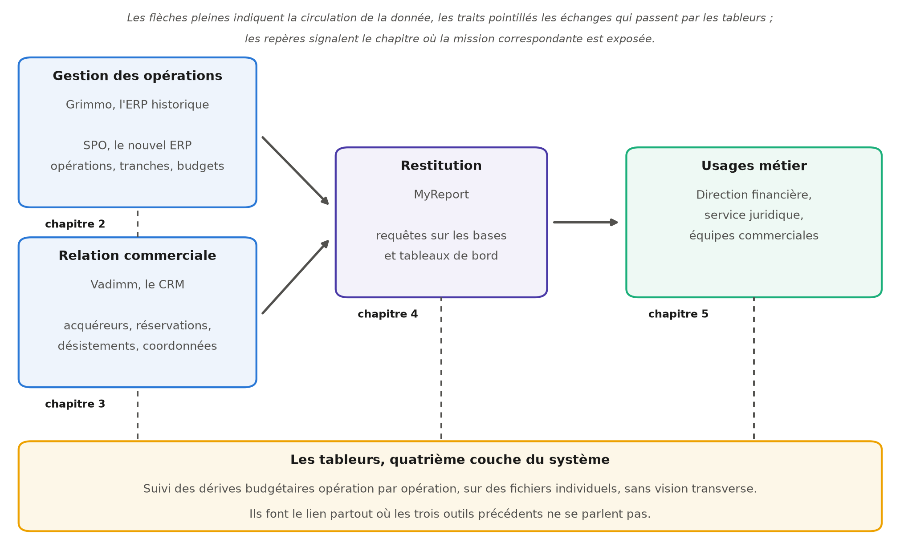{width=100%}

### Le remplacement de l'ERP : ce que le changement impose

La décision de remplacer Grimmo par SPO, l'ERP édité par Salvia, a été prise à l'échelle de
la direction, et elle a commandé le calendrier de toute l'année. Un changement d'ERP n'est
pas un changement d'outil : c'est un changement de modèle de données. Les objets ne portent
plus les mêmes noms, ne s'articulent plus de la même façon, et n'acceptent plus les mêmes
valeurs.

Trois contraintes en découlaient, et elles ont structuré mes missions du premier semestre.

La première est une contrainte de **volumétrie** : 283 opérations immobilières devaient être
reprises, avec leurs subdivisions et leurs budgets. À cette échelle, une saisie manuelle
intégrale était exclue.

La deuxième est une contrainte de **continuité de service**. Les utilisateurs devaient
pouvoir facturer dès le basculement, sans attendre que la reprise soit achevée. Une migration
qui aurait interrompu la facturation, même deux semaines, aurait été inacceptable pour
l'entreprise.

La troisième est une contrainte de **conformité au modèle cible**. SPO impose ses propres
règles d'intégrité, et ces règles n'étaient pas toutes documentées. Il a fallu les découvrir
en les heurtant, ce que le chapitre 2 détaille.

À ces trois contraintes s'ajoute une perspective qui n'était pas prévue au calendrier
initial : le passage prochain vers l'infrastructure technique du groupe Nexity. Ce
changement d'environnement engendrera des missions spécifiques d'adaptation de nos outils, et
il a influé sur certains de mes choix techniques, notamment lorsqu'il a fallu évaluer si
l'architecture retenue pour le projet de Data Science tiendrait à une échelle supérieure.

## Le contexte data : ce dont je disposais, et ce qu'il fallait en faire

### Une donnée abondante mais non exploitable en l'état

Le contexte data science de mes missions se résume à un paradoxe que j'ai mis plusieurs mois
à formuler clairement. L'entreprise ne manquait pas de données. Elle disposait de l'historique
complet de ses opérations, de ses ventes, de ses désistements et de ses budgets, sur
plusieurs années. Ce qui manquait, c'était la possibilité de s'en servir.

Trois obstacles se cumulaient.

Le premier est l'**absence d'identifiant partagé**. Un acquéreur du CRM et un tiers de l'ERP
ne se reconnaissent pas l'un l'autre. Rapprocher les deux suppose de reconstruire une clé
d'identité, ce qui est précisément le sujet du chapitre 3.

Le deuxième est l'**absence de définition partagée**. La marge d'une opération peut se calculer
sur le budget, sur l'engagé ou sur le facturé, et chacun de ces calculs a sa légitimité. Tant
que la définition n'est écrite nulle part, chaque tableau de bord porte implicitement la
sienne, et deux services peuvent afficher deux chiffres différents pour la même opération
sans que ni l'un ni l'autre ait tort.

Le troisième est l'**absence de profondeur temporelle**. Les exports du système de gestion sont
une photographie à date : ils disent où en est un budget aujourd'hui, mais pas comment il y
est arrivé. Cette limite, je ne l'ai pleinement mesurée qu'au moment de modéliser, et elle
plafonne l'un des trois axes du projet de Data Science, comme le chapitre 5 l'expose sans
détour.

Ces trois obstacles ont un point commun : aucun ne relève de la modélisation. Ce sont des
problèmes de structure, et ils se règlent avant tout modèle. C'est le constat qui fonde la
thèse de ce mémoire.

### Mon positionnement entre les métiers et le système d'information

Ma position dans l'organisation mérite d'être précisée, parce qu'elle explique la diversité
des missions présentées. Rattachée à la Holding SPA, j'ai travaillé au contact direct des
services métiers, en particulier la direction financière, le service juridique et les
équipes commerciales, tout en intervenant sur les outils du système d'information.

Cette position intermédiaire a une conséquence pratique constante : la formulation du besoin
fait partie du travail. Un service ne demande presque jamais un livrable technique. Il décrit
une gêne, un tableau qu'il faut refaire à la main chaque mois, une question à laquelle il ne
sait pas répondre. Traduire cette gêne en spécification exploitable, puis vérifier que la
traduction était fidèle, occupe une part du temps que je n'avais pas anticipée en arrivant.

C'est aussi cette position qui explique que mes missions ne se rangent pas toutes sous
l'étiquette de la data science. Le chapitre 4 présente ainsi une contribution au déploiement
du Single Sign-On, qui relève de l'administration système. Ces missions transverses, bien
que chronophages, sont complémentaires au travail de fond sur la donnée : elles m'ont donné
une vision de l'architecture du système d'information que je n'aurais pas acquise autrement.

## Les quatre missions de l'année et leur enchaînement

L'année s'organise en quatre missions, réparties sur deux semestres, que présente la
Figure 1.2. Leur enchaînement n'a rien d'arbitraire : chacune conditionne la suivante.

1. **La migration des données opérationnelles vers SPO** (premier semestre, chapitre 2) a
   consisté à reprendre les 283 opérations et leurs tranches depuis la base historique, les
   budgets détaillés étant reportés à un second temps. C'est le socle : sans les opérations, rien d'autre ne peut exister dans le
   nouvel ERP.
2. **La reprise des tiers** (second semestre, chapitre 3) a complété ce socle par le volet
   commercial, en créant dans SPO les 1 434 clients acquéreurs du groupe.
3. **Le maintien du système décisionnel et les missions SI transverses** (les deux semestres,
   chapitre 4) ont couru en parallèle sur toute l'année, pour que les services continuent de
   disposer de leurs indicateurs pendant que le socle se reconstruisait.
4. **Le Copilote Financier** (second semestre, chapitre 5) a exploité ce socle une fois
   stabilisé, en construisant un outil d'aide à la décision pour la direction financière.

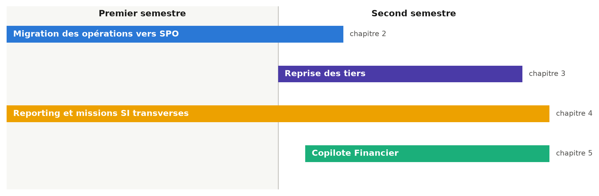{width=100%}

Cette progression dessine un mouvement que je n'avais pas prévu en arrivant, et qui est
l'histoire de ce mémoire : partie d'un projet de modélisation, j'ai passé la majeure partie
de l'année à construire ce qui rendait cette modélisation possible, avant d'y revenir. Le
détour n'était pas une perte de temps, c'était le travail.

::: transition
Ce premier chapitre aura montré que les missions de cette année ne se comprennent pas comme
une liste de tâches, mais comme la réponse à une situation précise : une entreprise dont le
métier impose des cycles longs, dont le système d'information changeait de socle, et dont la
donnée était abondante sans être exploitable.

Le chapitre suivant entre dans le premier de ces chantiers, et le plus lourd : la migration
des données opérationnelles vers l'ERP SPO. On y verra que le problème n'était pas de
transférer des données d'un système à un autre, mais de rétro-concevoir les règles d'un
modèle de données que personne, dans l'entreprise, ne connaissait encore.
:::


# La migration vers SPO : enjeux d'industrialisation et défis techniques

::: sommaire
**Sommaire**

- 2.1 Stratégie de reprise et méthodologie de travail
    - 2.1.1 Un arbitrage initial : automatiser ou saisir
    - 2.1.2 Phase préparatoire : appropriation technique et tests unitaires
    - 2.1.3 Industrialisation des flux via DirectAPI
- 2.2 Les défis techniques majeurs : dépendances et identifiants
    - 2.2.1 La gestion des dépendances hiérarchiques
    - 2.2.2 La complexité algorithmique des identifiants et du versionnement
- 2.3 Adaptation stratégique : le déploiement en « coquilles vides »
    - 2.3.1 Une approche agile par priorisation
    - 2.3.2 Gains opérationnels et lissage de la charge
- 2.4 Bilan de la migration à la fin du premier semestre
:::

Ce chapitre détaille la mission centrale du premier semestre : la migration des données
opérationnelles de la base historique Grimmo vers le nouvel ERP du groupe, SPO, édité par
Salvia. Ce projet visait un objectif critique : récupérer l'intégralité des opérations
immobilières actives pour assurer la continuité de la gestion financière et comptable du
groupe dans le nouvel environnement. J'y expose la stratégie de reprise retenue, les deux
difficultés structurelles qui ont mobilisé l'essentiel de mon temps, et l'arbitrage
stratégique qui a permis de tenir les délais sans sacrifier la continuité de service.

## Stratégie de reprise et méthodologie de travail

### Un arbitrage initial : automatiser ou saisir

Le périmètre de la migration concernait un volume de 283 opérations immobilières. Face à
cette volumétrie conséquente, une saisie manuelle intégrale aurait représenté un risque
d'erreur humaine trop élevé et une charge de travail incompatible avec les délais impartis.
Nous avons donc opté pour une stratégie hybride :

- Une approche automatisée pour l'injection des gros volumes de données structurelles via
  les API, afin de garantir rapidité et cohérence.
- Un traitement manuel pour les exceptions et les cas particuliers historiques ne pouvant
  entrer dans les gabarits standardisés.

Cet arbitrage mérite d'être explicité, car il n'allait pas de soi. Automatiser suppose un
investissement initial important, qui ne se rentabilise que si le volume est suffisant et si
les données sont suffisamment homogènes. Sur 283 opérations, la première condition était
remplie ; la seconde ne l'était que partiellement, et c'est précisément pourquoi la stratégie
retenue est hybride plutôt qu'entièrement automatisée. Vouloir tout automatiser aurait
conduit à écrire des règles pour des cas uniques, ce qui coûte plus cher que de les traiter
à la main.

Mon travail s'est structuré en deux phases techniques distinctes : une phase préparatoire
d'appropriation et une phase opérationnelle d'industrialisation.

### Phase préparatoire : appropriation technique et tests unitaires

Avant de pouvoir manipuler les données de masse, il était indispensable de maîtriser le
modèle de données cible. Ma première tâche a consisté à analyser en profondeur la
documentation technique de l'API de Salvia [2]. L'enjeu était de comprendre la structure des
objets attendus par l'ERP et leurs interdépendances.

La Figure 2.1 montre l'interface de SPO sur le dossier d'une opération. On y lit directement le
modèle de données : une opération est un conteneur, auquel se rattachent notamment son
identification, ses indicateurs, son foncier, ses intervenants, ses versions, ses tranches, son
budget, son planning, sa commercialisation et sa trésorerie. Cette arborescence n'est pas une
commodité d'affichage, c'est la structure même que l'API attend, et la comprendre était le
préalable à toute injection.

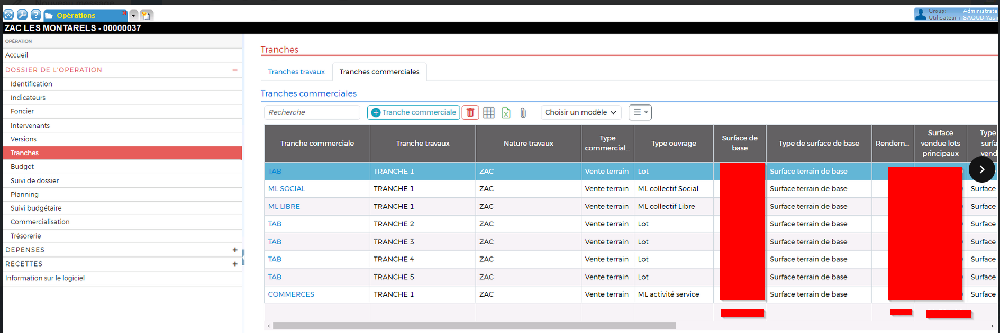{width=100%}

J'ai ensuite mené une phase de tests unitaires d'appels API. N'utilisant pas encore l'outil
d'injection final à ce stade, j'ai testé manuellement les différents endpoints (points de
terminaison), pour décortiquer la mécanique de création d'une donnée. Cette étape m'a permis
de valider quels champs étaient obligatoires et de comprendre la logique séquentielle imposée
par le logiciel.

Deux informations distinctes sont sorties de ces tests, et il est utile de les séparer. La
première tient au contenu de chaque objet : quels champs l'ERP exige pour accepter une
création, et lesquels il tolère vides. La documentation de l'éditeur les décrit, mais la
description reste théorique tant qu'on n'a pas vu le service la refuser. La seconde tient à
l'enchaînement des objets entre eux, c'est-à-dire à l'ordre dans lequel il faut les créer ;
elle n'était pas explicitée par la documentation, et c'est elle qui a occupé la suite du
travail.

Cette phase peut sembler improductive : elle ne crée aucune donnée et ne produit aucun
livrable visible. Je la considère pourtant comme la plus rentable de tout le projet. Chaque
règle découverte à ce stade sur un objet unique aurait coûté, découverte plus tard, un rejet
sur plusieurs centaines de lignes et une reprise complète du fichier d'injection.

### Industrialisation des flux via DirectAPI

Une fois le fonctionnement théorique validé, nous avons déployé le module DirectAPI de
l'éditeur, conçu pour interfacer des fichiers plats avec l'ERP. L'interface de cet outil
d'import, qui permet le paramétrage des flux et le suivi des injections, est présentée en
Figure 2.2. Mon rôle a été de construire l'intégralité du pipeline d'alimentation de cet
outil.

{width=78%}

Concrètement, j'ai conçu des maquettes d'injection Excel complexes, servant de pont entre
l'ancien et le nouveau système. Ce pipeline de données se décompose en trois étapes clés :

1. **Extraction** : j'ai utilisé MyReport Builder pour requêter directement notre base de
   données source et extraire les données brutes nécessaires.
2. **Transformation et mapping** : c'est le cœur du traitement. Dans Excel, j'ai mis en place
   des formules de recherche avancées (RechercheX) pour mapper les anciens champs Grimmo vers
   la nomenclature stricte de SPO. Ces correspondances s'appuyaient sur des tables de
   paramétrage extraites de SPO ou sur des fichiers de mapping que j'ai constitués.
3. **Chargement** : les maquettes finalisées étaient ensuite injectées via DirectAPI.

L'étape de transformation est celle qui a demandé le plus de travail, et celle dont dépendait
la validité de tout le reste. La nomenclature de SPO est stricte : un libellé de poste
budgétaire ou un type de tranche doit correspondre à une valeur que le nouveau système
reconnaît, faute de quoi la ligne est rejetée. Le travail a donc consisté, champ par champ, à
établir la correspondance entre ce que l'ancien système contenait et ce que le nouveau
accepte.

Ces correspondances n'ont pas toutes la même origine, et la distinction compte. Certaines
proviennent de tables de paramétrage extraites de SPO : ce sont les listes de valeurs que
l'ERP tient lui-même, qu'il suffit d'interroger. D'autres sont des fichiers de mapping que
j'ai constitués. La différence est importante au moment de rendre des comptes : dans le
premier cas, une divergence est une erreur de lecture ; dans le second, c'est une mise en
correspondance dont je réponds.

La fonction RechercheX joue dans ces maquettes le rôle d'une jointure : elle va chercher,
dans la table de correspondance, la valeur cible associée à la valeur source. Le choix
d'Excel comme moteur de transformation prolonge l'arbitrage exposé plus haut : la maquette
reste lisible par les personnes qui connaissent le métier et non le code, et une
correspondance douteuse peut leur être montrée telle quelle.

Pour sécuriser ce processus, j'ai appliqué une méthode de validation itérative : nous avons
d'abord migré 3 opérations pilotes, puis un lot de 12, afin de corriger les éventuels rejets
avant de lancer la migration de masse. Cette progression par paliers a une vertu que je n'ai
mesurée qu'après coup : elle rend les erreurs lisibles. Sur trois opérations, un rejet
s'analyse en quelques minutes ; sur plusieurs dizaines, les messages se mélangent et il
devient difficile de savoir quelle règle a été violée.

## Les défis techniques majeurs : dépendances et identifiants

Au-delà de la volumétrie, la complexité de cette migration a résidé dans l'architecture même
de la base de données cible. Ce projet ne s'est pas résumé à un simple transfert de données,
mais a nécessité une véritable rétro-ingénierie des processus de l'ERP. J'ai été confrontée
à deux difficultés structurelles majeures qui ont nécessité une analyse approfondie.

### La gestion des dépendances hiérarchiques

La première difficulté a été de décrypter l'ordre strict d'injection des données, une
contrainte d'intégrité référentielle qui n'était pas explicite dans la documentation
technique de l'éditeur.

J'ai découvert cette logique empiriquement, en analysant les codes d'erreur renvoyés par
l'API lors de mes premiers tests d'injection. Il est apparu qu'il fallait respecter une
séquence de création immuable :

1. Création de l'opération, le conteneur principal.
2. Création des tranches de travaux.
3. Création des tranches commerciales.
4. Création du budget associé.

La Figure 2.3 représente cette séquence et les dépendances qu'elle traduit. Toute tentative
d'injection ne respectant pas cet ordre se soldait par un échec, le système ne trouvant pas
l'objet parent nécessaire.

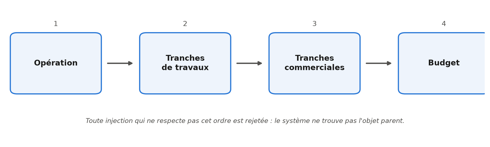{width=95%}

Face à ce manque de clarté initial, j'ai pris l'initiative de rédiger une documentation
interne. Ce document cartographie les étapes de la séquence et les prérequis de chaque objet,
c'est-à-dire, pour chaque type de donnée à créer, ce qui doit exister avant lui. Il fixe donc
par écrit une connaissance qui n'existait jusque-là que sous la forme de codes d'erreur
interprétés, et il la rend transmissible : un guide de référence permettant d'éviter les
erreurs de séquencement lors des phases de reprise ultérieures.

Rédiger cette note n'était pas prévu au départ. Je l'ai fait parce que les règles que les
codes d'erreur m'avaient révélées n'existaient nulle part ailleurs que dans mes notes de
test. C'est le premier livrable écrit de mon année qui n'était pas un fichier de données, et
c'est celui qui a le plus servi aux autres : la reprise des tiers, exposée au chapitre 3,
s'est appuyée directement dessus.

### La complexité algorithmique des identifiants et du versionnement

La seconde difficulté, techniquement plus complexe, concernait la gestion des identifiants
uniques (ID) dans le cadre des mises à jour de données, par exemple pour rectifier un montant
de budget après sa création.

Ces ID système n'étaient visibles nulle part dans l'interface utilisateur. De plus,
l'architecture de l'API SPO repose sur un principe de versionnement et non d'écrasement
simple, comme le ferait un UPDATE en SQL. Concrètement, lors de la modification d'un budget,
le système ne met pas à jour la ligne existante : il clôture la version précédente et crée un
nouveau budget avec un nouvel ID.

Cette spécificité a rendu l'automatisation particulièrement délicate, car je ne pouvais me
fier à aucun ID statique pour cibler une donnée. Pour contourner cette contrainte, j'ai dû
concevoir et scripter une logique de requêtage dynamique en plusieurs étapes pour chaque
injection, que résume la Figure 2.4 :

1. **Appel GET** : interrogation de l'API pour récupérer la liste exhaustive de toutes les
   versions de budgets liées à une opération donnée.
2. **Traitement algorithmique** : tri des résultats pour identifier l'ID correspondant à
   l'objet ayant la date de modification la plus récente, c'est-à-dire le budget actif.
3. **Appel POST** : utilisation de cet ID spécifique pour effectuer la mise à jour finale.

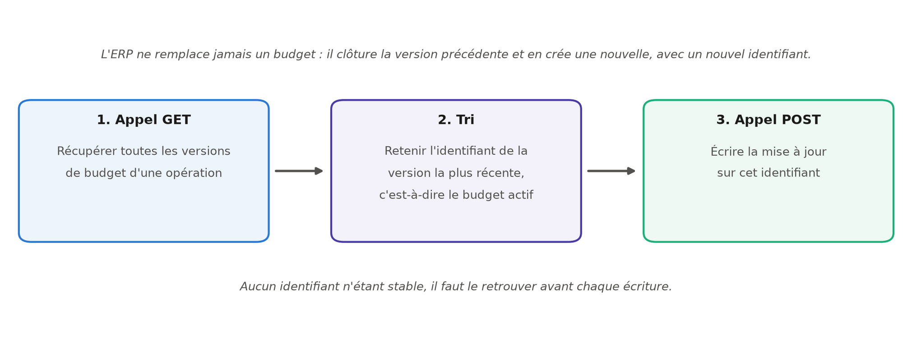{width=100%}

Cette contrainte forte m'a obligée à intégrer des vérifications programmatiques en amont de
chaque écriture. Elle m'a surtout appris quelque chose de plus général sur les interfaces de
programmation : une API ne se contente pas d'exposer des données, elle impose un modèle de
comportement. Ici, le versionnement traduit une exigence d'auditabilité comptable
parfaitement légitime, mais qui rend impossible toute écriture naïve. Comprendre l'intention
derrière la contrainte est ce qui permet de la contourner proprement plutôt que de lutter
contre elle.

## Adaptation stratégique : le déploiement en « coquilles vides »

Face aux complexités techniques inhérentes à la gestion des identifiants et au versionnement,
et compte tenu des délais stricts imposés par la direction, nous avons été confrontés à un
arbitrage nécessaire entre perfection technique et urgence opérationnelle.

La contrainte majeure provenait du besoin impératif des utilisateurs de réaliser la
facturation électronique dès le basculement vers le nouvel outil. Pour que ce processus
fonctionne, et notamment pour assurer le lien avec la Gestion Électronique des Documents
(GED), il fallait que les opérations existent dans l'ERP, même si leur historique n'était pas
encore intégralement reconstitué.

### Une approche agile par priorisation

Nous avons donc décidé d'adopter une stratégie de déploiement dite en « coquilles vides ».
Cette approche a consisté à dissocier le contenant, c'est-à-dire la structure de l'opération,
du contenu, c'est-à-dire les données budgétaires détaillées.

Concrètement, nous avons réorienté notre plan de migration pour prioriser la création massive
des fiches opérations dans SPO. Nous avons injecté en priorité les données indispensables à
la facturation, comme le code opération et le libellé, laissant temporairement de côté les
données historiques plus complexes, budgets passés et détail des tranches, qui nécessitaient
un temps de nettoyage supérieur.

Cette décision est celle dont j'ai le plus appris en matière de conduite de projet. Elle
suppose d'accepter qu'un système soit temporairement incomplet et de le documenter comme
tel, plutôt que de retarder la mise en service jusqu'à la complétude. Le risque est réel :
une donnée manquante que personne ne signale finit par être considérée comme absente pour de
bon. Nous l'avons couvert en tenant la liste de ce qui restait à reprendre, ce qui a
transformé une dette implicite en dette suivie.

### Gains opérationnels et lissage de la charge

Cette stratégie s'est révélée payante. Elle a permis de débloquer immédiatement la fonction
de facturation et d'assurer la continuité de service sans attendre la finalisation totale de
la migration. De plus, elle nous a offert un délai supplémentaire précieux pour traiter la
reprise des données au fil de l'eau, dans un second temps, sans subir la pression de
l'urgence quotidienne.

Cette adaptation témoigne d'une gestion de projet agile, capable d'ajuster sa méthodologie
pour répondre aux réalités du terrain.

## Bilan de la migration à la fin du premier semestre

Ce travail d'initialisation de la migration vers SPO a constitué l'axe central du premier
semestre. Il est essentiel de préciser qu'à la fin de cette période, nous n'étions qu'au
début de ce vaste chantier.

Nous avons réussi à modéliser et intégrer la structure fondamentale des dossiers, à savoir les
opérations et leurs tranches de travaux, la création des tranches commerciales étant encore en
cours à la fin du semestre. Une part conséquente du travail restait à accomplir : l'analyse et
l'intégration des données financières et comptables, notamment la reprise détaillée des budgets
et de l'historique des factures.

Le tableau suivant récapitule l'état d'avancement à ce jalon.

| Objet du modèle SPO | État à la fin du premier semestre |
|:--------------------------------|:--------------------------------------------|
| Opérations | Créées, hors budgets détaillés |
| Tranches de travaux | Créées |
| Tranches commerciales | En cours de création |
| Budgets détaillés | Reportés, stratégie des « coquilles vides » |
| Historique des factures | Non repris à ce stade |
| Tiers, clients acquéreurs | Non repris à ce stade, voir chapitre 3 |

Les fondations techniques étaient donc posées et les pipelines d'injection fonctionnels. Ce
bilan appelle une remarque de méthode qui vaut au-delà de ce projet : sur un chantier de
reprise, l'avancement ne se mesure pas au nombre d'enregistrements créés, mais à la part du
modèle cible réellement couverte. Créer 283 opérations sans leurs budgets, ce n'est pas avoir
fait la moitié du travail, c'est avoir rendu la seconde moitié possible.

::: transition
La migration vers SPO a occupé l'essentiel de mon premier semestre, et elle a défini le
niveau d'exigence technique du reste de l'année. J'y ai appris à lire un modèle de données
inconnu par ses messages d'erreur, à respecter une intégrité référentielle non documentée, et
à arbitrer entre l'exhaustivité et la continuité de service.

Néanmoins, le socle ainsi constitué restait incomplet sur un point qui allait vite se faire
sentir. Les opérations existaient, mais les clients qui achètent dans ces opérations, eux,
n'étaient pas encore dans le nouvel ERP. Or reprendre des clients n'est pas reprendre des
structures de gestion : il s'agit de personnes, avec ce que cela implique de
risques de doublons et d'exigence de qualité.

Le chapitre suivant présente donc la reprise des tiers, conduite au second semestre. On y
verra que le problème central n'y était plus l'ordre d'injection, mais une question
préalable et bien plus difficile à trancher : à partir de quoi décide-t-on que deux lignes
désignent la même personne ?
:::


# La reprise des tiers : une chaîne de traitement pilotée par formules

::: sommaire
**Sommaire**

- 3.1 Contexte et enjeux de la reprise des tiers
    - 3.1.1 Du CRM Vadimm à l'ERP SPO : le périmètre des données clients
    - 3.1.2 L'enjeu central : créer sans dupliquer
- 3.2 Conception du fichier de travail : une chaîne de traitement pilotée par formules
    - 3.2.1 Une architecture en trois temps : sources, feuille pivot, feuilles de sortie
    - 3.2.2 Le modèle de données des tiers dans SPO : couples, personnes physiques, personnes morales
- 3.3 Les trois mécanismes algorithmiques
    - 3.3.1 La déduplication par clés d'unicité différenciées selon la nature du tiers
    - 3.3.2 L'exclusion des tiers déjà présents dans SPO
    - 3.3.3 La propagation vers les feuilles de sortie par numérotation séquentielle
- 3.4 De la préparation à l'injection : procédure et contraintes techniques
    - 3.4.1 Génération et normalisation des fichiers d'import
    - 3.4.2 Le contournement par API : 872 requêtes PATCH pour les coordonnées des couples
- 3.5 Traitement des cas particuliers et arbitrages
- 3.6 Bilan de l'import et points de vigilance pour la suite
:::

Ce chapitre détaille la reprise des tiers, c'est-à-dire des clients acquéreurs, depuis notre
CRM Vadimm vers le nouvel ERP du groupe. Conduite au second semestre, cette mission prolonge
directement le chantier exposé au chapitre précédent, et elle constitue le premier pas vers
l'interopérabilité entre l'ERP et le CRM que je n'avais pu qu'annoncer à la fin du premier
semestre : elle transfère le référentiel client, la synchronisation permanente sans double
saisie restant à construire. Elle en change
toutefois la nature : il ne s'agissait plus d'injecter des structures de gestion, opérations,
tranches et budgets, mais des personnes, avec ce que cela implique de risques de doublons et
d'exigence de qualité. J'y expose la conception du fichier de travail que j'ai construit
pour industrialiser cette reprise, les trois mécanismes algorithmiques sur lesquels il
repose, les contraintes techniques du format d'import de SPO et la manière dont je les ai
contournées, puis le bilan de l'import et les enseignements que j'en retire.

## Contexte et enjeux de la reprise des tiers

### Du CRM Vadimm à l'ERP SPO : le périmètre des données clients

Le remplacement de l'ERP historique du groupe par SPO, décrit au chapitre 2, s'est fait par lots
successifs. Après la création des opérations immobilières et de leurs tranches, il restait à
reprendre les données commerciales, et en premier lieu les clients. Dans SPO, ces clients sont
désignés par le terme générique de *tiers* : la même entité de base sert à représenter un
acquéreur particulier comme une société, et se voit ensuite attribuer un ou plusieurs rôles.
Reprendre les tiers signifiait donc alimenter le socle sur lequel toute la gestion commerciale
allait s'appuyer.

Le périmètre m'a été fixé de la manière suivante : importer dans SPO l'ensemble des clients
ayant déjà acheté un bien chez Angelotti. La matière première provenait de notre CRM (*Customer
Relationship Management*, l'outil de gestion de la relation client) Vadimm, sous la forme de
deux extractions complémentaires : celle des ventes enregistrées, qui porte 1 557 lignes, et
celle des coordonnées de contact des acquéreurs et de leurs co-acquéreurs, qui en porte 1 602.
Les deux extractions ne se recouvrent donc pas exactement, et l'écart de 45 lignes entre elles
n'est pas documenté dans les fichiers sources ; il s'explique vraisemblablement par des contacts
renseignés sans vente correspondante. J'ai retenu le plus large des deux totaux, pour ne perdre
aucun acquéreur en entrée de chaîne : le périmètre de travail compte **1 602 lignes**, et c'est
de ce total que part toute la chaîne de traitement.

La difficulté ne tenait pas au volume. Elle tenait à la nature même de la donnée. Concrètement,
une ligne de l'extraction Vadimm ne décrit pas un client, elle décrit une vente. Un même
acquéreur qui a acheté trois lots apparaît donc trois fois, et rien dans le fichier ne le
signale. Transformer un fichier de ventes en un référentiel de personnes suppose de reconstituer
l'identité de chacune, ce que le système source ne faisait pas à ma place.

### L'enjeu central : créer sans dupliquer

L'enjeu de cette reprise se résume à une contrainte simple à énoncer et difficile à tenir :
créer chaque client une fois et une seule. Deux sources de duplication se cumulaient, et
elles n'appelaient pas la même parade.

La première est interne au fichier. Comme chaque ligne correspond à une vente, un client
fidèle est présent autant de fois qu'il a acheté. Importer le fichier tel quel aurait créé
autant de fiches que d'achats, avec des conséquences directes sur la gestion : un même
acquéreur aurait été rattaché à plusieurs identifiants, et il serait devenu impossible de
reconstituer son historique ou de lui adresser un courrier unique.

La seconde est externe. Au moment de préparer l'import, SPO n'était pas vide : environ
13 000 tiers y avaient déjà été créés, par saisie ou par d'autres canaux d'alimentation.
Injecter ces 1 602 lignes sans les confronter à cet existant aurait produit des doublons
d'une autre nature, plus insidieux parce qu'ils auraient opposé une fiche importée et une
fiche saisie, toutes deux légitimes en apparence.

Face à cette double contrainte, une reprise manuelle était exclue. Vérifier ligne à ligne
qu'un acquéreur n'existe ni ailleurs dans le fichier ni déjà dans un référentiel de 13 000
tiers représentait un volume de contrôles incompatible avec les délais, et surtout un
risque d'erreur humaine que rien n'aurait permis de tracer ensuite. J'ai donc fait le choix
de construire un fichier de travail qui automatise entièrement ces contrôles par formules,
de sorte que la décision d'importer ou non une ligne soit calculée et non prise au cas par
cas.

## Conception du fichier de travail : une chaîne de traitement pilotée par formules

### Une architecture en trois temps : sources, feuille pivot, feuilles de sortie

Le fichier que j'ai conçu ne se présente pas comme un tableur de saisie mais comme une
chaîne de traitement automatique, dans la lignée des maquettes d'injection que j'avais
construites au premier semestre. Les données entrent d'un côté sous leur forme brute et
ressortent de l'autre sous la forme exacte attendue par SPO, sans qu'aucune donnée soit
recopiée à la main entre les deux. Cette architecture se décompose en trois étages, que
présente la Figure 3.1.

1. **Les feuilles sources** : trois feuilles en lecture seule qui reçoivent les extractions
   telles quelles. La feuille `VADIMM` porte les 1 557 lignes de ventes reprises du CRM, la
   feuille `Builder coordonnée` les 1 602 lignes de coordonnées des acquéreurs et
   co-acquéreurs, et la feuille `SPO` l'extraction des tiers déjà existants dans l'ERP, qui
   sert de référentiel de comparaison.
2. **La feuille pivot `BuilderTiers`** : c'est le cœur du dispositif. Elle reçoit
   l'intégralité des lignes issues des sources et y adjoint les colonnes de calcul qui
   déterminent, pour chaque ligne, si elle correspond à un tiers nouveau, à un doublon
   interne ou à un tiers déjà présent dans SPO.
3. **Les six feuilles de sortie** : une feuille par fichier d'import attendu par SPO,
   entièrement générée par formules à partir de la feuille pivot, et destinée à être
   exportée en CSV.

{width=100%}

Ce découpage répond à une règle que je me suis imposée dès la conception, et qui figure en
tête de la note de procédure que j'ai rédigée pour l'équipe : on ne modifie jamais
directement une feuille de sortie. Ces feuilles étant intégralement calculées, toute
correction saisie dedans serait écrasée au recalcul suivant, sans laisser de trace. Toute
intervention passe donc par `BuilderTiers` ou par la feuille de coordonnées. Cette
discipline peut sembler contraignante à l'usage, mais elle est la contrepartie
indispensable de l'automatisation : c'est elle qui garantit qu'à tout moment, le contenu
des fichiers d'import est bien le résultat des règles décrites, et non d'une retouche
ponctuelle oubliée depuis.

### Le modèle de données des tiers dans SPO : couples, personnes physiques, personnes morales

Avant de pouvoir automatiser quoi que ce soit, il fallait comprendre comment SPO représente
un tiers. Cette phase d'appropriation a repris la méthode que j'avais déjà éprouvée sur les
opérations : lecture de la documentation de l'éditeur, puis tests unitaires de création
pour valider empiriquement les champs réellement obligatoires.

Deux caractéristiques du modèle ont structuré tout le reste du travail.

La première est que SPO distingue trois **natures** de tiers, et que cette nature commande
la manière dont l'identité est portée. Une **personne morale** est une société, identifiée
par sa raison sociale et son SIRET (le numéro d'identification à quatorze chiffres d'un
établissement). Une **personne physique** est un individu, identifié par son nom, son
prénom et sa date de naissance. Un **couple** est une entité particulière : le tiers
lui-même n'est ni l'un ni l'autre des deux conjoints, il les regroupe, et les deux
personnes qui le composent sont enregistrées comme ses *représentants*. Cette troisième
nature est de loin la plus fréquente dans notre activité, puisque l'essentiel de nos ventes
se fait à des couples acquéreurs.

La seconde caractéristique est qu'un tiers n'est pas un enregistrement unique mais un
ensemble d'objets liés. La fiche principale ne porte que l'identité ; l'adresse, le
courriel, le téléphone, les représentants et les rôles sont autant d'objets rattachés, avec
chacun son propre fichier d'import. La Figure 2.2, présentée au chapitre précédent, montre
précisément l'interface du module DirectAPI avec la ressource « Tiers » sélectionnée : on y
lit directement cette décomposition, puisque l'écran propose un emplacement de fichier
distinct par objet rattaché. Six d'entre eux correspondent aux six feuilles de sortie de mon
fichier, les deux autres, les RIB et les sites web, n'étant pas alimentés par cette reprise.

C'est cette décomposition qui explique pourquoi mon fichier produit six feuilles de sortie
et non une seule. Elle explique aussi une asymétrie qui reviendra plus loin : les adresses,
courriels et téléphones se rattachent directement à une personne physique ou morale, mais
pour un couple, ils se rattachent aux représentants. Cette différence de traitement, qui
paraît anodine sur le papier, s'est révélée être la principale contrainte technique de
l'import.

## Les trois mécanismes algorithmiques

La feuille pivot repose sur trois mécanismes qui s'enchaînent : d'abord identifier les
doublons internes, ensuite écarter les tiers déjà créés dans SPO, enfin distribuer les
lignes retenues vers les six feuilles de sortie. Ces trois mécanismes sont ce qui distingue
un fichier de mise en forme d'un outil de reprise, puisqu'ils déplacent la décision
d'importer une ligne de l'opérateur vers une règle écrite.

### La déduplication par clés d'unicité différenciées selon la nature du tiers

Dédupliquer suppose de répondre d'abord à une question qui n'est pas technique : à partir de
quoi décide-t-on que deux lignes désignent la même personne ? C'est le point sur lequel
j'ai le plus hésité, et celui qui commande la qualité de tout le résultat.

Une clé unique appliquée à l'ensemble du fichier ne pouvait pas convenir, précisément parce
que les trois natures de tiers ne s'identifient pas de la même façon. Deux sociétés peuvent
porter des raisons sociales très proches sans être la même entité, alors qu'il devient très
improbable que deux lignes partageant nom, prénom, date de naissance et adresse désignent
deux personnes distinctes. J'ai
donc retenu **trois clés d'unicité distinctes**, une par nature, calculées chacune dans sa
propre colonne de la feuille pivot :

1. **Pour un couple** : le nom et le prénom de l'acquéreur principal, désigné ADV dans nos
   extractions du nom du dossier de vente auquel il est rattaché, complétés du nom et du
   prénom du co-acquéreur, désigné CO. C'est la combinaison des deux identités qui fait l'unicité, et non chacune prise
   isolément.
2. **Pour une personne physique** : le nom, le prénom, la date de naissance et l'adresse.
   La date de naissance sépare les homonymes, et l'adresse ajoute un second point de
   comparaison.
3. **Pour une personne morale** : la raison sociale et le SIRET. Le SIRET est l'identifiant
   légal de l'établissement, et la raison sociale le double lorsqu'il fait défaut.

Chaque colonne calcule un **rang** : la première occurrence d'un tiers reçoit le rang 1,
les occurrences suivantes les rangs 2, 3, et ainsi de suite. Seules les lignes de rang 1
sont retenues pour l'import, les autres étant considérées comme des achats successifs d'un
client déjà compté. Ce principe de rang présente un avantage sur une déduplication par
suppression : aucune ligne n'est effacée du fichier de travail. Les doublons restent
visibles, avec leur rang, permettant à tout moment de vérifier pourquoi une ligne n'a
pas été importée et de remonter à la vente concernée.

Ce choix de trois clés différenciées est, à mes yeux, le véritable cœur méthodologique de ce
travail. En effet, il traduit une idée simple : la règle d'unicité n'est pas une propriété du
fichier, c'est une propriété du métier. Chercher une clé universelle aurait conduit soit à
fusionner des tiers distincts, soit à en dupliquer, et dans les deux cas l'erreur n'aurait été
découverte que bien plus tard, dans l'usage quotidien de l'ERP.

### L'exclusion des tiers déjà présents dans SPO

Le deuxième mécanisme répond à la duplication externe. Pour chaque ligne de la feuille
pivot, trois formules de recherche interrogent la feuille contenant l'extraction des tiers
déjà créés dans SPO, chacune adaptée à une nature :

1. La première recherche les **personnes morales** par leur raison sociale.
2. La deuxième recherche les **personnes physiques** par leur nom et leur prénom.
3. La troisième recherche les **couples** par les quatre noms qui les composent, en testant
   les deux ordres possibles entre l'acquéreur et le co-acquéreur.

Ce dernier point mérite d'être souligné, parce qu'il illustre le genre de détail qui décide
de la réussite d'une reprise. Rien ne garantit que l'ordre des deux conjoints soit le même
dans Vadimm et dans SPO : un couple saisi manuellement peut très bien y figurer avec le
conjoint en premier. Une recherche qui ne testerait qu'un seul sens laisserait donc passer
une partie des doublons, et les tiers concernés seraient créés une seconde fois sans que
personne s'en aperçoive avant longtemps. Tester les deux sens allonge la formule, mais
supprime entièrement ce risque.

Lorsque l'une de ces trois formules renvoie un code tiers de SPO, du type `T00012666`, la
ligne est automatiquement exclue de l'import. Sur ce projet, **40 tiers** ont ainsi été
détectés comme déjà existants et écartés. Rapporté aux 1 474 tiers uniques, le volume peut
sembler faible, mais chacun de ces 40 cas aurait produit un doublon durable dans le
référentiel client de l'entreprise.

La Figure 3.2 récapitule l'effet cumulé de ces deux premiers mécanismes. Des 1 602 lignes
du périmètre de départ, la déduplication interne en écarte 128 qui correspondent à des
achats répétés, ramenant le total à 1 474 tiers uniques ; l'exclusion des tiers déjà présents
dans SPO en retire 40 de plus, pour un total de **1 434 tiers à créer**. Chaque étage de
ce filtrage correspond à une règle explicite, écrite dans une colonne du fichier, donc
vérifiable et reproductible.

{width=92%}

### La propagation vers les feuilles de sortie par numérotation séquentielle

Restait à alimenter les six feuilles de sortie à partir des lignes retenues. La difficulté tient
à ce que ces feuilles n'ont ni la même population ni le même nombre de lignes. La feuille des
tiers reçoit un enregistrement par tiers créé, mais la feuille des adresses ne concerne que les
personnes physiques et morales, celle des courriels seulement celles de ces personnes dont le
courriel est renseigné, et celle des représentants deux lignes par couple plus une par société.
Il fallait donc, pour chaque feuille, une numérotation qui lui soit propre.

Le mécanisme que j'ai retenu attribue à chaque ligne de la feuille pivot un **numéro
séquentiel par destination**, calculé dans une colonne dédiée. Une ligne qui n'a pas
vocation à alimenter une feuille donnée ne reçoit pas de numéro pour cette feuille ; les
lignes concernées sont numérotées de 1 à *n* dans l'ordre de la feuille pivot. Chaque
feuille de sortie n'a plus alors qu'à rechercher, pour sa ligne *i*, la ligne de
`BuilderTiers` portant le numéro *i* dans la colonne qui la concerne.

L'intérêt de ce détour est qu'il rend les six feuilles indépendantes les unes des autres
tout en les gardant synchronisées avec une source unique. Si une ligne est corrigée dans la
feuille pivot, ou si une nouvelle exclusion apparaît, les six numérotations se recalculent
et les six fichiers restent cohérents entre eux. C'est exactement le problème qui, en
saisie manuelle, produit les incohérences les plus difficiles à détecter : une adresse
rattachée au mauvais tiers parce qu'une ligne a été insérée quelque part sans que le reste
suive.

La Figure 3.3 donne la volumétrie effectivement produite par chacune des six feuilles. On
y lit directement le modèle de données décrit plus haut : 1 434 lignes pour la liste
maîtresse des tiers et autant pour l'attribution du rôle « Client », mais 1 871 lignes de
représentants, puisque chaque couple en compte deux, et seulement 553 adresses, 538
téléphones et 469 courriels, ces trois derniers fichiers ne portant que les personnes
physiques et morales. Ces écarts de volumétrie d'un fichier à l'autre ne sont donc pas des
approximations : ils sont la traduction directe du modèle de données décrit en 3.2.2.

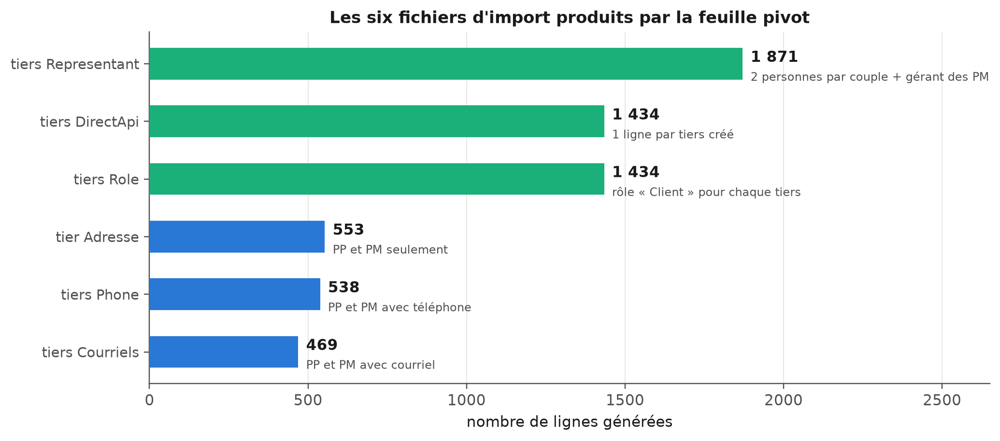{width=95%}

> **À insérer — figure.** Capture d'écran de la feuille `BuilderTiers`, montrant côte à
> côte les colonnes de données reprises et les colonnes calculées : les trois rangs de
> déduplication avec des valeurs 1 et 2 visibles, et une ligne portant un code SPO dans les
> colonnes de rapprochement. Anonymiser les noms d'acquéreurs. Les figures suivantes sont à
> renuméroter après insertion.

## De la préparation à l'injection : procédure et contraintes techniques

### Génération et normalisation des fichiers d'import

Une fois les six feuilles calculées, il restait à les transformer en fichiers réellement
acceptés par SPO. Cette étape, que j'imaginais purement mécanique, a en réalité mobilisé
plusieurs contraintes de format que la documentation ne mentionnait pas et que les premiers
rejets ont fait apparaître.

- **L'encodage et le séparateur.** Les fichiers doivent être enregistrés en CSV
  (*Comma-Separated Values*, un format texte où les colonnes sont séparées par un
  caractère) encodé en UTF-8, avec le point-virgule comme séparateur. C'est la seule
  configuration acceptée par l'outil d'import.
- **La normalisation des caractères.** SPO refuse les caractères accentués dans les
  colonnes textuelles. Il a donc fallu convertir en ASCII pur l'ensemble des noms, prénoms,
  adresses et professions, en remplaçant les caractères accentués par leur équivalent non
  accentué. Cette contrainte est frustrante, puisqu'elle dégrade volontairement une donnée
  correcte, mais elle est bloquante : sans elle, les lignes concernées sont rejetées.
- **La structure de l'en-tête.** Les feuilles de travail comportent deux lignes de titre,
  l'intitulé des colonnes et le type de données attendu. Seule la première doit être
  conservée dans le fichier exporté.
- **Le découpage en lots.** Les fichiers doivent être découpés en lots de 200 tiers au
  maximum, et surtout être homogènes en nature : un même fichier ne peut pas contenir à la
  fois des couples et des personnes physiques. Cette dernière règle a une conséquence
  pratique importante, puisqu'elle impose de trier les lignes par nature avant de découper,
  et c'est elle qui explique que l'import des couples s'est fait en cinq lots successifs.

J'ai consigné l'ensemble de ces contraintes dans la note de procédure remise à l'équipe, en
même temps que la marche à suivre pour rejouer l'import si celui-ci devait être différé.
Ce dernier point n'est pas anecdotique : entre la préparation du fichier et l'injection
effective, d'autres tiers peuvent être créés dans SPO par les équipes commerciales. La
procédure prévoit donc de redemander une extraction actualisée des tiers existants, de
remplacer le contenu de la feuille de référence et de recalculer : les tiers devenus
existants entre-temps sortent alors automatiquement du périmètre d'import. Le fichier reste
ainsi utilisable dans le temps, ce qui était l'un de mes objectifs de conception.

### Le contournement par API : 872 requêtes PATCH pour les coordonnées des couples

C'est à ce stade que j'ai rencontré la contrainte la plus structurante du projet, et celle
dont la résolution m'a le plus appris.

Le format d'import CSV de SPO ne permet pas de porter les courriels et les téléphones des
couples. La raison en est logique au regard du modèle de données décrit en 3.2.2 : pour un
couple, ces coordonnées ne sont pas des attributs du tiers mais des attributs de ses
représentants, et les fichiers d'import de coordonnées ne savent viser qu'un tiers. Le
résultat est que, sur les 881 couples créés, les fichiers CSV pouvaient produire l'identité
et les représentants, mais ne pouvaient pas porter les coordonnées de contact. Concrètement,
plus de six tiers sur dix se seraient retrouvés dans l'ERP sans adresse électronique ni
numéro de téléphone, ce qui aurait vidé une bonne partie de l'intérêt de la reprise pour
les équipes commerciales.

Deux voies restaient praticables. La première, saisir ces coordonnées à la main après
l'import, représentait plusieurs centaines de saisies et reconduisait exactement le risque
d'erreur que le fichier automatisé visait à supprimer. La seconde consistait à passer par
l'API de SPO, que j'avais déjà pratiquée au premier semestre. C'est celle que j'ai
retenue.

L'API expose en effet une opération de modification partielle au format **JSON Patch**,
normalisé par la RFC 6902 [3]. Ce format permet de décrire une modification non pas en
renvoyant l'objet entier, mais sous la forme d'une liste d'opérations élémentaires, chacune
indiquant l'action à effectuer, le chemin de la propriété visée dans l'objet et la valeur à
appliquer. C'est exactement ce dont j'avais besoin : ajouter un courriel et un téléphone
sur un représentant déjà créé, sans toucher au reste de sa fiche ni risquer d'écraser une
donnée saisie ailleurs.

La démarche s'est déroulée en trois temps :

1. **Génération des requêtes.** J'ai construit le corps de chaque requête à partir des
   données présentes dans la feuille `Builder coordonnée`.
2. **Constitution de la collection.** J'ai regroupé ces requêtes dans une collection
   Postman, l'outil de test et d'exécution de requêtes. La collection compte
   **872 requêtes PATCH**, organisées en cinq lots correspondant aux cinq fichiers d'import
   de couples.
3. **Exécution et contrôle.** Les cinq lots ont été exécutés après la création des couples,
   et l'intégralité des 872 requêtes est passée sans erreur.

> **À insérer — figure.** Capture d'écran de la collection Postman : arborescence des cinq
> lots et vue d'une requête PATCH sur son onglet *Body*, montrant la structure JSON Patch.
> Masquer l'adresse du serveur et les identifiants, comme sur la Figure 2.2. Les figures
> suivantes sont à renuméroter après insertion.

Ce contournement m'a appris quelque chose que je n'avais pas formulé aussi clairement
jusque-là : dans un projet de reprise, la limite d'un format d'import n'est pas
nécessairement une limite du système. Le fichier plat et l'API sont deux portes d'entrée
vers le même modèle de données, et elles n'offrent pas les mêmes possibilités. Savoir
basculer de l'une à l'autre au bon moment, plutôt que d'accepter une perte de données ou de
retomber dans la saisie manuelle, est une compétence que la reprise du premier semestre
n'avait pas eu l'occasion de mobiliser.

## Traitement des cas particuliers et arbitrages

Aussi automatisée soit-elle, une reprise de données laisse toujours un résidu de cas qui ne
rentrent dans aucune règle. Les traiter est moins spectaculaire que de concevoir un
mécanisme de déduplication, mais c'est une part réelle du travail, et surtout une part qui
engage une décision. J'ai tenu à documenter chacun de ces arbitrages dans la note de
procédure, pour que la trace en subsiste indépendamment de moi.

**Les adresses étrangères :** Trois tiers avaient une adresse hors de France, dont un en
Allemagne et un aux Émirats arabes unis. SPO refusait initialement la création d'un tiers avec un pays
étranger renseigné directement dans le fichier d'import. Plutôt que de bloquer la chaîne
pour ces trois cas, nous avons choisi de les créer avec le pays France par défaut, puis
de rectifier le pays manuellement dans l'ERP après création, en vérifiant à chaque fois que
la modification était bien prise en compte. C'est un compromis assumé : il fait passer une
information provisoirement fausse dans le système, mais sur un périmètre connu, listé, et
corrigé dans la foulée.

**Les tiers mal classés :** Trois autres tiers étaient renseignés dans Vadimm avec une nature qui
ne correspondait pas à la réalité. Deux étaient enregistrés comme personnes physiques alors
qu'il s'agissait de sociétés, et un troisième comme personne physique alors qu'il
s'agissait d'un couple mal saisi. J'ai modifié manuellement leur nature dans la feuille
pivot avant génération des fichiers, ce qui a suffi à ce qu'ils soient créés correctement,
puisque la nature commande à la fois la clé d'unicité et la feuille de sortie qui les
reçoit. L'un d'eux, en revanche, était déjà créé dans SPO par un autre canal : il a été
retiré du fichier d'import plutôt que reclassé.

**Les exclusions ponctuelles :** Un tiers relevant d'une opération de dation, c'est-à-dire
d'un paiement en biens plutôt qu'en numéraire, existait déjà dans SPO et a été retiré du
fichier.

**Les doublons avec adresses divergentes :** Deux cas ont demandé un arbitrage véritable.
Une même personne y apparaissait deux fois avec deux adresses différentes, sans qu'il soit
possible de déterminer automatiquement laquelle retenir : la déduplication savait dire
qu'il s'agissait de la même personne, elle ne pouvait pas dire où cette personne habite
aujourd'hui. L'explication la plus vraisemblable était un déménagement entre deux achats.
Après vérification des dates dans Vadimm, nous avons tranché en conservant l'adresse
rattachée à la vente la plus récente.

Ces cas sont peu nombreux au regard des 1 434 tiers créés, et il serait tentant de les
présenter comme des détails. Je crois au contraire qu'ils délimitent précisément ce que
l'automatisation peut et ne peut pas faire. Les formules savent appliquer une règle ;
elles ne savent pas décider laquelle de deux adresses également plausibles est la bonne.
La valeur du fichier de travail n'est pas d'avoir supprimé la décision humaine, mais de
l'avoir concentrée sur une poignée de cas identifiés, au lieu de la diluer sur 1 602 lignes.

## Bilan de l'import et points de vigilance pour la suite

L'intégralité des imports CSV et des requêtes PATCH a été exécutée avec succès. Le tableau
suivant récapitule ce qui a été créé dans SPO.

| Objet créé dans SPO                      | Volume | Canal          |
|:-----------------------------------------|-------:|:---------------|
| Tiers                                     |  1 434 | Import CSV     |
| Adresses                                  |    553 | Import CSV     |
| Courriels (personnes physiques et morales) |    469 | Import CSV     |
| Téléphones (personnes physiques et morales) |    538 | Import CSV     |
| Représentants (couples et sociétés)       |  1 871 | Import CSV     |
| Rôles « Client »                          |  1 434 | Import CSV     |
| Coordonnées des couples                   |    872 | Requêtes PATCH |

Les 1 434 tiers créés se répartissent en **881 couples**, **462 personnes physiques** et
**91 personnes morales**, répartition que représente la Figure 3.4. Cette structure n'est
pas un simple constat de volumétrie : elle justifie a posteriori l'attention portée au
traitement des couples, qui représentent plus de six tiers sur dix et concentrent à eux
seuls la contrainte de format qui a imposé le recours à l'API.

{width=92%}

> **À insérer — figure.** Capture d'écran d'une fiche de couple dans SPO, onglet des
> représentants ouvert, montrant les deux personnes du couple et les coordonnées ajoutées
> par requête PATCH sur l'une d'elles. Anonymiser les noms.

Au-delà du résultat, ce projet m'a laissé un ensemble de points de vigilance que j'ai
documentés et qui valent, je crois, bien au-delà du cas de cet import.

Le premier concerne l'usage du fichier lui-même. Quatre manipulations le cassent silencieusement
: modifier une feuille de sortie, dont le contenu est régénéré à chaque recalcul ; modifier les
colonnes calculées de la feuille pivot, qui portent toute la logique de rang et de numérotation
; insérer une ligne au milieu de la feuille pivot ou de la feuille de coordonnées, ce qui décale
toutes les références ; et trier la feuille pivot, ce qui détruit la logique de rang, celle-ci
étant calculée de façon cumulative sur l'ordre des lignes. Aucune de ces quatre manipulations ne
produit de message d'erreur, les rendant d'autant plus dangereuses. C'est la raison pour
laquelle la note de procédure les mentionne avant même d'expliquer comment utiliser le fichier.

Le second concerne un ensemble de pièges techniques que j'ai rencontrés en construisant les
formules, et qui ont chacun coûté du temps de recherche avant d'être compris :

1. **Le comptage des chaînes vides.** Une formule de comptage conditionnel considère comme
   une valeur la chaîne vide renvoyée par une autre formule. Les compteurs de contrôle
   étaient donc systématiquement surévalués, jusqu'à ce que je restreigne le comptage aux
   seules valeurs textuelles réelles.
2. **Le format des dates.** Le code de mise en forme des mois peut être interprété comme
   un code de minutes selon le contexte, produisant des clés de déduplication fausses
   sans qu'aucune erreur soit signalée. J'ai remplacé toute mise en forme globale par une
   recomposition explicite de l'année, du mois et du jour.
3. **Les heures parasites dans les dates de naissance.** Certaines dates issues de
   l'extraction portaient une heure non nulle, d'autres non. Deux dates identiques à
   l'affichage étaient donc considérées comme différentes par le tableur, cassant la
   déduplication des personnes physiques. La normalisation systématique des dates à
   minuit a réglé le problème.
4. **La différence entre cellule vide et chaîne vide.** Une cellule contenant une formule
   qui renvoie une chaîne vide n'est pas une cellule vide, et les tests de vacuité ne la
   détectent pas comme telle. Cette confusion est à l'origine de plusieurs faux positifs
   dans les premières versions des formules d'exclusion.

Ces quatre points ont un dénominateur commun, et c'est l'enseignement principal que j'en
tire : dans une chaîne de traitement par formules, l'erreur ne se manifeste presque jamais
par un message d'erreur. Elle se manifeste par un compteur qui ne tombe pas juste. C'est
pourquoi j'ai ajouté à la feuille pivot un panneau de contrôle affichant en permanence les
compteurs clés, et pourquoi la procédure impose de les vérifier avant tout export : tout
écart entre ces compteurs et les valeurs attendues signale un problème à investiguer avant
d'aller plus loin. Ce panneau est le seul dispositif de détection dont je disposais.

Un dernier point de vigilance relève de la performance. Le fichier comporte environ 60 000
cellules de formules, rendant le recalcul automatique pénible pendant les phases de
modification. Basculer en calcul manuel pendant le travail, puis forcer un recalcul complet
avant chaque export, est la manière de travailler que j'ai retenue et que la procédure
recommande.

::: transition
Cette reprise des tiers achève, pour la partie qui me revenait, le travail de constitution
du socle de données du nouvel ERP. Après les opérations et leurs tranches migrées au
premier semestre, les 1 434 clients acquéreurs disposent désormais dans SPO d'une fiche
unique, correctement typée, dotée de ses représentants, de son rôle et, lorsque la source
les portait, de ses coordonnées.
Le référentiel commercial du groupe est reconstitué, et il l'est selon des règles écrites,
tracées et rejouables plutôt que par une saisie dont personne n'aurait pu, six mois plus
tard, reconstituer la logique.

Néanmoins, il serait excessif de présenter ce chantier comme achevé. La reprise des
historiques budgétaires reste devant nous, et le fichier de travail devra probablement être
rejoué au moins une fois avant la bascule définitive, à mesure que de nouveaux tiers sont
créés dans l'ERP par les équipes commerciales. Le référentiel client est en revanche
stabilisé, et c'est lui qui conditionne la suite.

La valeur de ce travail ne se mesure pas au nombre de lignes importées. Elle tient d'abord
au choix des trois clés d'unicité, qui décide de ce qu'est un client dans notre référentiel ;
ensuite à la capacité à contourner une limite de format en changeant de porte d'entrée vers
le système ; enfin à la documentation des arbitrages, qui rend la reprise vérifiable par
quelqu'un d'autre que celle qui l'a faite.

Les deux chapitres qui précèdent ont donc reconstitué, chacun de son côté, une moitié du
socle de gestion du groupe : les opérations et leurs tranches d'une part, les clients
acquéreurs d'autre part. Pendant que ce socle se reconstruisait, les services n'ont pas cessé
pour autant d'avoir besoin de leurs indicateurs, et l'entreprise a continué de faire évoluer
son infrastructure.

Le chapitre suivant présente ces missions filées, menées en parallèle des deux chantiers de
reprise : le maintien du système décisionnel, avec une demande du service juridique qui
illustre bien la difficulté d'implanter une règle métier dans un outil qui ne l'attend pas,
et la contribution au déploiement du Single Sign-On. On y verra apparaître, sur un terrain
plus modeste, la même question que celle qui commandera le projet de Data Science : où écrit-on
une règle pour que tout le monde consomme la même ?
:::


# Maintien du système décisionnel et missions SI transverses

::: sommaire
**Sommaire**

- 4.1 Le maintien opérationnel du reporting
    - 4.1.1 Traduire un besoin métier en indicateur exploitable
    - 4.1.2 Une complexité métier : la règle de facturation juridique
    - 4.1.3 Contraintes techniques et modélisation dynamique
- 4.2 Contribution à l'infrastructure : le déploiement du SSO
    - 4.2.1 Enjeux et réalisation opérationnelle
    - 4.2.2 Ce qu'une mission d'administration système apprend sur la donnée
- 4.3 Ce que les missions filées coûtent et ce qu'elles rapportent
:::

Si les deux chantiers de reprise ont constitué la majeure partie de mon année, j'ai
maintenu en parallèle mes activités de gestionnaire d'information, assurant la continuité
des missions de reporting initiées en Master 1, tout en prenant part à des projets
d'infrastructure système. Ce chapitre détaille ces activités filées, qui sont essentielles
au bon fonctionnement quotidien des services et qui ont couru sur les deux semestres.

Elles méritent un chapitre propre pour une raison de fond, et pas seulement par souci
d'exhaustivité. C'est en les menant que j'ai rencontré, sous une forme miniature, le
problème qui commande tout le projet de Data Science exposé au chapitre 5 : lorsqu'une
règle de gestion n'a nulle part où être écrite, elle finit par être recalculée partout,
différemment.

## Le maintien opérationnel du reporting

### Traduire un besoin métier en indicateur exploitable

Dans la continuité de ma première année d'alternance, j'ai conservé la charge de la
réalisation des demandes de reporting pour les différents services du groupe. Cette
mission consiste à traduire des besoins métiers parfois abstraits en indicateurs visuels
exploitables et fiables.

Le travail commence rarement par une spécification. Il commence par une gêne exprimée en
réunion, ou par un tableau que quelqu'un refait à la main tous les mois. La première partie du
travail consiste donc à reformuler la demande jusqu'à ce qu'elle soit calculable : de quelles
lignes parle-t-on exactement, sur quelle période, et que fait-on des cas limites ? Cette
reformulation est la partie du reporting que je sous-estimais en arrivant, et c'est celle qui
décide de l'utilité du résultat.

### Une complexité métier : la règle de facturation juridique

Un exemple significatif de ce travail est la demande du service juridique. Le besoin
portait sur la visualisation et le suivi des commandes clients, afin de déterminer avec
précision ce qui doit être facturé ou non.

La complexité de cette demande ne réside pas dans la donnée brute, mais dans l'application
d'une règle de gestion spécifique. Il s'agit d'une alternance conditionnelle stricte où la
première commande est payante, la deuxième est gratuite, la troisième est payante, et
ainsi de suite. Cette logique, simple à énoncer pour un humain, devient un véritable défi
lorsqu'il faut l'automatiser dans un outil décisionnel sans modifier l'architecture des
données.

La difficulté tient à ce que la règle ne porte pas sur une ligne, mais sur la position
d'une ligne dans une séquence. Aucune colonne de la base ne contient l'information « c'est
la deuxième commande de ce client sur ce lot » : cette information n'existe que si on la
calcule, et elle change dès qu'une commande est ajoutée ou annulée.

### Contraintes techniques et modélisation dynamique

Mon travail a consisté à trouver la manière la plus efficace d'implémenter cette logique
avec nos logiciels existants. En effet, je faisais face à des contraintes techniques fortes
qui limitaient mes options :

1. **Pas de droits d'écriture sur la base.** Je ne possédais pas les droits nécessaires pour
   créer des champs de statut directement dans la base de données SQL, ce qui interdisait la
   solution la plus simple, à savoir matérialiser le statut au moment de l'enregistrement de
   la commande.
2. **Pas de colonne statique dans les fichiers sources.** Je ne pouvais pas non plus ajouter
   de colonnes dans les fichiers Excel sources, car ces derniers étaient écrasés à chaque
   mise à jour des données.

Ces deux contraintes se conjuguaient pour interdire toute solution qui aurait consisté à
*stocker* le résultat. Il fallait donc concevoir une méthode de calcul dynamique.
L'objectif était de créer un algorithme au sein de MyReport qui, lors de la génération du
tableau, effectuait un traitement en temps réel. Le système devait d'abord identifier les
opérations et les lots, puis classer leurs commandes par ordre chronologique. Il attribuait
ensuite un rang à chaque commande et appliquait une condition logique, dont l'énoncé, lui,
ne dépend d'aucune date : si le rang est impair, le statut est « Payant » ; s'il est pair,
il est « Gratuit ».
La Figure 4.1 représente cette chaîne de calcul.

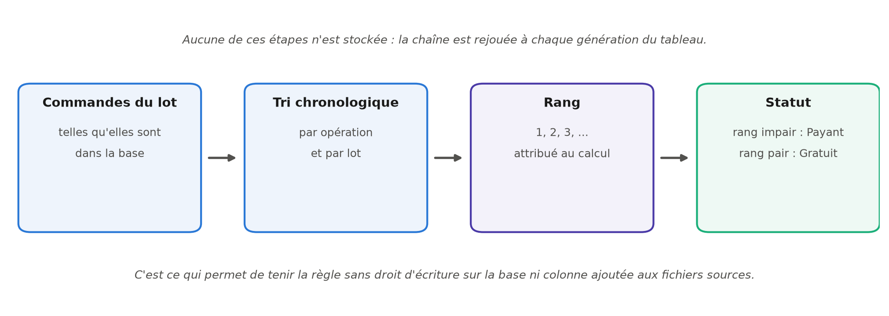{width=100%}

Cette approche permet de répondre au besoin métier sans altérer la structure des données
sources, garantissant ainsi l'intégrité du système tout en offrant la flexibilité
demandée. Elle a cependant un coût qu'il faut assumer : la règle est recalculée à chaque
affichage, et elle n'existe nulle part ailleurs que dans la définition du tableau. Si un
autre service a besoin de la même notion, il devra la redemander, et rien ne garantit
qu'elle sera implantée à l'identique.

C'est exactement le problème que le projet de Data Science résoudra, au chapitre 5, en
écrivant les définitions partagées une seule fois dans des vues de base de données. La
contrainte rencontrée ici en miniature m'a rendue attentive à cette question bien avant de
concevoir l'architecture du Copilote Financier.

## Contribution à l'infrastructure : le déploiement du SSO

### Enjeux et réalisation opérationnelle

Au-delà de l'exploitation des données, j'ai également eu l'opportunité de participer à la
sécurisation de leur accès. En parallèle de mes missions principales, j'ai collaboré avec
l'administratrice des systèmes et outils SI sur un projet d'infrastructure transverse : le
déploiement du SSO (Single Sign-On).

Le SSO est une technologie permettant à un utilisateur d'accéder à plusieurs applications
avec une seule authentification. Pour le groupe Angelotti, l'enjeu était double :
simplifier l'expérience utilisateur en réduisant le nombre de mots de passe à mémoriser,
et renforcer la sécurité des accès aux outils sensibles.

Mon rôle a été à la fois opérationnel et pédagogique. J'ai pris en charge le déploiement
de la solution logicielle sur les postes de travail, en ciblant deux périmètres clés :
l'agence de Perpignan et le service financier du siège. Cette mission m'a demandé de
coordonner mes interventions avec les plannings des collaborateurs pour minimiser l'impact
sur leur travail. Concrètement, j'ai procédé à l'installation du connecteur sur chaque
poste, vérifié la bonne synchronisation avec l'annuaire de l'entreprise, et accompagné les
utilisateurs lors de leur première connexion pour m'assurer de la bonne prise en main de
l'outil. Nous avons volontairement commencé par ces deux périmètres avant d'envisager une
généralisation, afin de mesurer les difficultés réelles sur un échantillon restreint.

### Ce qu'une mission d'administration système apprend sur la donnée

Cette expérience m'a permis de mieux appréhender les problématiques de gestion de parc
informatique et de gouvernance des accès, des aspects souvent invisibles mais cruciaux
pour la cohérence du Système d'Information.

Elle m'a aussi appris quelque chose que je n'attendais pas d'une mission de déploiement.
L'annuaire d'entreprise, sur lequel repose le SSO, est un référentiel d'identités : il
répond, pour les collaborateurs, à la même question que celle que je me posais pour les
clients au chapitre 3, à savoir comment garantir qu'une personne n'existe qu'une fois et
qu'on sait la reconnaître. Voir ce problème résolu, du côté de l'infrastructure, par un
annuaire centralisé et une synchronisation automatique, éclaire par contraste la situation
côté données de gestion, où aucun référentiel de ce type n'existait avant la reprise des
tiers.

Enfin, l'accompagnement des utilisateurs lors de leur première connexion a été instructif
à sa manière. Une solution techniquement correcte qui déroute l'utilisateur au moment de
s'en servir n'est pas une solution livrée. Ce constat, fait ici sur une fenêtre
d'authentification, s'est retrouvé mot pour mot au moment de livrer l'application d'aide à
la décision.

## Ce que les missions filées coûtent et ce qu'elles rapportent

Ces missions transverses, bien que chronophages, sont complémentaires au travail de fond
sur la donnée et participent à ma compréhension des enjeux stratégiques du groupe. Il
serait malhonnête de ne pas dire ce qu'elles ont coûté : elles fragmentent le temps, et un
chantier de reprise interrompu trois fois dans la journée pour une demande de tableau de
bord avance moins vite qu'un chantier mené d'un trait.

Elles rapportent cependant trois choses que je n'aurais pas obtenues autrement.

La première est une **connaissance du métier** que la seule fréquentation des bases de
données ne donne pas. On ne comprend pas ce qu'est une commande gratuite en lisant une
table ; on le comprend en écoutant le service juridique expliquer pourquoi la règle
existe.

La deuxième est une **crédibilité** auprès des services. Avoir répondu à leurs demandes
courantes pendant un an est ce qui a rendu possible, au second semestre, un échange direct
avec la direction financière sur ses besoins d'aide à la décision.

La troisième est une **vision de l'architecture** du système d'information dans son
ensemble, depuis l'authentification des postes jusqu'aux tableaux de bord, en passant par
les bases de gestion. Cette vision d'ensemble est précisément ce qui manque le plus
souvent à un profil purement analytique, et c'est elle qui m'a permis de concevoir le
projet du second semestre comme une chaîne complète plutôt que comme une suite de modèles.

::: transition
Ces activités filées illustrent la diversité des missions inhérentes au métier de
gestionnaire d'information. Au-delà des projets structurels de reprise, j'ai dû faire preuve
d'agilité pour répondre aux besoins quotidiens des services métiers. La demande du service
juridique a particulièrement mis en exergue ma capacité à contourner des limitations
techniques par une modélisation logique rigoureuse, transformant une contrainte d'outil en
une solution pérenne pour l'entreprise.

Ces solutions restent pourtant des contournements, et il faut le reconnaître. Une règle
recalculée à chaque affichage tient tant que personne d'autre n'en a besoin ; un tableau
de bord construit sur un fichier écrasé chaque nuit tient tant que le format ne change
pas. Ces contournements auront néanmoins rendu un service précis : ils ont maintenu le
système décisionnel en état de marche pendant les douze mois qu'a duré la reconstruction
du socle.

Ce socle étant désormais fiable, le chapitre suivant présente ce qu'il devient possible d'en
faire. Il expose le projet de Data Science mené au second semestre, le Copilote Financier,
et
la manière dont les questions rencontrées jusqu'ici, la définition partagée d'une notion, la
reformulation d'un besoin métier, la prise en main par l'utilisateur, s'y retrouvent toutes,
déplacées d'un cran.
:::


# Le Copilote Financier

::: sommaire
**Sommaire**

- 5.1 Contexte
    - 5.1.1 Problème métier
        - 5.1.1.1 Besoins par axe et exigences non fonctionnelles
    - 5.1.2 Objectifs du dashboard
- 5.2 Données disponibles
    - 5.2.1 Données internes
    - 5.2.2 Données externes
- 5.3 Architecture technique
- 5.4 Notebooks et résultats
    - 5.4.1 Exploration et nettoyage des données brutes
    - 5.4.2 SQL et Spark
    - 5.4.3 Axe A : risque de dérive de marge
    - 5.4.4 Axe B : vitesse d'écoulement
    - 5.4.5 Axe C : prix du stock
    - 5.4.6 Signaux faibles (texte et réseau)
- 5.5 Plateforme Streamlit
- 5.6 Périmètre et limites
- 5.7 Conclusion du chapitre
:::

Ce chapitre présente le projet de Data Science annoncé à la fin du premier semestre : le
« Copilote Financier », un outil d'aide à la décision construit sur les données de gestion du
groupe Angelotti pour sa direction financière. Le périmètre envisagé au départ, la prédiction de
la rentabilité des opérations d'aménagement, a été redéfini en cours de projet : la prédiction
de la marge à terminaison subsiste comme premier axe de travail, mais le besoin exprimé par la
direction financière l'a élargie à deux autres questions, et la restitution a finalement été
restreinte à la promotion immobilière. J'y expose d'abord le besoin métier tel qu'il m'a été
formulé, puis les données dont je disposais réellement, l'architecture retenue pour les rendre
exploitables, les trois axes d'analyse et leurs résultats, la plateforme qui les restitue aux
contrôleurs de gestion, et enfin les limites que je considère comme faisant partie du livrable.

Une décision a orienté tout le projet, et il vaut mieux l'énoncer d'emblée parce qu'elle
explique la forme de ce qui suit. La taille des données disponibles, 267 opérations et
quatre exports totalisant 32 Mo, ne justifie pas un empilement de modèles. J'ai donc
retenu un petit nombre de méthodes simples, chacune choisie pour une question précise et
validée sérieusement, plutôt qu'un catalogue d'algorithmes dont aucun n'aurait pu être
correctement évalué à cette échelle.

## Contexte

Le groupe Angelotti conçoit, finance et commercialise des programmes immobiliers en
Occitanie et en région PACA. Chaque opération de promotion y est portée par une société
dédiée et vit sur un cycle long : un budget est arrêté au moment de l'engagement, puis le
chantier et la commercialisation le font dériver au fil des mois. Les appels d'offres
reviennent plus chers qu'anticipé, des acquéreurs se désistent, le rythme de vente
ralentit sous l'effet de la conjoncture.

La direction financière suit ces dérives opération par opération, sur tableurs, sans vision
transverse. Personne ne dispose d'une vue d'ensemble permettant de dire, à un instant donné,
quelles opérations méritent l'attention en priorité. C'est ce manque qui a motivé le projet.

### Problème métier

Trois questions structurent les revues de gestion, et les tableurs actuels n'y répondent
pas.

La première porte sur la marge. Quelles opérations examiner en priorité, parce que leur
marge d'engagement dérive, et sur quels postes cette dérive se joue-t-elle, pour combien
d'euros ? La question suppose de comparer des dizaines d'opérations entre elles, ce
qu'aucun tableur individuel ne permet.

La deuxième porte sur le rythme de vente. Quel volume de réservations budgéter pour 2026 ?
La période récente a montré à quel point la demande est sensible au coût du crédit : le
taux moyen des crédits habitat est passé d'environ 1,1 % à un pic de 3,6 % fin 2023, avant
de refluer vers 3,1 % mi-2026, et le rythme du groupe est tombé d'environ 150 à moins de
115 réservations par mois en 2023. Reste à savoir ce qui, dans cette chute, revient à la
conjoncture et ce qui revient aux programmes eux-mêmes.

La troisième porte sur le prix. Quels lots du stock faut-il repricer, c'est-à-dire réviser
à la hausse ou à la baisse ? La question n'est
pas théorique, puisque 45 % des 2 157 désistements enregistrés ont pour motif un problème
de financement ou un refus de prêt, et que les remises sont aujourd'hui accordées au cas
par cas.

Il faut souligner ce que ces trois questions ont en commun. Face à des besoins de ce type,
la tentation serait de partir sur un projet d'apprentissage automatique de grande ampleur.
C'est pourtant un problème de contrôle de gestion outillé par la donnée, et rien d'autre.
Le matériau disponible se résume à 267 opérations et quatre exports Excel, soit une
photographie à date.

#### Besoins par axe et exigences non fonctionnelles

J'ai formalisé ces besoins en trois axes de travail, complétés d'un axe transverse :

1. **Axe A, risque de marge** : un score permettant de trier les opérations par risque de
   dérive, le détail en euros des postes déjà en dépassement, et la possibilité de
   comparer une opération à ses semblables.
2. **Axe B, vitesse d'écoulement** : quantifier l'effet du taux d'intérêt sur le rythme de
   réservation, en le séparant de l'effet propre à chaque programme, et simuler des
   scénarios de taux pour 2026.
3. **Axe C, prix** : estimer un prix de marché par lot, signaler le stock qui s'en écarte,
   et proposer une règle de remise argumentée.
4. **Axe transverse** : tirer des signaux simples des commentaires de vente et de la
   structure du réseau de vendeurs.

Quatre exigences non fonctionnelles ont cadré le travail. La **reproductibilité** d'abord : tout
doit se reconstruire depuis les exports bruts par un seul script, sans étape manuelle
intermédiaire. L'**interprétabilité** ensuite : chaque score doit être accompagné des variables
qui le déterminent. La **confidentialité** également : aucune donnée nominative de client n'est
affichée ni modélisée. L'**acceptation d'un petit échantillon** enfin : à cette taille, des
modèles simples validés en validation croisée valent mieux que des architectures complexes dont
on ne saurait pas mesurer la performance réelle.

### Objectifs du dashboard

Le livrable final est une application web destinée à la direction financière, dont la
fonction est de traduire les modèles en décisions. C'est sur ce point qu'un retour de
l'entreprise, reçu en cours de projet, nous a imposé une clarification utile.

La première version de l'interface était trop marquée par le vocabulaire de la
modélisation. Les écrans parlaient de scores, de probabilités et d'intervalles, là où les
utilisateurs attendaient des niveaux d'alerte, des dépassements en euros et un prix de
marché estimé. J'ai donc entièrement réécrit l'interface en langage de gestion, et nous en avons
restreint le périmètre aux 147 opérations de promotion immobilière, l'aménagement foncier
relevant d'une logique économique différente. Les métriques de validation, elles, restent
dans les notebooks : l'écran ne montre que ce qui se décide.

Ce retour a été l'un des enseignements les plus utiles du projet. Un modèle correctement
validé mais restitué dans le vocabulaire du modélisateur reste inutilisable par le métier,
et cette distance ne se comble pas par de la pédagogie, elle se comble en changeant les
mots affichés.

## Données disponibles

### Données internes

Quatre exports du système de gestion constituent le point de départ du projet. Leur
périmètre de 267 opérations ne recouvre pas exactement les 283 opérations reprises au
chapitre 2 : ce sont deux extractions distinctes, faites à des dates différentes, et les
exports de gestion ne portent que les opérations disposant d'un budget analytique au moment
de l'extraction.

| Export                     | Grain                | Volumétrie                | Usage                            |
|:---------------------------|:---------------------|:--------------------------|:---------------------------------|
| Grille de prix             | lot × dossier de vente | 16 467 lignes, 196 opérations | ventes, prix, dates, désistements |
| Budget & EFR               | poste analytique     | 65 000 lignes, 267 opérations | budget, engagé et facturé par poste |
| Budget LIVE                | poste budgétaire     | 79 106 lignes            | contrôle de cohérence            |
| 06_Informations Lots       | dossier désisté      | 2 164 lignes             | détail des désistements          |

Deux intitulés sont abrégés dans ce tableau : l'export de la grille de prix
s'appelle « Grille de Prix Avec Désistements » dans le système de gestion, et le fichier de
contrôle « A_DM_BUDGET_MONTANT_GESTION_LIVE », désigné ci-après comme le fichier LIVE.

Comprendre ces exports m'a demandé plus de temps que les modéliser. Ce déséquilibre m'a
d'abord surprise, puis m'a paru normal : c'est à cette étape que se jouait la fiabilité de
tout le reste. Trois constats l'illustrent.

Le premier concerne le fichier « 06_Informations Lots ». Malgré son nom, il ne contient
pas les lots : il ne porte que des dossiers désistés, 2 157 au motif « Désisté » et 7 au
motif « Résolution de vente ». La table maîtresse des lots est en réalité la grille de
prix. Prendre ce fichier pour ce que son nom annonce aurait faussé toute l'analyse du
stock.

Le deuxième concerne le fichier « Budget & EFR ». Il affiche 65 000 lignes, un chiffre rond
qui évoquait immédiatement une troncature à l'export. J'ai donc réconcilié ce fichier avec
le fichier LIVE, et la vérification a montré le contraire de ce que je craignais : les
totaux sont identiques à l'euro près sur les 118 opérations jointes, avec un écart médian
nul. Les 65 000 lignes se décomposent en 64 788 postes de détail et 212 lignes de synthèse.
Le chiffre rond n'était qu'une coïncidence.

Le troisième concerne le nettoyage proprement dit, qui a traité les défauts classiques d'un
export de gestion. Les natures de lot ont été harmonisées, les libellés « appt »,
« Appartement » ou « stat » étant regroupés en huit familles. Les doublons orthographiques
de communes ont été fusionnés : 91 orthographes désignaient en réalité 90 communes. Enfin,
les surfaces et les prix à zéro ont été convertis en valeurs manquantes plutôt que traités
comme des zéros réels, un zéro de surface n'ayant aucun sens économique.

### Données externes

Trois sources publiques complètent les données internes. Je les ai toutes récupérées par
script, et non par téléchargement manuel, pour qu'elles restent re-téléchargeables et que
l'analyse puisse être rejouée sur des séries actualisées :

1. **Le taux moyen des crédits habitat en France**, série mensuelle de la Banque centrale
   européenne [4], de 2015 à 2026.
2. **L'indicateur de confiance des ménages**, publié par Eurostat [5], sur la même période.
3. **Un référentiel des 90 communes d'implantation** du groupe, comprenant la population et
   les coordonnées géographiques, obtenu par l'API publique `geo.api.gouv.fr` [6] et enrichi
   d'une distance au littoral que j'ai calculée.

Ce détour par le script plutôt que par le téléchargement manuel a un coût en temps au
départ, mais c'est lui qui rend l'exigence de reproductibilité tenable jusqu'au bout de la
chaîne.

## Architecture technique

L'architecture retenue tient en une chaîne courte et entièrement rejouable. Les quatre
exports et les trois sources externes alimentent un script de nettoyage, qui charge une
base SQLite organisée en schéma en étoile, c'est-à-dire autour de tables de faits
rattachées à des tables de dimensions. On y trouve trois dimensions, les opérations, les
communes et la conjoncture mensuelle, et quatre tables de faits : 64 788 lignes
budgétaires, 14 123 lots, 14 428 dossiers de vente et 2 164 désistements. Les notebooks
d'analyse et l'application s'appuient tous deux sur cette base.

Trois vues SQL y encapsulent les calculs partagés : la marge budgétée contre la marge
engagée par opération, les réservations par opération et par mois, et l'état du stock. Ce
choix est plus structurant qu'il n'y paraît. La définition de la marge est écrite une seule
fois, dans la vue, et les notebooks comme la plateforme consomment la même. C'est
exactement la situation inverse de celle décrite au chapitre 4, où la règle de facturation
juridique, ne pouvant être écrite nulle part, devait être recalculée à chaque génération du
tableau.

Une seule commande reconstruit l'ensemble depuis les exports bruts, en quelques secondes.
L'analyse complète est versionnée et ré-exécutable de bout en bout, ce qui signifie que
tous les résultats présentés dans ce chapitre sont reproductibles. Cette contrainte, que je
me suis imposée avant d'écrire la première ligne d'analyse, est ce qui distingue un travail
vérifiable d'une suite de manipulations dont personne ne saurait refaire le chemin.

## Notebooks et résultats

### Exploration et nettoyage des données brutes

Au-delà du nettoyage décrit en section 5.2, l'exploration a produit deux résultats qui ont
directement orienté la modélisation.

Le premier concerne la distribution des prix. Le prix au mètre carré des appartements est
fortement asymétrique, avec un coefficient d'asymétrie de 19,2, ce qui rendait le prix brut
impropre à une modélisation linéaire directe. Après passage au logarithme, la
distribution devient proche d'une loi normale : le coefficient d'asymétrie tombe à 0,39 et
le diagramme quantile-quantile, qui compare la distribution observée à la distribution
théorique, devient presque rectiligne. La Figure 5.1 rassemble les deux distributions et
les diagrammes quantile-quantile correspondants. C'est ce constat qui a conduit l'axe C à
modéliser le logarithme du prix plutôt que le prix lui-même.

{width=100%}

Le second résultat est une leçon de méthode, et c'est peut-être le passage du projet dont
j'ai le plus appris. En calculant la corrélation entre les réservations mensuelles du
groupe et le taux des crédits habitat, j'obtenais une valeur quasi nulle, de +0,07. Prise
au premier degré, cette valeur signifiait que la conjoncture n'explique rien du rythme de
vente, ce qui contredisait tout ce que l'on sait du marché.

En réalité, la série brute est brouillée par la croissance du portefeuille. Le nombre
d'opérations en commercialisation a fortement augmenté sur la période, soutenant le volume total
de réservations même lorsque la demande par programme s'effondre. Rapportées au nombre
d'opérations actives, les réservations racontent l'inverse. La Figure 5.2 donne cette série
d'intensité corrigée ; sa corrélation avec le taux d'intérêt passe à -0,34 et celle avec la
confiance des ménages à +0,44. Tout l'axe B repose sur cette correction. Sans elle, j'aurais
conclu à l'absence d'effet de la conjoncture, et j'aurais eu tort.

{width=100%}

### SQL et Spark

Le véritable livrable de cette étape est la base SQL décrite en section 5.3 : les vues
métier partagées, les index, et un contrôle croisé des agrégats qui retrouve les mêmes
totaux par deux moteurs indépendants, soit 1 561,8 M€ de dépenses budgétées et 1 754,8 M€
de recettes, à l'arrondi près. Ce contrôle n'est pas une coquetterie : il garantit que la
base chargée dit bien la même chose que les exports d'origine.

J'ai ensuite évalué Spark comme piste de montée en charge, l'entreprise appartenant à un groupe
dont le périmètre de données dépasse largement le sien. Le test aboutit à une conclusion
négative, et c'est en cela qu'il est utile. Sur notre volumétrie, 64 788 lignes représentant 9
Mo en mémoire, l'agrégation chronométrée est environ cinquante fois plus lente qu'avec pandas.
Le rapport mesuré est de 58, après 24 secondes de démarrage de la machine virtuelle Java ; une
exécution antérieure donnait 28. Le chiffre varie donc avec la machine, mais la conclusion non.

SQLite et pandas constituent donc la bonne architecture à cette échelle. L'intérêt du test
est ailleurs : le chemin de montée en charge est identifié, si le périmètre devait un jour
s'étendre à celui du groupe Nexity.

### Axe A : risque de dérive de marge

La difficulté de l'axe A n'était pas le modèle mais la définition de la cible. Les exports
dont je disposais sont une photographie à date, sans historique des révisions budgétaires :
je ne peux donc pas observer comment un budget a évolué, seulement où il en est
aujourd'hui.

J'ai donc mesuré la dérive par les dépassements déjà engagés, poste par poste. Les dépenses
à terminaison sont estimées par le maximum de l'engagé et du budget de chaque poste, selon
un principe qui se formule simplement : un dépassement engagé est acquis, et le budget
restant sera dépensé. La variation de marge rapporte ensuite la marge ainsi recalculée à la
marge budgétée. Cette grandeur est appelée dans le projet la variation de marge
« committée », par emprunt à la notion comptable de coût engagé : elle ne mesure pas une
dérive anticipée, mais la part de dérive que les engagements déjà pris rendent acquise.

Cette définition impose une précaution sur les variables explicatives, et j'y ai veillé
dès la construction du jeu de données. Concrètement, le modèle n'utilise que le budget
initial et les signaux commerciaux, jamais l'engagé ni le facturé, qui sont précisément ce
qui définit la cible. Sans cette précaution, le modèle aurait « prédit » sa propre
définition.

Sur le périmètre exploitable, soit les 123 opérations engagées à au moins 60 % et dont la
marge budgétée dépasse 50 k€, plus d'un tiers des opérations, 36,6 % exactement, n'a aucun
dépassement engagé. Mais 28 % franchissent le seuil de dérive matérielle, que j'ai fixé à
2 % de la marge, et deux cas extrêmes dépassent la moitié de la marge budgétée. La
Figure 5.3 donne la distribution complète et situe ce seuil, avec à droite le détail des
opérations en dérive.

{width=95%}

La partie la plus utile de cet axe pour l'entreprise n'est pas un modèle appris : c'est le
tableau descriptif des dépassements engagés en euros, par opération et par poste, calculé
en SQL pur. C'est lui qui alimente la page « Alertes marge » de la plateforme.

La modélisation vient en complément, comme score de tri. Une régression du taux de
variation atteint un coefficient de détermination de 0,08 sur l'échantillon test. Le
résultat est modeste, et je le présente tel quel : la structure du budget initial
prédispose à la dérive mais ne la détermine pas, l'aléa de chantier faisant le reste. Une
classification des opérations « à risque », c'est-à-dire dont la dérive dépasse 2 %,
atteint un score F1, qui combine en une seule valeur la capacité à détecter les cas à
risque et celle à ne pas en signaler à tort, de l'ordre de 0,30 à 0,34 en validation
croisée stratifiée, c'est-à-dire
sur des découpages qui conservent la proportion d'opérations à risque, contre 0 pour la
référence majoritaire, qui ne détecte rien du tout. J'ai confronté quatre
classifieurs classiques : la régression logistique, le séparateur à vaste marge, l'arbre de
décision et la forêt aléatoire. À 123 observations, leurs écarts de performance ne sont pas
significatifs. Le choix s'est donc porté sur la forêt aléatoire, dont les probabilités
alimentent les niveaux d'alerte de la plateforme.

Il faut donc lire ce dispositif pour ce qu'il est : un outil de hiérarchisation de
l'attention, pas un oracle.

### Axe B : vitesse d'écoulement

Budgéter les réservations de 2026 suppose de distinguer, dans le rythme de vente, ce qui
relève de la conjoncture et ce qui relève du programme lui-même. C'est l'axe dont les
résultats sont les plus solides, et celui qui sert le plus directement la décision
budgétaire.

Le rythme de vente est modélisé sur un panel opération × mois, soit 3 230 observations
portant sur 160 opérations. J'ai pris soin d'y réintroduire les mois à zéro réservation,
entre la première et la dernière vente de chaque programme : les omettre reviendrait à ne
compter que les mois où quelque chose s'est passé, et donc à surestimer le rythme.

Un modèle à effets aléatoires sépare alors ce qui revient à l'opération de ce qui revient à
la conjoncture. Deux enseignements en ressortent. D'une part, les deux tiers de la variance
tiennent au programme lui-même, avec un coefficient de corrélation intraclasse de 0,66 : ce
qui distingue les programmes entre eux pèse davantage que la conjoncture qui leur est
commune.
D'autre part, l'effet du taux d'intérêt est fortement significatif : **une hausse d'un point
de taux réduit les réservations mensuelles d'environ 19 %**, pour un coefficient de -0,216
associé à une p-valeur inférieure à 10^-15^. La régression naïve, qui ignore la structure en
panel, surestime cet effet ; le modèle à effets aléatoires le corrige.

J'ai posé un garde-fou méthodologique, qui fonde la manière dont les scénarios sont
construits. Sur la série agrégée du groupe, qui compte 114 mois, j'ai mené une régression
dynamique à erreurs ARIMA, c'est-à-dire une régression dont les résidus sont eux-mêmes
modélisés comme une série temporelle, dans les règles de l'art : vérification que ces
résidus sont assimilables à un bruit blanc d'abord, sélection du modèle par le critère AICc
ensuite, qui arbitre entre qualité d'ajustement et nombre de paramètres.
Cette approche ne parvient pas à identifier l'effet du taux, dont le coefficient y est
indiscernable de zéro, avec une p-valeur de 0,82. L'explication tient à la nature de la
série : les variations du taux sont trop lentes pour être identifiées sur une seule série
de cette longueur.

Ce résultat négatif dit deux choses. Il confirme d'abord que la significativité obtenue sur
le panel n'est pas un artefact de régression fallacieuse, c'est-à-dire d'une corrélation
née de la seule tendance commune des deux séries, puisque la voie temporelle, plus
exigeante sur ce point, ne produit tout simplement pas d'effet mesurable. Il indique
ensuite que les scénarios doivent combiner les deux modèles : la série temporelle fournit
la trajectoire de référence, avec sa dynamique et sa saisonnalité, et l'élasticité estimée
sur le panel traduit chaque scénario de taux en effet sur le rythme. Sur cette base,
présentée en Figure 5.4, une détente à 2,5 % fin 2026 redonnerait environ +6 % de rythme en
moyenne sur douze mois, tandis qu'une remontée à 3,5 % en retirerait 3 %.

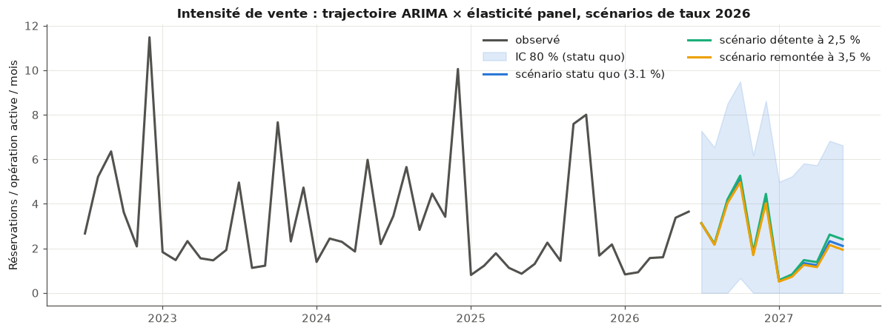{width=95%}

À l'échelle d'un programme pris isolément, la courbe des réservations cumulées suit une
forme en S, que j'ai ajustée par une fonction logistique à trois paramètres. Sur les 28
opérations terminées du périmètre, cet ajustement bat la droite dans 25 cas, comme
l'illustre la Figure 5.5 sur quatre programmes. Il fournit surtout un indicateur
directement utile à la trésorerie : le délai d'atteinte de 90 % du potentiel de vente, dont
la médiane est proche de vingt mois.

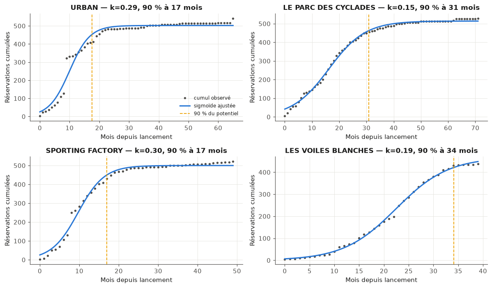{width=95%}

La limite de cet indicateur est connue et vérifiée : en début de commercialisation, le
potentiel n'est pas identifiable, l'ajustement pouvant alors produire n'importe quelle
valeur. L'outil n'est donc proposé que sur les programmes suffisamment avancés.

### Axe C : prix du stock

Repricer le stock suppose d'abord de savoir à quel prix chaque lot devrait se vendre. Le
modèle que j'ai construit pour répondre à cette question est volontairement le plus simple
qui fonctionne. Il s'agit d'une régression
linéaire du logarithme du prix au mètre carré des 5 064 appartements transigés
depuis 2016, expliqué par leurs caractéristiques, à savoir la surface, l'étage,
l'exposition, le type de produit, l'agence, la commune et la proximité du littoral, ainsi
que par leur année de réservation. Ce modèle explique 88,6 % de la variance sur
l'échantillon test, avec une erreur type d'environ 11 % sur le prix.

Son intérêt principal n'est pas sa performance mais sa lisibilité : ses coefficients se
lisent comme des prix implicites, ce qui permet de les discuter avec la direction
commerciale. On y lit une prime d'étage de +6 %, une prime d'exposition sud, une décote de
63 % pour le logement social, qui s'explique par des prix réglementés, et un effet millésime
d'environ +19 points entre 2016 et 2023, suivi d'un plateau. La Figure 5.6 représente cet
effet millésime année par année.

{width=88%}

Ce plateau mérite d'être commenté, car il recoupe l'axe B. Les prix du neuf n'ont pas
baissé avec la remontée des taux : c'est le volume qui s'est ajusté, en parfaite cohérence
avec l'axe B. J'ai également testé une variante régularisée du
modèle, sans gain : avec cinq mille observations pour une trentaine de coefficients, il n'y
avait rien à stabiliser.

Appliqué aux 127 appartements en stock, ce modèle sert de détecteur. Au seuil d'une erreur
type, 103 lots sont dans le marché, 8 se situent au-dessus du prix estimé et 16 en dessous.
La Figure 5.7 confronte le prix de grille au prix de marché estimé et matérialise cette
bande de tolérance.

{width=88%}

La recommandation de remise est ensuite posée comme une petite optimisation sous
contrainte : maximiser le revenu attendu à douze mois d'une opération, en ajustant chaque
prix dans des bornes commerciales de -10 à +5 %, sous un objectif d'accélération de
l'écoulement, la demande réagissant au prix avec une élasticité fixée à -1, c'est-à-dire
une baisse de prix de 1 % qui ferait vendre 1 % de plus.

Ce paramètre d'élasticité est la fragilité assumée de l'axe, et je préfère l'exposer que la
laisser découvrir. Mon estimation interne donne -0,81, valeur qui a le bon signe mais qui
n'est pas significative sur les 95 opérations disponibles. La valeur retenue vient donc de
la littérature sur le logement neuf, et non de nos données.

Le résultat, lui, est robuste et contre-intuitif. À cette élasticité, la remise optimale
est uniforme en euros sur tous les lots, de l'ordre de 23 k€ par lot sur l'opération
d'application. Elle est donc proportionnellement plus forte sur les petits lots, à
l'inverse de la pratique actuelle des remises accordées au cas par cas. Sur l'opération
test, qui compte 18 appartements en stock, viser +8 % d'écoulement déplace le volume
attendu de 6,8 à 7,4 lots pour un revenu quasi inchangé, en recul de 0,3 %. L'intérêt de la
manœuvre n'est donc pas le revenu immédiat mais la vitesse, et l'économie de frais de
portage que l'objectif ne compte pas.

### Signaux faibles (texte et réseau)

Trois constats simples, obtenus avec des moyens simples, complètent le dispositif.

Le premier est un moteur de recherche par similarité, construit sur les 9 688 commentaires
libres de vente. Une requête formulée en langage courant, comme « refus de prêt banque » ou
« remise prix hors pack », remonte les dossiers concernés. C'est un outil d'audit des
remises non structurées réellement utilisable.

Le deuxième porte sur les motifs de désistement, analysés par agence. Le profil obtenu
révèle un problème de qualité de saisie plus qu'un fait commercial : à Salon-de-Provence,
90 % des motifs sont enregistrés en « Autres motifs », rendant les désistements de cette
agence inanalysables tant que la saisie n'est pas fiabilisée.

Le troisième porte sur la structure du réseau de vente, qui se révèle très concentrée. Deux
acteurs, le réseau interne et un prescripteur externe, portent à eux seuls 51,6 % des
dossiers attribués, avec des taux de désistement allant du simple au triple : 9 % pour le
réseau interne contre 29,6 % pour le prescripteur externe. L'écart a une traduction
financière immédiate, puisque chaque commission versée sur un dossier qui n'aboutit pas est
une dépense sans recette.

J'ai enfin tenté de prédire le désistement à partir du seul texte du commentaire, avec un
contrôle de fuite soigneux pour ne pas utiliser d'information postérieure au désistement.
Cette tentative plafonne à un score F1 de 0,34 : le texte seul ne suffit pas, et il est donc
traité comme un signal d'appoint et non comme un prédicteur.

## Plateforme Streamlit

L'application finale est la meilleure réponse au risque de sur-complexité que j'évoquais en
ouverture de ce chapitre : ce qui est livré au métier est simple. Cinq pages, un périmètre
restreint aux 147 opérations de promotion, et aucun terme de modélisation à l'écran.

La page **Vue d'ensemble**, présentée en Figure 5.8, donne la situation en quelques secondes :
147 opérations suivies, dont 10 en alerte et 2 à surveiller parmi les 68 opérations en cours
suffisamment engagées, les 56 autres étant conformes, 421 lots principaux en stock, un rythme
récent de 4,8 réservations par opération et par mois, pour un taux de crédit à 3,11 %.

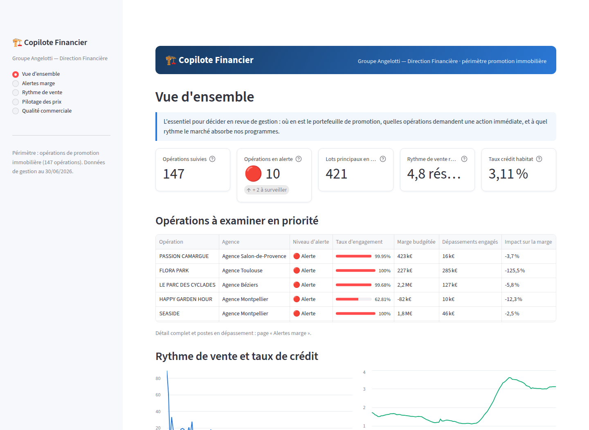{width=100%}

La page **Alertes marge**, présentée en Figure 5.9, classe les opérations par niveau
d'alerte, le score de l'axe A étant traduit en trois niveaux. Elle affiche surtout, pour
chaque opération, les dépassements déjà engagés en euros et les postes concernés. C'est la
page la plus consultée, et il faut redire qu'elle repose sur du SQL et non sur un modèle.

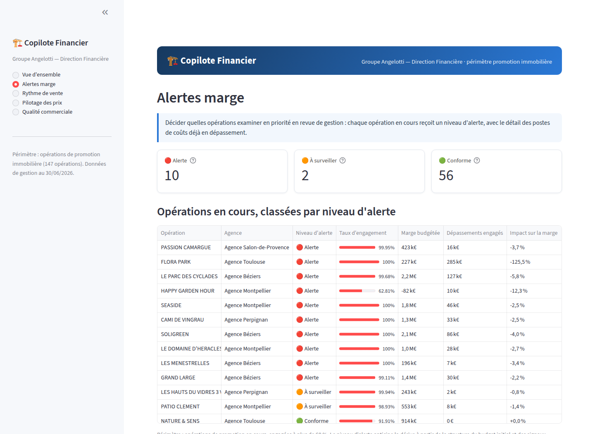{width=100%}

Les trois autres pages transposent les axes restants. La page **Rythme de vente** fait de
l'axe B un simulateur : un curseur de taux 2026 produit une phrase de résultat fondée sur
l'élasticité du panel, et la trajectoire d'écoulement de chaque programme donne son délai
estimé. La page **Pilotage des prix** affiche le diagnostic du stock et la grille
d'ajustement recommandée sous un objectif d'accélération choisi au curseur. La page
**Qualité commerciale** reprend les signaux faibles, alerte de saisie comprise.

Chaque page a été vérifiée par le cadre de test de Streamlit, en contrôlant qu'elle
s'exécute sans exception, y compris aux bornes des curseurs et sur les sélections vides,
et l'ensemble se reconstruit depuis les exports bruts, conformément à l'exigence de
reproductibilité posée au départ.

## Périmètre et limites

Je considère que l'énoncé des limites fait partie du livrable, au même titre que les
résultats. Les présenter comme telles est aussi ce qui permet à la direction financière de
savoir jusqu'où elle peut s'appuyer sur l'outil.

La limite principale est structurelle et commande la suite du projet : les données
budgétaires sont une photographie à date, sans historique des révisions. C'est elle qui
plafonne l'axe A, avec un coefficient de détermination de 0,08 en régression et des scores
F1 de l'ordre de 0,3 en classification. On ne peut pas apprendre la dynamique d'une dérive
sur une image fixe. Ma première recommandation à l'entreprise est donc d'historiser les
exports mensuels dans le nouvel ERP : au bout d'un an, le score statique deviendra un
véritable suivi de trajectoire.

Les autres limites sont assumées et documentées :

- L'échantillon de l'axe A est petit, 123 opérations, et les écarts entre modèles y sont
  indiscernables ; c'est ce qui a motivé le choix d'un modèle interprétable unique plutôt
  qu'une sélection par performance.
- L'élasticité de l'axe C n'a pas pu être estimée significativement en interne et vient de
  la littérature. Les recommandations de prix sont donc des aides à la décision, non
  opposables, et la grille reste sous le contrôle de la direction commerciale.
- Les intervalles de prévision de l'axe B ignorent l'incertitude sur les taux futurs
  eux-mêmes, ce qui est précisément la raison pour laquelle la plateforme présente des
  scénarios plutôt qu'une prévision unique.
- Le texte des commentaires est un signal d'appoint, et non un prédicteur.

Enfin, la plateforme couvre la promotion, soit 147 opérations, et exclut l'aménagement
foncier, dont la logique économique justifierait un traitement dédié. L'analyse, elle,
couvre bien les 267 opérations, périmètre des exports de gestion à la date d'extraction. La
frontière entre les deux activités ressort d'ailleurs d'elle-même dès l'analyse
exploratoire, constituant une validation involontaire du choix de périmètre demandé par
l'entreprise.

## Conclusion du chapitre

Le Copilote Financier répond aux trois questions posées en ouverture, mais il n'y répond
pas avec la même force, et je crois qu'il est plus honnête de le dire que de présenter un
ensemble homogène. L'axe B est solide : l'effet du taux d'intérêt sur le rythme de
réservation est mesuré, séparé de l'effet propre à chaque programme, et confirmé par un
garde-fou méthodologique qui aurait pu l'invalider. L'axe C est lisible et directement
discutable avec la direction commerciale, à la réserve près d'un paramètre d'élasticité
emprunté à la littérature. L'axe A, enfin, ne dépasse pas le stade du score de tri, et sa
partie la plus utilisée n'est pas un modèle mais une requête SQL.

Ce déséquilibre n'est pas un accident de parcours, c'est une conséquence directe de la donnée
disponible. Là où j'avais une profondeur temporelle, le modèle a produit un résultat
exploitable ; là où je n'avais qu'une photographie à date, il n'a pas pu en produire. Cette
observation est, pour moi, l'apport principal du projet, et elle vérifie la thèse annoncée en
introduction : la structure de la donnée commande ce que la modélisation peut en tirer.

Ce chapitre et les deux chantiers de reprise qui le précèdent se répondent précisément sur ce
point. Les chapitres 2 et 3 racontent la reconstitution d'un socle de gestion dans un nouvel
ERP, avec ses séquences d'injection, ses clés d'unicité, ses contournements de format et ses
arbitrages documentés. Celui-ci raconte ce que l'on peut faire d'un patrimoine de données une
fois qu'il est fiable, et ce que l'on ne peut pas en faire lorsqu'il lui manque une
dimension. Le lien entre eux n'est pas rhétorique : les deux recommandations formulées plus
haut, historiser les exports mensuels et fiabiliser la saisie des motifs de désistement, sont
exactement de la même nature que le travail décrit aux chapitres 2 et 3. Ce sont des travaux
de structure, faits pour rendre possible une analyse à venir.

::: transition
Une succession de récits de mission ne fait pourtant pas un bilan. Les questions que pose un
jury à un mémoire professionnel sont d'un autre ordre : comment ces projets ont-ils été
conduits, avec quelles méthodes et quelles technologies, comment ai-je su que le résultat
était bon, et qu'est-ce qui n'a pas fonctionné ? Elles ne se traitent pas au fil de chaque
chapitre sans l'alourdir.

Le chapitre suivant leur est donc consacré. Il relit transversalement les quatre missions,
sous l'angle de la conduite de projet, des outils, de l'évaluation des résultats et des
difficultés rencontrées.
:::


# Conduite de projet, méthodes et évaluation : une lecture transversale de l'année

::: sommaire
**Sommaire**

- 6.1 La conduite de projet : quatre missions, deux régimes
    - 6.1.1 Le régime de la reprise : itératif et piloté par les rejets
    - 6.1.2 Le régime du projet analytique : cadrer, explorer, restituer
    - 6.1.3 Un arbitrage récurrent entre exhaustivité et continuité de service
- 6.2 Technologies et méthodes mobilisées
    - 6.2.1 La chaîne d'outils, mission par mission
    - 6.2.2 Les choix que je referais, et ceux que je ne referais pas
- 6.3 Comment j'ai évalué mon propre travail
    - 6.3.1 Trois régimes de preuve selon la nature du livrable
    - 6.3.2 Ce que ces évaluations ne couvrent pas
- 6.4 Les difficultés rencontrées
    - 6.4.1 Difficultés techniques
    - 6.4.2 Difficultés tenant à la donnée
    - 6.4.3 Difficultés organisationnelles
- 6.5 Résultats consolidés de l'année
:::

Les cinq chapitres précédents ont exposé les missions dans l'ordre où elles se sont
présentées. Ce chapitre les relit transversalement, sous quatre angles que le récit
chronologique ne permet pas de traiter proprement : comment ces projets ont été conduits,
avec quels outils et quelles méthodes, comment j'ai su que le résultat était bon, et ce qui
n'a pas fonctionné.

Cette relecture n'est pas un exercice imposé. Deux des enseignements que je retire de l'année
ne sont visibles que dans la comparaison entre les missions, et resteraient invisibles si
chacune était jugée seule.

## La conduite de projet : quatre missions, deux régimes

### Le régime de la reprise : itératif et piloté par les rejets

Les deux chantiers de reprise, les opérations puis les tiers, ont été conduits selon la même
méthode, et je ne l'avais pas choisie a priori : elle s'est imposée parce que le modèle cible
était inconnu.

Le principe en est simple. On ne peut pas spécifier complètement une reprise dont on ne
connaît pas les règles d'acceptation. On avance donc par paliers de volume croissant, en
traitant chaque rejet comme une information sur le modèle cible plutôt que comme une erreur à
corriger. Sur la migration des opérations, cela a donné la progression de 3 opérations
pilotes, puis 12, avant la masse. Sur la reprise des tiers, cela a donné le découpage en lots
de 200 lignes, homogènes en nature.

Cette méthode a une propriété que j'ai appris à apprécier : **le coût d'une erreur y est
proportionnel au palier où on la découvre**. Une règle non comprise coûte quelques minutes sur
trois opérations, une demi-journée sur douze, et une reprise complète du fichier sur la
totalité du périmètre. Toute la valeur de la progression par paliers tient dans ce rapport.

Elle a aussi une limite qu'il faut nommer. Elle est lente à démarrer, et elle produit peu de
livrable visible pendant les premières semaines. Il faut accepter de rendre compte d'un
travail dont le résultat, à ce stade, est une documentation interne et non des données dans
le système.

### Le régime du projet analytique : cadrer, explorer, restituer

Le projet du second semestre a suivi une logique différente, en trois temps nettement
séparés.

1. **Le cadrage.** Formuler les questions de gestion avant de regarder les données, et poser
   les exigences non fonctionnelles avant de commencer. C'est à cette étape que j'ai décidé
   que la reproductibilité, l'interprétabilité, la confidentialité et l'acceptation d'un
   petit échantillon primeraient sur la performance brute.
2. **L'exploration et la modélisation.** Comprendre ce que contiennent réellement les
   exports, construire la base, puis traiter chaque question avec la méthode la plus simple
   qui y réponde.
3. **La restitution.** Traduire les résultats dans le langage de l'utilisateur et les livrer
   dans un outil qu'il ouvre lui-même.

Le point d'articulation le plus délicat se situe entre les étapes 2 et 3. La première version
de l'interface, trop marquée par le vocabulaire de la modélisation, a dû être entièrement
réécrite après un retour de l'entreprise. Cette réécriture n'était pas une correction
cosmétique : elle a changé ce que l'écran affiche, donc ce sur quoi l'utilisateur décide.

### Un arbitrage récurrent entre exhaustivité et continuité de service

Un même arbitrage est revenu dans les quatre missions, sous des formes différentes, et c'est
le premier enseignement transversal de l'année.

Sur la migration des opérations, il a pris la forme des « coquilles vides » : livrer une
structure incomplète pour débloquer la facturation, plutôt qu'un système complet trop tard.
Sur la reprise des tiers, il a pris la forme du traitement manuel des cas particuliers :
écrire une règle pour deux cas coûte plus cher que de les traiter à la main. Sur le
reporting juridique, il a pris la forme du calcul dynamique : accepter de recalculer la règle
à chaque affichage faute de pouvoir la stocker. Sur le projet analytique, enfin, il a pris la
forme du périmètre restreint à la promotion immobilière, l'aménagement relevant d'une autre
logique économique.

Dans les quatre cas, la décision a consisté à livrer quelque chose d'utile et d'incomplet
plutôt que rien de complet. Ce qui distingue cet arbitrage d'un renoncement, c'est
uniquement le fait d'écrire ce qui a été laissé de côté. Une dette documentée est une dette
suivie ; une dette implicite devient, quelques mois plus tard, une donnée que tout le monde
croit absente.

## Technologies et méthodes mobilisées

### La chaîne d'outils, mission par mission

Le tableau suivant récapitule les technologies et les méthodes effectivement employées, en
distinguant ce qui relève de l'outil de ce qui relève de la méthode.

| Mission | Technologies | Méthodes |
|:------------|:-------------------------------|:---------------------------------|
| Migration des opérations | Excel et RechercheX, MyReport Builder, API REST de Salvia, module DirectAPI | Rétro-ingénierie du modèle cible par les codes d'erreur, mapping par tables de correspondance, validation itérative par paliers |
| Reprise des tiers | Excel, environ 60 000 cellules de formules, CSV, API REST, JSON Patch, Postman | Déduplication par clés d'unicité différenciées, exclusion par rapprochement, numérotation séquentielle par destination |
| Reporting et SSO | MyReport, SQL en lecture, annuaire d'entreprise | Modélisation dynamique par calcul de rang, accompagnement utilisateur |
| Copilote Financier | Python et pandas, SQLite en schéma en étoile, PySpark évalué, Streamlit | Régression linéaire et logistique, arbre, forêt aléatoire, séparateur à vaste marge, modèle à effets aléatoires sur panel, régression dynamique à erreurs ARIMA, ajustement logistique, recherche par similarité, optimisation sous contrainte |

Deux remarques sur ce tableau.

La première est que **la colonne des outils est beaucoup moins intéressante que celle des
méthodes**, et c'est contre-intuitif quand on sort d'un cursus où l'on apprend des
technologies. Excel figure dans deux missions sur quatre, non parce qu'il serait le bon outil
dans l'absolu, mais parce que c'est l'outil que l'entreprise sait relire, corriger et
maintenir sans moi. Un script Python aurait produit les mêmes fichiers d'import plus vite,
et personne n'aurait pu le reprendre après mon départ.

La seconde est que **la sophistication des méthodes décroît quand on se rapproche de
l'utilisateur**. La partie la plus consultée du Copilote Financier repose sur du SQL
descriptif, pas sur un modèle appris. Ce n'est pas un échec de la modélisation, c'est sa
place réelle dans un outil de gestion.

### Les choix que je referais, et ceux que je ne referais pas

Trois choix me paraissent, avec le recul, avoir bien tenu.

Le premier est **l'écriture des définitions partagées une seule fois**, dans les vues de la
base du projet analytique. C'est la réponse directe au problème rencontré sur le reporting
juridique, et c'est ce qui garantit que les notebooks et l'application disent la même chose.

Le deuxième est **la documentation systématique des arbitrages**, aussi bien la note interne
sur la séquence d'injection que la note de procédure de l'import des tiers. Ces documents
sont ce qui rend le travail vérifiable par quelqu'un d'autre.

Le troisième est **le refus d'ajouter une technologie sans nécessité**. Le test de montée en
charge a montré que l'architecture légère retenue était la bonne à cette échelle ; conclure
par la négative et le dire est un résultat.

Un choix, en revanche, je ne le referais pas de la même façon. J'ai construit la première
version de l'interface du Copilote Financier **avant** de la confronter aux utilisateurs, en
supposant que des indicateurs correctement calculés seraient lisibles. Ils ne l'étaient pas.
Aujourd'hui, je montrerais une maquette de l'écran avant d'écrire le premier modèle, parce
que c'est l'écran qui détermine quelles grandeurs doivent être calculées, et non l'inverse.

## Comment j'ai évalué mon propre travail

### Trois régimes de preuve selon la nature du livrable

L'évaluation d'un livrable dépend entièrement de sa nature, et c'est le second enseignement
transversal de l'année. Une reprise de données, un tableau de bord et un modèle statistique
ne se prouvent pas de la même manière. La Figure 6.1 représente les trois régimes que j'ai
employés.

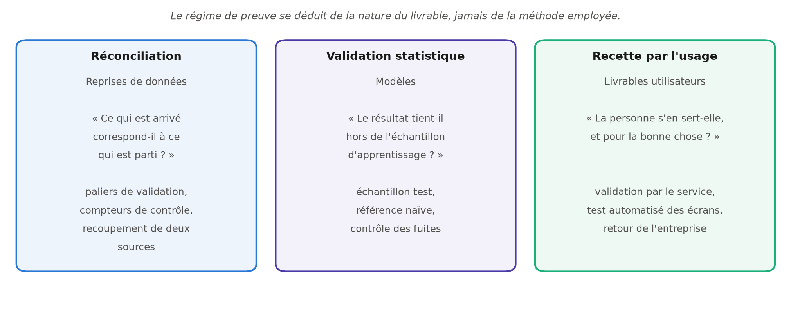{width=100%}

Le premier régime est celui de la **réconciliation**. Il s'applique aux reprises de données, où
la question posée est : ce qui est arrivé correspond-il à ce qui est parti ? J'y ai eu
recours sous plusieurs formes. Sur la migration des opérations, la validation itérative par
paliers a servi de contrôle avant la masse. Sur la reprise des tiers, un panneau de compteurs
intégré à la feuille pivot affichait en permanence les valeurs attendues, et la procédure
impose de les vérifier avant tout export. Sur le projet analytique, la réconciliation des
deux exports budgétaires a montré des totaux identiques à l'euro près sur les 118 opérations
jointes, et un contrôle croisé des agrégats par deux moteurs indépendants a retrouvé les
mêmes 1 561,8 M€ de dépenses budgétées et 1 754,8 M€ de recettes.

Le deuxième régime est celui de la **validation statistique**. Il s'applique aux modèles, où la
question posée est : le résultat tient-il hors de l'échantillon sur lequel il a été construit ?
J'y ai systématiquement associé trois précautions : une évaluation sur un échantillon test
distinct, une comparaison à une référence naïve, et un contrôle des fuites entre les
variables explicatives et la cible. La comparaison à la référence est celle qui m'a le plus
servi : un score F1 de 0,3 ne veut rien dire dans l'absolu, mais il prend un sens précis
lorsque la référence majoritaire, elle, ne détecte rien du tout.

Le troisième régime est celui de la **recette par l'usage**. Il s'applique aux livrables
destinés à un utilisateur, où la question posée est : la personne s'en sert-elle, et pour la
bonne chose ? Sur le reporting juridique, le régime de preuve retenu est la validation par le
service demandeur, seul juge de la conformité de la règle appliquée. Sur l'application, chaque
page a été vérifiée par un cadre de test automatisé, y compris aux bornes des curseurs et sur
les sélections vides, mais c'est le retour de l'entreprise sur le vocabulaire des écrans qui a
constitué la véritable recette.

### Ce que ces évaluations ne couvrent pas

Il serait malhonnête de présenter ce dispositif comme complet, et je préfère en exposer les
angles morts.

La réconciliation prouve qu'une donnée est arrivée, pas qu'elle est juste. Les 1 434 tiers
créés correspondent exactement à ce que le fichier de travail prévoyait, mais si une clé
d'unicité était mal choisie, l'erreur passerait le contrôle sans être vue, puisque les
compteurs, eux, tomberaient juste.

La validation statistique mesure une performance sur des données passées, dans une
conjoncture donnée. Rien ne garantit qu'un modèle calibré sur la période récente tienne si le
marché change de régime.

La recette par l'usage, enfin, ne dit rien à court terme sur l'utilité réelle d'un outil. Une
page consultée n'est pas une décision prise. Il faudra plusieurs mois d'utilisation pour
savoir si le Copilote Financier a changé quelque chose aux revues de gestion, et cette
mesure-là, je n'ai pas pu la faire dans le temps de l'alternance.

## Les difficultés rencontrées

### Difficultés techniques

Les difficultés techniques de l'année se ramènent presque toutes à une même situation : un
système imposait une règle qui n'était écrite nulle part.

L'ordre d'injection des objets dans l'ERP en est le cas le plus net. Il n'était pas documenté,
et je l'ai reconstitué par l'analyse des codes d'erreur. Le versionnement des budgets en est
le second : les identifiants système étant invisibles dans l'interface, et toute modification
créant un nouvel objet plutôt que d'écraser l'ancien, il a fallu concevoir une logique de
requêtage dynamique en trois temps pour cibler le bon enregistrement.

Le refus des caractères accentués par le format d'import et l'impossibilité de porter les
coordonnées des couples en CSV relèvent de la même famille. Dans le second cas, la solution a
consisté à changer de porte d'entrée vers le système, en passant par l'API plutôt que par le
fichier plat.

Enfin, les pièges du tableur ont coûté un temps de recherche disproportionné à leur
apparente banalité : le comptage qui prend une chaîne vide pour une valeur, le code de mise
en forme des mois interprété comme des minutes, les heures parasites qui rendent deux dates
identiques différentes. Ces quatre pièges partagent un trait qui en fait, à mes yeux, un vrai
enseignement de méthode : **aucun ne produit de message d'erreur**. Ils se manifestent par un
compteur qui ne tombe pas juste, et c'est la seule raison pour laquelle je les ai vus.

### Difficultés tenant à la donnée

Trois difficultés relèvent de la donnée elle-même et non des outils.

La première est l'**absence d'historique**. Les exports budgétaires sont une photographie à
date, sans trace des révisions successives. Cette limite plafonne l'axe le plus attendu du
projet analytique, et aucune méthode ne la contourne : on ne peut pas apprendre la dynamique
d'une dérive sur une image fixe.

La deuxième est la **qualité de saisie**. Le cas le plus parlant est celui d'une agence dont
90 % des motifs de désistement sont enregistrés en « Autres motifs », ce qui rend ses
désistements inanalysables tant que la saisie n'est pas fiabilisée. Ce constat n'était pas
attendu, et il a produit une recommandation opérationnelle immédiate.

La troisième est l'**impossibilité d'estimer certains paramètres en interne**. L'élasticité de
la demande au prix, centrale pour la règle de remise, a le bon signe dans nos données mais
n'y est pas significative. La valeur retenue vient de la littérature, et c'est une fragilité
que le chapitre 5 expose plutôt que de la masquer.

### Difficultés organisationnelles

La difficulté la plus constante de l'année n'a été ni technique ni statistique : c'est la
**fragmentation du temps**. Les missions filées du chapitre 4 n'attendent pas la fin d'un
chantier de reprise pour se manifester. Un fichier d'injection interrompu trois fois dans la
journée pour une demande de tableau de bord avance moins vite qu'un fichier mené d'un trait,
et surtout, il se reprend plus mal : il faut à chaque fois reconstituer où l'on en était dans
une logique de formules imbriquées.

Ce que j'ai fini par mettre en place tient en peu de choses, mais m'a coûté plusieurs mois à
comprendre. J'ai réservé les plages longues aux travaux qui ne se découpent pas, regroupé les
demandes courtes plutôt que de les traiter à leur arrivée, et surtout, j'ai commencé à écrire
systématiquement où j'en étais avant d'interrompre une tâche. Cette dernière habitude est
celle qui m'a le plus fait gagner de temps sur l'année.

Une seconde difficulté organisationnelle mérite d'être signalée, parce qu'elle a modifié le
projet : le **décalage entre le calendrier universitaire et le calendrier de l'entreprise**. Le
projet de Machine Learning prévu au premier semestre n'a pas pu être mené, la migration ayant
mobilisé l'essentiel de mon temps. Ce report, frustrant sur le moment, s'est révélé logique
avec le recul, et il constitue le fil de ce mémoire.

## Résultats consolidés de l'année

Le tableau suivant récapitule ce qui a été livré et se trouve aujourd'hui en service.

| Livrable | Volume ou périmètre |
|:-------------------------------------------------|:----------------------------|
| Opérations créées dans SPO, hors budgets détaillés | 283 |
| Tiers créés dans SPO, avec leurs objets rattachés | 1 434 |
| Adresses, courriels et téléphones importés | 553, 469 et 538 |
| Représentants des couples et des sociétés | 1 871 |
| Coordonnées ajoutées par requête API | 872 requêtes, toutes passées |
| Documentation interne produite | Séquence d'injection, procédure d'import des tiers |
| Reportings maintenus et faits évoluer | Sur l'ensemble des services demandeurs |
| Postes équipés du SSO | Agence de Perpignan et service financier du siège |
| Base de données analytique | Trois dimensions, quatre tables de faits, trois vues métier |
| Application d'aide à la décision livrée | Cinq pages, 147 opérations de promotion suivies |

Ces chiffres ne disent pourtant pas l'essentiel, et je préfère le formuler moi-même plutôt
que de laisser le tableau parler seul. Ce que l'année a produit de plus durable n'est aucun
de ces volumes : ce sont trois définitions écrites quelque part. La séquence d'injection
valide pour l'ERP, la clé qui décide qu'un client est le même client, et la formule qui dit
ce qu'est la marge d'une opération. Les données se réinjectent ; ces trois décisions-là, il
faut les reprendre depuis le début si elles se perdent.

::: transition
Ce chapitre aura relu l'année sous quatre angles : la conduite de projet, les outils, les
régimes de preuve et les difficultés. Deux enseignements en ressortent, qu'aucune mission
prise isolément ne donnait. Le premier est que l'arbitrage entre exhaustivité et continuité
de service est revenu dans les quatre missions, et qu'il ne devient acceptable qu'à la
condition d'écrire ce qu'on laisse de côté. Le second est que la nature du livrable commande
le régime de preuve, et qu'appliquer à une reprise de données les critères d'un modèle
statistique, ou l'inverse, revient à ne rien prouver du tout.

Ces enseignements restent pourtant des enseignements de méthode. Un mémoire professionnel
attend aussi une position sur le métier lui-même : ce qu'est un data scientist dans une
entreprise qui n'a pas d'équipe data, ce que cette année m'a appris de la pratique
professionnelle, et ce que je compte en faire.

Le chapitre suivant y est consacré. Il livre ma réflexion sur le métier tel que je l'ai
exercé, puis présente les perspectives des projets engagés et le projet professionnel qui en
découle.
:::


# Réflexion sur le métier, perspectives et projet professionnel

::: sommaire
**Sommaire**

- 7.1 Le métier de data scientist vu depuis une entreprise sans équipe data
    - 7.1.1 Un traducteur avant d'être un modélisateur
    - 7.1.2 La place réelle de la modélisation
    - 7.1.3 L'honnêteté sur ce qu'un résultat ne dit pas
- 7.2 Ce que j'ai appris de la pratique professionnelle
    - 7.2.1 Documenter est un acte technique
    - 7.2.2 Livrer, c'est faire adopter
- 7.3 Perspectives des projets engagés
    - 7.3.1 Achever la reprise et historiser les données
    - 7.3.2 Faire vivre le Copilote Financier
    - 7.3.3 L'intégration à l'infrastructure Nexity
- 7.4 Mon projet professionnel
    - 7.4.1 Le positionnement que je vise
    - 7.4.2 Les compétences qu'il me reste à consolider
:::

Ce dernier chapitre quitte le récit des missions pour livrer la réflexion qu'elles ont
produite. Il porte d'abord sur le métier de data scientist tel que je l'ai exercé, dans une
entreprise qui n'a pas d'équipe data et où j'étais la seule personne à temps plein sur ces
sujets. Il expose ensuite les perspectives des chantiers engagés, dont aucun n'est achevé, et
se termine par le projet professionnel qui découle de ces deux années d'alternance.

## Le métier de data scientist vu depuis une entreprise sans équipe data

### Un traducteur avant d'être un modélisateur

L'image que j'avais de ce métier en entrant en Master 2 était celle que donne le cursus : on
reçoit un jeu de données et une question, on choisit une méthode, on évalue, on livre un
modèle. Cette image n'est pas fausse, elle est simplement très minoritaire dans le temps
réel.

Sur les quatre missions de l'année, une seule correspond à cette description, et encore
partiellement. Le poste que j'ai réellement occupé se rapproche davantage de celui de
gestionnaire d'applications tel que le décrivent les référentiels métier [1] : comprendre les
outils, les données qu'ils produisent et les besoins de ceux qui s'en servent. Ce qui a occupé
le reste, c'est un travail de traduction, dans les deux sens. Traduire une gêne exprimée par un
service en question calculable, d'abord. Traduire ensuite un résultat statistique en information
sur laquelle quelqu'un peut décider. Entre ces deux traductions, la modélisation proprement dite
occupe une place modeste.

Cette traduction n'est pas une tâche annexe qu'on expédierait avant le vrai travail. Elle est
le vrai travail, et elle est difficile pour une raison précise : les deux langues n'ont pas
les mêmes catégories. Le service juridique parle de commandes payantes et gratuites ; la base
ne connaît que des lignes sans position dans une séquence. La direction financière parle
d'opérations qui dérivent ; les exports ne contiennent qu'un budget et un engagé à une date.
Chaque fois, il a fallu construire la catégorie manquante, et ce sont ces constructions qui
engagent le plus, parce qu'elles décident de ce que l'entreprise pourra observer ensuite.

### La place réelle de la modélisation

Le second constat est plus inconfortable, et je le formule d'autant plus volontiers qu'il va
contre ce que j'espérais démontrer en commençant le projet du second semestre.

Dans le Copilote Financier, la page la plus consultée par les contrôleurs de gestion ne
repose sur aucun modèle appris. C'est un tableau descriptif de dépassements en euros, calculé
en SQL. Le modèle statistique intervient en complément, pour hiérarchiser l'attention, et il
le fait avec des performances modestes que le chapitre 5 expose sans les farder.

Je ne tire pas de ce constat que la modélisation serait inutile. J'en tire deux choses plus
précises. La première est que **la valeur d'un projet data ne se mesure pas au degré de
sophistication des méthodes employées**, mais à l'écart entre ce que l'entreprise savait avant
et après. À cette aune, le résultat le plus utile de l'année est peut-être le constat sur la
qualité de saisie d'une agence, obtenu avec des moyens élémentaires.

La seconde est que **le choix de la méthode se déduit de la donnée disponible, jamais de
l'ambition du projet**. Sur le rythme de vente, la profondeur temporelle des données autorisait
un modèle exigeant, et il a donné un résultat solide. Sur le risque de marge, l'absence
d'historique interdisait tout modèle dynamique, et aucune sophistication n'aurait compensé
cette absence. Comprendre cela avant de choisir un algorithme, plutôt qu'après l'avoir
évalué, est ce que cette année m'a le mieux appris.

### L'honnêteté sur ce qu'un résultat ne dit pas

Le troisième constat porte sur une exigence que je n'attendais pas au même niveau : la
rigueur dans l'énoncé des limites.

Dans un exercice universitaire, présenter un modèle faible est un mauvais résultat. Dans une
entreprise, présenter un modèle faible **sans le dire** est bien pire, parce que quelqu'un
décidera dessus. Un score de risque qui trie correctement une liste sans permettre de fonder
une décision individuelle est utile, à condition que cette distinction soit portée à l'écran
et non enfouie dans une annexe.

C'est pourquoi j'ai fait de l'énoncé des limites une partie du livrable, au même titre que
les résultats : le paramètre d'élasticité emprunté à la littérature, l'absence d'historique
qui plafonne un axe entier, les intervalles de prévision qui ignorent l'incertitude sur les
taux futurs. Cette pratique a un effet secondaire que je n'avais pas anticipé : elle rend les
recommandations plus faciles à discuter, parce que l'interlocuteur sait sur quoi il peut
s'appuyer.

## Ce que j'ai appris de la pratique professionnelle

### Documenter est un acte technique

J'ai longtemps considéré la documentation comme une formalité qui suit le travail. Deux
épisodes de l'année m'ont fait changer d'avis.

Le premier est la note interne sur la séquence d'injection dans l'ERP, rédigée après l'avoir
reconstituée par les codes d'erreur. Ce document a servi à la reprise des tiers six mois plus
tard, et il aurait servi à quelqu'un d'autre si je n'avais pas été là.

Le second est la note de procédure de l'import des tiers, qui commence par la liste des
manipulations à ne jamais faire avant d'expliquer comment utiliser le fichier. Cet ordre n'est
pas rhétorique : les quatre manipulations en question cassent le fichier sans produire le
moindre message d'erreur, et un utilisateur qui ne les connaît pas produira des fichiers
d'import faux en croyant bien faire.

J'en retire une formulation que j'assume : **documenter, ce n'est pas décrire ce qu'on a fait,
c'est rendre le travail reprenable par quelqu'un d'autre**. La différence est concrète. Une
description raconte les étapes ; une documentation utile énonce les règles, les pièges et les
décisions, c'est-à-dire ce qui ne se déduit pas du résultat.

### Livrer, c'est faire adopter

La leçon la plus nette de l'année tient en un épisode : la première version de l'interface du
Copilote Financier, techniquement correcte, était inutilisable par ceux à qui elle était
destinée, parce qu'elle parlait de scores et de probabilités là où l'on attendait des niveaux
d'alerte et des euros.

Ce que j'en retiens dépasse le vocabulaire des écrans. Un livrable n'existe qu'à partir du
moment où quelqu'un s'en sert, et la distance entre un résultat juste et un résultat utilisé
ne se comble pas par de la pédagogie. Elle se comble en changeant le livrable. La même chose
s'est vérifiée, sur un terrain bien plus modeste, lors du déploiement du SSO :
l'accompagnement des utilisateurs à leur première connexion faisait partie du déploiement, il
n'en était pas le service après-vente.

## Perspectives des projets engagés

Aucun des chantiers de cette année n'est achevé, et il serait malvenu de conclure ce mémoire
en laissant croire le contraire. Trois perspectives se dégagent, dans un ordre de priorité qui
n'est pas le mien mais celui de l'entreprise.

### Achever la reprise et historiser les données

La migration vers SPO reste prioritaire. La stratégie des « coquilles vides », si elle a
sauvé le démarrage de la facturation, doit maintenant laisser place à une reprise
exhaustive : intégration des historiques budgétaires complets, vérifications approfondies de
l'intégrité des données par contrôle de cohérence comptable, et phases de tests finaux avant
la bascule définitive. Le fichier de reprise des tiers devra pour sa part être rejoué au moins
une fois avant cette bascule, afin d'écarter les tiers créés entre-temps par les équipes
commerciales.

À ce chantier s'ajoute la recommandation la plus structurante que je laisse à l'entreprise :
**historiser les exports mensuels dans le nouvel ERP**. C'est l'absence de cet historique qui
plafonne aujourd'hui l'analyse du risque de marge. Au bout d'un an de conservation, le score
statique deviendrait un véritable suivi de trajectoire, et l'axe le plus attendu du Copilote
Financier changerait de nature. Cette recommandation ne coûte presque rien à mettre en œuvre ;
elle coûte seulement d'y penser maintenant plutôt que dans deux ans.

### Faire vivre le Copilote Financier

L'application livrée est fonctionnelle et reproductible, mais elle reste une photographie.
Trois évolutions la rendraient durable.

1. **L'historisation des données**, déjà évoquée, qui transformerait le score de risque en
   suivi.
2. **L'extension à l'aménagement foncier**, aujourd'hui exclu du périmètre de l'application. La
   logique économique de cette activité étant différente, cette extension suppose un
   traitement dédié plutôt qu'une simple levée de filtre.
3. **La fiabilisation de la saisie des motifs de désistement**, sans laquelle les analyses
   commerciales resteront partielles sur une partie du réseau.

### L'intégration à l'infrastructure Nexity

Une mission structurante, non prévue initialement, vient s'ajouter à cette feuille de route :
le passage vers l'infrastructure technique du groupe Nexity. Ce changement d'environnement
engendrera des missions spécifiques d'adaptation de nos outils, qu'il s'agisse de la
reconfiguration des connecteurs de bases de données, de l'adaptation des protocoles de
sécurité pour les accès distants ou de la migration de certains scripts d'automatisation vers
de nouveaux serveurs.

Cette perspective a déjà influé sur mes choix techniques. Le test de montée en charge conduit
dans le projet analytique n'avait pas d'autre objet que de savoir si l'architecture retenue
tiendrait à une échelle supérieure, et de documenter le chemin à prendre le cas échéant.

## Mon projet professionnel

### Le positionnement que je vise

Ces deux années d'alternance ont déplacé mon projet, et je préfère le dire ainsi plutôt que
de prétendre qu'il n'a pas bougé. J'y suis entrée en visant la data science au sens strict, la
modélisation prédictive. J'en sors en visant un positionnement plus large et, je crois, plus
juste au regard de ce dont les entreprises ont réellement besoin : **construire et fiabiliser
les chaînes de données qui rendent la décision possible, puis les outiller**.

Ce positionnement se situe à l'intersection de trois domaines que l'année m'a fait pratiquer
ensemble.

1. **L'ingénierie des données.** Reprises, migrations, interfaces de programmation, qualité et
   déduplication, modélisation d'une base analytique. C'est la partie du travail sur laquelle
   j'ai le plus progressé, et celle où je me sens aujourd'hui la plus solide.
2. **L'analyse et la modélisation.** Le choix d'une méthode proportionnée à la donnée
   disponible, sa validation honnête, et la lecture métier de ses coefficients.
3. **La restitution et le dialogue avec les métiers.** La traduction d'un besoin en
   spécification, puis d'un résultat en écran sur lequel on décide.

Un profil qui ne tiendrait que le premier de ces domaines produirait des pipelines que
personne n'interroge ; un profil qui ne tiendrait que le deuxième modéliserait des données
dont il ignore la provenance. C'est la combinaison qui m'intéresse, et le secteur immobilier
m'a donné pour l'exercer un terrain que je connais désormais : des cycles longs, des
opérations portées par des sociétés dédiées, une gestion où la moindre définition de marge
engage des montants importants.

À court terme, ma priorité est de conduire à son terme ce que cette année a engagé. La
reprise des historiques budgétaires, la bascule définitive vers SPO et l'adaptation des outils
à l'infrastructure du groupe Nexity forment un ensemble cohérent, sur lequel ma connaissance
du modèle de données constitue un avantage que personne d'autre n'a aujourd'hui dans
l'entreprise. C'est donc au sein du groupe que je souhaite poursuivre en premier lieu, sur le
périmètre données et système d'information.

À moyen terme, je vise un poste d'ingénieure données orientée aide à la décision, dans une
structure où la donnée de gestion est un enjeu réel et non un sujet d'affichage. Deux types
d'organisations m'intéressent pour des raisons opposées et complémentaires : les entreprises
de taille intermédiaire qui n'ont pas encore d'équipe data constituée, où le poste couvre
toute la chaîne comme cette année, et les directions data structurées, où je pourrais combler
la lacune que j'identifie plus bas en travaillant enfin à plusieurs sur un même chantier.

### Les compétences qu'il me reste à consolider

Il serait présomptueux de conclure sans nommer ce qui me manque, d'autant que l'année l'a
rendu visible.

La première lacune est l'**industrialisation**. J'ai construit des chaînes de traitement
reproductibles, mais elles se lancent à la main. Passer à une exécution planifiée, surveillée
et alertée en cas d'échec est le pas suivant, et c'est celui qui sépare un livrable d'un
service.

La deuxième est la **profondeur statistique sur les données temporelles**. C'est l'axe où le
projet du second semestre a donné les meilleurs résultats, et c'est aussi celui où j'ai le
plus senti la limite de mes acquis. Les modèles de panel et les séries temporelles méritent
mieux que l'usage que j'ai pu en faire en quelques semaines.

La troisième, enfin, est la **conduite d'un projet à plusieurs**. J'ai travaillé seule sur les
sujets data pendant deux ans, ce qui a des vertus mais laisse une compétence entière hors
champ : les conventions de code partagées, la revue par un pair, la répartition d'un chantier
entre plusieurs personnes. C'est une raison de plus pour souhaiter rejoindre, à terme, une
équipe constituée.

::: transition
Ce chapitre aura livré ce qu'une année de pratique m'a appris du métier : qu'il consiste
d'abord à traduire, que la modélisation y occupe une place plus modeste et plus précise que
je ne le croyais, et qu'un résultat livré sans ses limites est un résultat dangereux. Il aura
également exposé les trois chantiers qui se poursuivent après mon départ et le positionnement
professionnel que je vise.

Il reste à refermer l'ensemble. La conclusion qui suit reprend le fil des sept
chapitres et revient sur la thèse annoncée en introduction, pour dire dans quelle mesure
l'année l'a effectivement démontrée.
:::


# Conclusion {-}

Ce mémoire témoigne d'une année charnière dans mon parcours d'alternance au sein du groupe
Angelotti. Contrairement à mon année de Master 1, qui m'avait permis de découvrir
l'analyse exploratoire des données dans un cadre relativement stable, cette deuxième année
a été marquée par la complexité et l'urgence d'une transformation numérique de fond. Elle
a été dominée par des enjeux d'ingénierie des données et d'architecture système, avant de
revenir, au second semestre, à la modélisation statistique.

Le premier semestre a été celui de la reconstruction du socle. La migration de la base
Grimmo vers l'ERP SPO m'a confrontée à la réalité rugueuse du terrain. Il ne s'agissait
pas simplement de transférer des données, mais de rétro-concevoir un modèle dont les
règles n'étaient pas documentées, de résoudre des problèmes d'intégrité référentielle
complexes avec la gestion des identifiants dynamiques et du versionnement, et de faire
preuve d'agilité stratégique. L'adoption de la méthode des « coquilles vides » pour
sécuriser le démarrage de la facturation illustre cette capacité à adapter la technique
aux impératifs métiers. En parallèle, j'ai maintenu un haut niveau de service sur le
reporting, illustré par la mise en œuvre d'une règle de gestion juridique complexe malgré
les contraintes de nos outils, tout en participant à la sécurisation du système
d'information via le déploiement du SSO.

Le second semestre a prolongé ce travail, puis l'a valorisé. La reprise des tiers a achevé
de constituer le socle commercial du nouvel ERP, en créant 1 434 clients acquéreurs sans
doublon détecté par les trois clés d'unicité retenues, et elle a fait le premier pas vers
l'interopérabilité entre l'ERP et le CRM qui restait à construire.
Le Copilote Financier a ensuite exploité ce socle pour outiller la direction financière
sur trois questions de gestion, et il l'a fait de bout en bout, de la compréhension des
exports jusqu'à une application que les contrôleurs de gestion ouvrent eux-mêmes.

Ce parcours en deux temps aura démontré la thèse annoncée en introduction. Il l'aura même
fait deux fois plutôt qu'une. Une première fois en creux, lorsque la charge de la
migration a repoussé le projet de modélisation au second semestre : tenter de modéliser
des phénomènes financiers sur une base fragmentée entre l'ancien et le nouveau système
aurait conduit à des résultats biaisés et non pérennes. Une seconde fois en plein, lorsque
le projet de Data Science a donné des résultats solides sur le rythme d'écoulement, où les
données avaient une profondeur temporelle, et des résultats modestes sur le risque de
marge, où elles n'étaient qu'une photographie à date. La structure de la donnée commande
ce que la modélisation peut en tirer : c'est le même énoncé dans les deux cas, obtenu par
deux chemins indépendants.

Il reste évidemment beaucoup à faire. La migration vers SPO n'est pas achevée,
l'historique budgétaire reste à reprendre, l'intégration à l'infrastructure Nexity
s'annonce, et le Copilote Financier ne deviendra un véritable outil de suivi que lorsque
les exports auront été historisés sur une durée suffisante. Ce que cette année aura établi
n'en dépend pas. Un projet de données ne se joue pas au moment du choix de l'algorithme
mais bien avant, lorsqu'on décide ce qu'est un client, ce qu'est une marge, ou ce que
contient réellement un fichier dont le nom annonce autre chose. Structurer une donnée et
la modéliser ne sont pas deux métiers successifs, mais deux moments du même travail, et
c'est le premier qui décide de ce que le second pourra en tirer.

C'est cette conviction, forgée sur le terrain plutôt qu'en cours, que j'emporte de ces
deux années d'alternance, et c'est elle qui oriente le projet professionnel exposé au
chapitre 7.

# Bibliographie {-}

[1] Michael Page. (2025). *Fiche métier : gestionnaire d'applications.* [En ligne]. Disponible
sur :
<https://www.michaelpage.fr/advice/m%C3%A9tiers/syst%C3%A8mes-dinformation/fiche-m%C3%A9tier-gestionnaire-d%E2%80%99applications>.

[2] Salvia Développement. (2025). *Site officiel de l'éditeur de la solution SPO et
documentation technique de son API.* [En ligne]. Disponible sur :
<https://www.salviadeveloppement.fr/>.

[3] Bryan, P. et Nottingham, M. (2013). *JavaScript Object Notation (JSON) Patch,* RFC 6902,
Internet Engineering Task Force. [En ligne]. Disponible sur :
<https://www.rfc-editor.org/rfc/rfc6902>.

[4] Banque centrale européenne. *Taux d'intérêt des crédits à l'habitat en France, série
mensuelle.* [En ligne]. Disponible sur : <https://data.ecb.europa.eu/>.

[5] Eurostat. *Indicateur de confiance des ménages.* [En ligne]. Disponible sur :
<https://ec.europa.eu/eurostat>.

[6] Etalab. *API Découpage administratif, référentiel des communes françaises.* [En ligne].
Disponible sur : <https://geo.api.gouv.fr/>.
